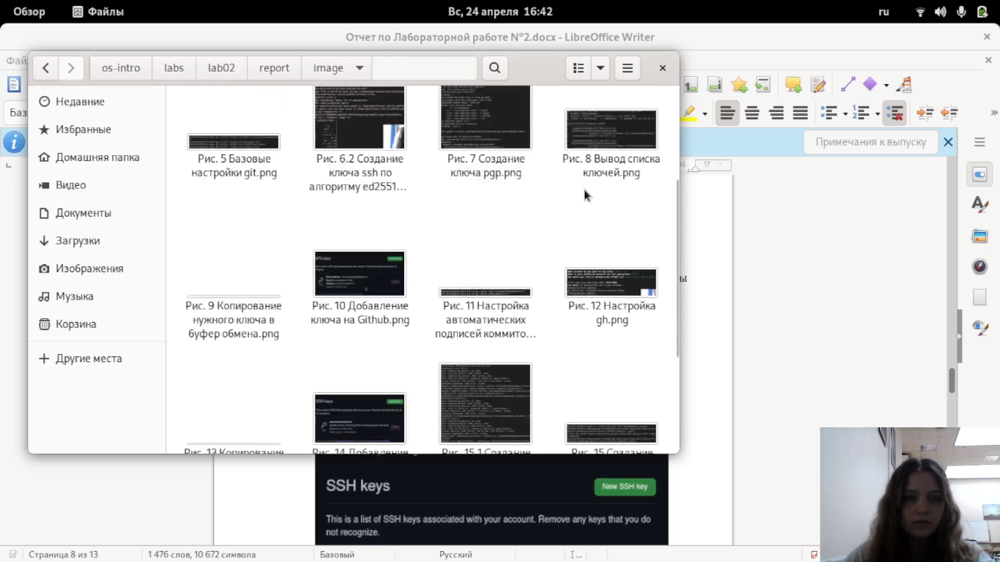
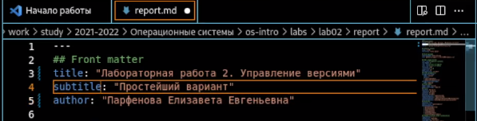
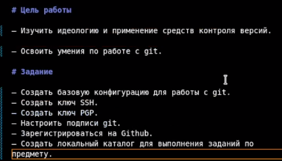
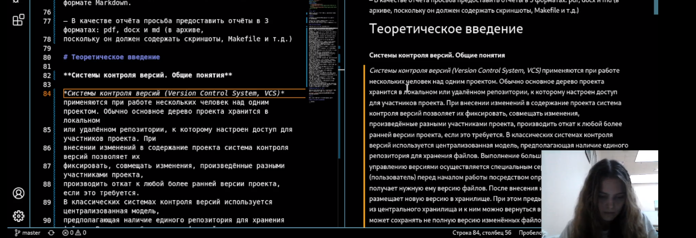
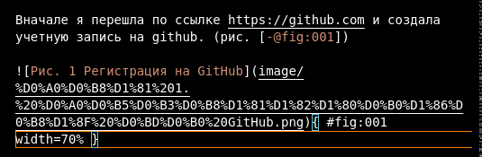
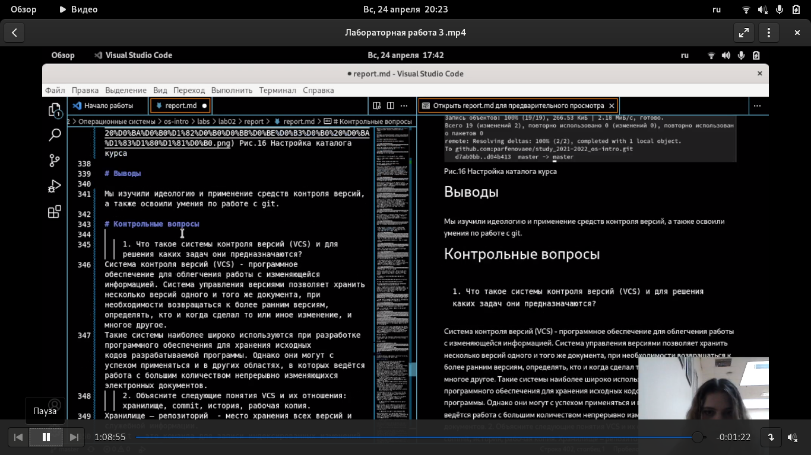

---
## Front matter
title: "Отчет по Лабороторной работе 3"
subtitle: "Markdown"
author: "Парфенова Елизавета Евгеньевна"

## Generic otions
lang: ru-RU
toc-title: "Содержание"

## Bibliography
bibliography: bib/cite.bib
csl: pandoc/csl/gost-r-7-0-5-2008-numeric.csl

## Pdf output format
toc: true # Table of contents
toc-depth: 2
lof: true # List of figures
lot: true # List of tables
fontsize: 12pt
linestretch: 1.5
papersize: a4
documentclass: scrreprt
## I18n polyglossia
polyglossia-lang:
  name: russian
  options:
	- spelling=modern
	- babelshorthands=true
polyglossia-otherlangs:
  name: english
## I18n babel
babel-lang: russian
babel-otherlangs: english
## Fonts
mainfont: PT Serif
romanfont: PT Serif
sansfont: PT Sans
monofont: PT Mono
mainfontoptions: Ligatures=TeX
romanfontoptions: Ligatures=TeX
sansfontoptions: Ligatures=TeX,Scale=MatchLowercase
monofontoptions: Scale=MatchLowercase,Scale=0.9
## Biblatex
biblatex: true
biblio-style: "gost-numeric"
biblatexoptions:
  - parentracker=true
  - backend=biber
  - hyperref=auto
  - language=auto
  - autolang=other*
  - citestyle=gost-numeric
## Pandoc-crossref LaTeX customization
figureTitle: "Рис."
tableTitle: "Таблица"
listingTitle: "Листинг"
lofTitle: "Список иллюстраций"
lotTitle: "Список таблиц"
lolTitle: "Листинги"
## Misc options
indent: true
header-includes:
  - \usepackage{indentfirst}
  - \usepackage{float} # keep figures where there are in the text
  - \floatplacement{figure}{H} # keep figures where there are in the text
---

# Цель работы

Научиться оформлять отчёты с помощью легковесного языка разметки Markdown.


# Задание

– Сделайте отчёт по предыдущей лабораторной работе в формате Markdown.

– В качестве отчёта просьба предоставить отчёты в 3 форматах: pdf, docx и md (в архиве,
поскольку он должен содержать скриншоты, Makefile и т.д.)

# Теоретическое введение

### **Базовые сведения о Markdown**

Чтобы создать заголовок, используйте знак ( # ), например:

1. '# This is heading 1'

2. '## This is heading 2'

3.  '### This is heading 3'

4.  '#### This is heading 4'

Чтобы задать для текста полужирное начертание, заключите его в двойные звездочки:

This text is **bold** 

Чтобы задать для текста курсивное начертание, заключите его в одинарные звездочки:

This text is *italic* 

Чтобы задать для текста полужирное и курсивное начертание, заключите его в тройные
звездочки:

This is text is both ***bold and italic*** 

Блоки цитирования создаются с помощью символа >:

> The drought had lasted now for ten million years, and the reign of the terrible lizards had long since ended. Here on the Equator, in
the continent which would one day be known as Africa, the battle for existence had reached a new climax of ferocity, and the victor
was not yet in sight. In this barren and desiccated land, only the small or the swift or the fierce could flourish, or even hope to
survive.

Неупорядоченный (маркированный) список можно отформатировать с помощью звездочек или тире:

- List item 1

- List item 2

- List item 3

Чтобы вложить один список в другой, добавьте отступ для элементов дочернего списка:

- List item 1

     - List item A

     - List item B

- List item 2

Упорядоченный список можно отформатировать с помощью соответствующих цифр:

 1. First instruction

 1. Second instruction
 1. Third instruction

Чтобы вложить один список в другой, добавьте отступ для элементов дочернего списка:
 1. First instruction
    1. Sub-instruction
    1. Sub-instruction
 1. Second instruction

 Синтаксис Markdown для встроенной ссылки состоит из части [link text] , представляющей текст гиперссылки, и части (file-name.md) – URL-адреса или имени файла,
на который дается ссылка:

[link text] (file-name.md)

Markdown поддерживает как встраивание фрагментов кода в предложение, так и их
размещение между предложениями в виде отдельных огражденных блоков. Огражденные
блоки кода — это простой способ выделить синтаксис для фрагментов кода. Общий
формат огражденных блоков кода:

 ``` language

 your code goes in here

```

Верхние индексы записывается как:

H~2~O

Нижние индексы записывается как:

2^10^

Внутритекстовые формулы делаются аналогично формулам LaTeX. Например, формула sin2(x)+cos 2 (x) = 1 запишется как

$\sin^2 (x) + \cos^2 (x) = 1$


# Выполнение лабораторной работы

Выполнение лабораторной работы я начала со скачивания Visual Studio Code и загрузки в программу шаблона, который находился в моем репозитории. (рис. [-@fig:001])


{ #fig:001 width=70% }

После этого я открыла отчет в LibreOfice и начала сохранять скриншоты из него в папку images, находящуюся в репозитории. Это нужно для того, чтобы добавить их в отчет в Markdowm. (рис. [-@fig:002])

{ #fig:002 width=70% }

После этого я возвратилась к шаблону и начала его редактировать. Вначале я изменила названия и автора.(рис. [-@fig:003])

{ #fig:003 width=70% }

Далее я перешла к записи цели работы, ее я просто скопировала из отчета, открытого в LibreOfice. Также я записала задание, которое нужно было выполнить в ходе Лабороторной работы №2. (рис. [-@fig:004]) 

{ #fig:004 width=70% }


Псоле я приступила к разделу "Теоретическое введение". информацию для него я брала из файла Лабораторной работы №2. (рис. [-@fig:005]) 

{ #fig:005 width=70% } 

Затем я начала прописывать сам ход работы. Я полностью повторила отчет, который делала к сдаче Лабороторной работы №2. Копируя текст из документа, я не забывала добавлять скриншоты по правилам Markdown. (рис. [-@fig:006]) 

{ #fig:006 width=70% } 

После завершения описания этапов Лабораторной работы, я напсиала вывод к ней. Его я также скопировала из прошлого отчета. После я перенесла ответы на Контрольные вопросы.
(рис. [-@fig:007]) 

{ #fig:007 width=70% } 

В конце я просто сохранила сделанный в Markdown отчет. 

# Вывод

Мы научились оформлять отчёты с помощью легковесного языка разметки Markdown.


