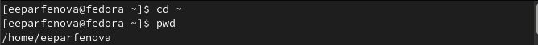

---
## Front matter
title: "Лабораторная работа №4"
subtitle: "Основы интерфейса взаимодействия
пользователя с системой Unix на уровне командной строки"
author: "Парфенова Елизавета Евгеньевна"

## Generic otions
lang: ru-RU
toc-title: "Содержание"

## Bibliography
bibliography: bib/cite.bib
csl: pandoc/csl/gost-r-7-0-5-2008-numeric.csl

## Pdf output format
toc: true # Table of contents
toc-depth: 2
lof: true # List of figures
lot: true # List of tables
fontsize: 12pt
linestretch: 1.5
papersize: a4
documentclass: scrreprt
## I18n polyglossia
polyglossia-lang:
  name: russian
  options:
	- spelling=modern
	- babelshorthands=true
polyglossia-otherlangs:
  name: english
## I18n babel
babel-lang: russian
babel-otherlangs: english
## Fonts
mainfont: PT Serif
romanfont: PT Serif
sansfont: PT Sans
monofont: PT Mono
mainfontoptions: Ligatures=TeX
romanfontoptions: Ligatures=TeX
sansfontoptions: Ligatures=TeX,Scale=MatchLowercase
monofontoptions: Scale=MatchLowercase,Scale=0.9
## Biblatex
biblatex: true
biblio-style: "gost-numeric"
biblatexoptions:
  - parentracker=true
  - backend=biber
  - hyperref=auto
  - language=auto
  - autolang=other*
  - citestyle=gost-numeric
## Pandoc-crossref LaTeX customization
figureTitle: "Рис."
tableTitle: "Таблица"
listingTitle: "Листинг"
lofTitle: "Список иллюстраций"
lotTitle: "Список таблиц"
lolTitle: "Листинги"
## Misc options
indent: true
header-includes:
  - \usepackage{indentfirst}
  - \usepackage{float} # keep figures where there are in the text
  - \floatplacement{figure}{H} # keep figures where there are in the text
---

# Цель работы

Приобретение практических навыков взаимодействия пользователя с системой посредством командной строки.

# Задание

1. Определите полное имя вашего домашнего каталога. Далее относительно этого каталога будут выполняться последующие упражнения.

2. Выполните следующие действия:

    2.1. Перейдите в каталог /tmp.

    2.2. Выведите на экран содержимое каталога /tmp. Для этого используйте команду ls с различными опциями. Поясните разницу в выводимой на экран информации.

   2.3. Определите, есть ли в каталоге /var/spool подкаталог с именем cron?

    2.4. Перейдите в Ваш домашний каталог и выведите на экран его содержимое. Определите, кто является владельцем файлов и подкаталогов?

3. Выполните следующие действия:

    3.1. В домашнем каталоге создайте новый каталог с именем newdir.

    3.2. В каталоге ~/newdir создайте новый каталог с именем morefun.

    3.3. В домашнем каталоге создайте одной командой три новых каталога с именами letters, memos, misk. Затем удалите эти каталоги одной командой.

    3.4. Попробуйте удалить ранее созданный каталог ~/newdir командой rm. Проверьте, был ли каталог удалён.

    3.5. Удалите каталог ~/newdir/morefun из домашнего каталога. Проверьте, был ли каталог удалён.

4. С помощью команды man определите, какую опцию команды ls нужно использовать для просмотра содержимое не только указанного каталога, но и подкаталогов,
входящих в него.

5. С помощью команды man определите набор опций команды ls, позволяющий отсортировать по времени последнего изменения выводимый список содержимого каталога
с развёрнутым описанием файлов.

6. Используйте команду man для просмотра описания следующих команд: cd, pwd, mkdir, rmdir, rm. Поясните основные опции этих команд.
7. Используя информацию, полученную при помощи команды history, выполните модификацию и исполнение нескольких команд из буфера команд.

# Выполнение лабораторной работы

Открыв терминал, я перешла в домашний каталог с помощью команды ***cd***. Далее, используя команду ***pwd*** я определила полное имя домашнего каталога. Оно указано на рисунке 1.(рис. [-@fig:001]) 

{ #fig:001 width=70% }

Следующим шагом я с пмощью команды ***cd*** перешла в каталог /tmp. Далее, используя команду ***ls*** с различными опциями я выводила содержимое каталога. Команда ***ls*** просто вывела подкаталоги, находящиеся в tmp. (рис. [-@fig:002]) 

{ #fig:002 width=70% }

Далее команда ***ls -a*** показала содержимое каталога вместе со скрытыми папками. (рис. [-@fig:003]) 

{ #fig:003 width=70% }

После я ввела команду ***ls -l***, с помощью которой посмотрела подробную информацию о файлах и каталогах.(рис. [-@fig:004]) 

{ #fig:004 width=70% }  

Последней опцией, применяемой к ***ls***, стала опция ***-alF***. Данная опция позволила просмотреть расширенное наполнение каталога с подробной информацией о каждом подкаталоге и файле, учитывая скрытые. (рис. [-@fig:005]) 

{ #fig:005 width=70% }  

Следующим шагом я перешла в каталог /var/spool, используя команду ***cd***. Командой ***ls*** и ***ls -a*** я проверила просто содержимое каталога и его содержимое со скрытыми папками, однако подкаталога cron, о котором говорилось в задании, я там не нашла.(рис. [-@fig:006]) 
(рис. [-@fig:007]) 

{ #fig:006 width=70% }  

{ #fig:007 width=70% }    

Используя команду ***cd***, я вернулась в домашний каталог. Команда ***ls -l*** позволила мне вывести содержимое домашнего каталога с указанием, в том числе, и имени владельца. Владельцем всех файлов являюсь я, указано мое имя пользователя. (рис. [-@fig:008])

{ #fig:008 width=70% }

Следующим шагом с помощью команды ***mkdir*** я в домашнем каталоге создала новый подкаталог с именем newdir. Командой ***ls*** проверила, все ли прошло успепшно. Далее перешла в созданный каталог командой ***cd*** и командой ***mkdir*** создала еще один каталог morefun. Снова проверилаЮ сработала ли команда коректно с помощью ***ls***. (рис. [-@fig:009])
 
{ #fig:009 width=70% } 

Далее я использовала команду ***mkdir -p***,что бы создать сразу три каталога. Командой ***ls*** проверям выполнение предыдущей команды. Все прошло успешно. (рис. [-@fig:010])

{ #fig:010 width=70% }

Далее я, как и требовало задние, удалила эти каталоги одной командой ***rmdir -p***. Командой ***ls*** убедилась в том, что все удалилось. (рис. [-@fig:011])

{ #fig:011 width=70% } 

По заданию я попробовала удалить ранее созданный каталог newdir командой ***rm***. Система выдала ошибку, так как данный катлог не пуст и удалить его можно только написав команду с опцией ***rm -r***. Я удалила катлог и его покаталог и после командой ***ls*** убедилась в этом. (рис. [-@fig:012])

{ #fig:012 width=70% } 

Следующим шагом нужно было определить с помощью какой опции команды ***ls*** можно просмотреть содержимое не только указанного каталога, но и подкаталогов, входящих в него. (рис. [-@fig:013) Для этого я ввела ***man ls*** и среди высветившихся данных нашла нужную опцию. Этой опцией оказалась ***-R***.Далее я ввела команду ***ls -R*** и увидела нужные данные. (рис. [-@fig:014])

{ #fig:013 width=70% } 

{ #fig:014 width=70% } 

Далее по заданию нужно было найти опцию ***ls***, которая позвовлила бы отсортировать по времени последнего изменения выводимый список содержимого каталога с развёрнутым описанием файлов. Для этого я снова использовала ***man ls***. В открывшемся руководстве я нашла опцию ***-c -lt***, которая после ввода позволила посмотреть мне нужную информацию. (рис. [-@fig:015])

{ #fig:015 width=70% } 

Далее с помощью команды ***man*** я просмотрела основные опции нескольких команд. (рис. [-@fig:016])

{ #fig:016 width=70% }    

Задание требовало объяснить оснвные опции каждой из команд. Команда ***cd*** без обозначения каталогов автоматически переносит пользователя в домашний каталог. Также, если пользователь хочет вернуться в родительскую папку, для этого достаточно ввести в терминал ***cd..***.(рис. [-@fig:017])

{ #fig:017 width=70% }  

Опция ***-L**** команды ***pwd*** позволяет брать директорию из окружающей среды, даже если она содержит символические ссылки. Опция же ***-P*** отбрасывает эти символические ссылки. (рис. [-@fig:018])

{ #fig:018 width=70% }  

Опция ***-m*** команды ***mkdir*** позволяет установить атрибуты доступа. Опция ***-p*** позволяет создать несколько катлогов одной командой. То есть мы создаем катлог вместе с родителским по отношлени. к нему. (рис. [-@fig:019])

{ #fig:019 width=70% }   

Команда ***rm*** имеет опцию ***-i***, которая запрашивает подтверждение команды при удаление какого-либо файла или каталога. Опция ***-r*** позволяет удалить каталог, даже если там есть файлы. (рис. [-@fig:020]) 

{ #fig:020 width=70% }  

Опция ***-p*** команды ***rmdir*** позволяет удалить сразу несколько каталогов (катлог вместе с родительским по отношению к нему) (рис. [-@fig:021])

{ #fig:021 width=70% }  

Следующим шагом я, используя команду ***history***, вывела список всех выполненых команд. (рис. [-@fig:022])

{ #fig:022 width=70% }   

После я нашла те, в кторых можно произвести модификацию. Я взяла строки 176 и 200. Далее ввела вот такую команду  ***!<номер_команды>:s/<что_меняем>/<на_что_меняем>***. Все пршло успешно. Команды поменяли свои опции и сработали. (рис. [-@fig:023])

{ #fig:023 width=70% } 

# Выводы

Мы приоберли практические навыки взаимодействия пользователя с системой посредством командной строки.

# Контрольные вопросы

1. Что такое командная строка?

Командная строка - это программа, которая запускает в компьютере какие-то процессы после ввода в нее соответствующих комнад.

2. При помощи какой команды можно определить абсолютный путь текущего каталога? Приведите пример.

Определить абсолютный путь текущего каталога можно с помощью команды ***pwd***. Пример был представлен в лабороторной работе:

***pwd ~***

***/home/eeparfenova***

3. При помощи какой команды и каких опций можно определить только тип файлов и их имена в текущем каталоге? Приведите примеры.

Тип файлов можно определить с помощью команды ***ls*** и ее опций ***-l*** и ***-alF***. Пример можно увидеть при выполнении лабораторной работы (Рис.4 и Рис.5)

4. Каким образом отобразить информацию о скрытых файлах? Приведите примеры.

Отобразить информацию о скрытых файлах можно с помощью команды ***ls -a***. Примером служит Рис.3 из лабороторной работы.

5. При помощи каких команд можно удалить файл и каталог? Можно ли это сделать одной и той же командой? Приведите примеры.

Файл и каталог можно удалить при помощи команд ***rm*** и ***rmdir***. Да, это можно сделать при помощи одной команды (команда ***rm***), но есть некоторые тонкости. Например, если каталог имеет внутри файлы мы не можем удалить его командой  ***rmdir***, так как она применяется только для пустых каталогов. Наполненный каталог нужно удалять командой ***rm*** с опцией ***-r***. Примеры содержит выполненная лабораторная работа (Рис.12)

6. Каким образом можно вывести информацию о последних выполненных пользователем командах? 

Это можно вывести с помощью команды ***history***.

7. Как воспользоваться историей команд для их модифицированного выполнения? Приведите примеры.

Для того чтобы модифицировать команды из истории мы должны воспользоваться командой ***!<номер_команды>:s/<что_меняем>/<на_что_меняем>***. Пример:

***176 ls -a***

***!176:s/a/l***

***ls -l***

Также пример можно посмотреть в лабороторной работе, Рис. 23

8. Приведите примеры запуска нескольких команд в одной строке.

Пример: 

***cd; ls -a***

9. Дайте определение и приведите примера символов экранирования.

Символ экранизирования - символ, который позволяет использовать специальные символы (типа «.»,
«/», «*») без вреда для кода. Символом экранизирования является обратный слэш.

10. Охарактеризуйте вывод информации на экран после выполнения команды ls с опцией l.

Такая команда позволяет увидеть пользователю подробную информацию о каталоге и каждом подкаталоге(файле), находящимся внутри. При этом о каждом файле и каталоге будет выведена следующая
информация:

– тип файла

– право доступа

– число ссылок

– владелец

– размер

– дата последней ревизии

– имя файла или каталога

11. Что такое относительный путь к файлу? Приведите примеры использования относительного и абсолютного пути при выполнении какой-либо команды.

Относительный путь к файлу - это путь относительно текущей папки. То есть компьютер показывает нам путь до нужного каталога, исходя из того, в каком из них мы сейчас 
находимся.

 Абсолютный путь к файлу - это путь от корневой пакпи, то есть полный путь к папке, независящий от того каталога, в котором мы сейчас находимся. 

 Пример:

 В подкаталоге my каталога tmp, который находится в корневой папке, создан file1. Мы находимся в tmp. 

 Относительный путь: ***tmp/my/file1***

 Абсолютный путь: ***/tmp/my/file1***

12. Как получить информацию об интересующей вас команде?

Информацию можно получить с помощью команды ***man***.

13. Какая клавиша или комбинация клавиш служит для автоматического дополнения вводимых команд?

Клавиша Tab.