---
## Front matter
lang: ru-RU
title: Лабораторная работа №5. Анализ файловой системы Linux. Команды для работы с файлами и каталогами 
author: Парфенова Елизавета Евгеньевна
institute: RUDN University, Moscow, Russian Federation

## Formatting
toc: false
slide_level: 2
theme: metropolis
header-includes: 
 - \metroset{progressbar=frametitle,sectionpage=progressbar,numbering=fraction}
 - '\makeatletter'
 - '\beamer@ignorenonframefalse'
 - '\makeatother'
aspectratio: 43
section-titles: true
---

## Цель работы

Ознакомление с файловой системой Linux, её структурой, именами и содержанием каталогов. Приобретение практических навыков по применению команд для работы с файлами и каталогами, по управлению процессами (и работами), по проверке использования диска и обслуживанию файловой системы.

## Задание

1. Выполните все примеры, приведённые в первой части описания лабораторной работы.
2. Выполните следующие действия, зафиксировав в отчёте по лабораторной работе используемые при этом команды и результаты их выполнения:

    2.1. Скопируйте файл /usr/include/sys/io.h в домашний каталог и назовите его
equipment. Если файла io.h нет, то используйте любой другой файл в каталоге /usr/include/sys/ вместо него.

    2.2. В домашнем каталоге создайте директорию ~/ski.plases.

   2.3. Переместите файл equipment в каталог ~/ski.plases.

   2.4. Переименуйте файл ~/ski.plases/equipment в ~/ski.plases/equiplist.

   2.5. Создайте в домашнем каталоге файл abc1 и скопируйте его в каталог ~/ski.plases, назовите его equiplist2.

   2.6. Создайте каталог с именем equipment в каталоге ~/ski.plases.

   2.7. Переместите файлы ~/ski.plases/equiplist и equiplist2 в катало ~/ski.plases/equipment.

   2.8. Создайте и переместите каталог ~/newdir в каталог ~/ski.plases и назовите его plans.

3. Определите опции команды chmod, необходимые для того, чтобы присвоить перечисленным ниже файлам выделенные права доступа, считая, что в начале таких прав
нет:

   3.1. drwxr--r-- ... australia

   3.2. drwx--x--x ... play

   3.3. -r-xr--r-- ... my_os

   3.4. -rw-rw-r-- ... feathers

   При необходимости создайте нужные файлы.

## Задание

4. Проделайте приведённые ниже упражнения, записывая в отчёт по лабораторной
работе используемые при этом команды:

   4.1. Просмотрите содержимое файла /etc/password.

    4.2. Скопируйте файл ~/feathers в файл ~/file.old.

    4.3. Переместите файл ~/file.old в каталог ~/play.

    4.4. Скопируйте каталог ~/play в каталог ~/fun.

    4.5. Переместите каталог ~/fun в каталог ~/play и назовите его games.

    4.6. Лишите владельца файла ~/feathers права на чтение.

    4.7. Что произойдёт, если вы попытаетесь просмотреть файл ~/feathers командой cat?

    4.8. Что произойдёт, если вы попытаетесь скопировать файл ~/feathers?

    4.9. Дайте владельцу файла ~/feathers право на чтение.

    4.10. Лишите владельца каталога ~/play права на выполнение.

    4.11. Перейдите в каталог ~/play. Что произошло?

    4.12. Дайте владельцу каталога ~/play право на выполнение.

5. Прочитайте man по командам mount, fsck, mkfs, kill и кратко их охарактеризуйте,
приведя примеры.

# Выполнение работы

## Выполнение примеров

Вначале Лабораторной работы требовалось выполнить все примеры, описанные в ней. Прикладываю скриншоты выполнения. (рис. [-@fig:001]) (рис. [-@fig:002]) (рис. [-@fig:003])

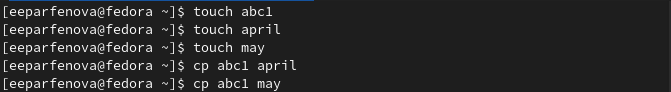{ #fig:001 width=40% }

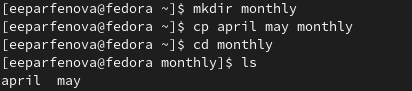{ #fig:002 width=40% }

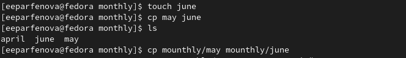{ #fig:003 width=40% }

## Выполнение примеров

(рис. [-@fig:004]) (рис. [-@fig:005])

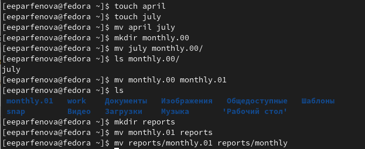{ #fig:004 width=40% }

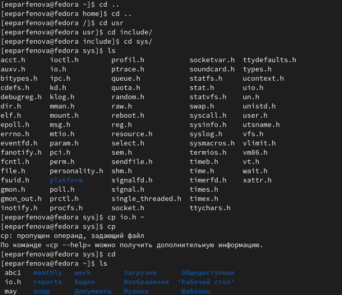{ #fig:005 width=40% }

## Копирование и переименование файла io.h

Далее мы должны скопировать io.h в домашний каталог командой ***cp io.h ~*** (рис. [-@fig:006]) и переимновать его командой ***mv io.h equipment***. (рис. [-@fig:007]).

{ #fig:006 width=40% }

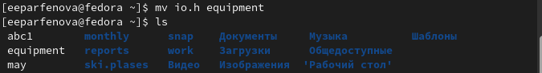{ #fig:007 width=50% }

## Перемещение и переименовывание файла equipment

Далее в домашнем каталоге мы создаем директорию ~/ski.plases с помощью ***mkdir*** (рис. [-@fig:008]) и перемещаем туда файл equipment с помощью команды ***mv equipment ski.plases***

 { #fig:008 width=70% }

После переименовываем equipment в equiplist командой ***mv ski.plases/equipment в ski.plases/equiplist (рис. [-@fig:009])

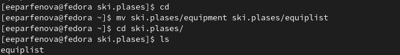{ #fig:009 width=60% }

## Копирование и переименовывание abc1. 

Создаем в домашнем каталоге файл abc1 и копируем его в каталог ~/ski.plases командой ***mv abc1 ski.plases/***. C помощью команды ***mv abc1  equiplist2*** переименовываем его.  (рис. [-@fig:010])

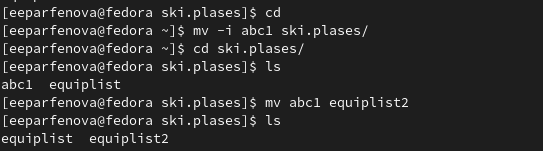{ #fig:010 width=40% }

Следующим шагом в ski.plases создаем новый каталог equipment командой ***mkdir***. (рис. [-@fig:011])

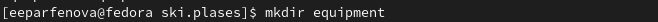{ #fig:011 width=40% }

## Перещение файловв каталог.

После перемещаем файлы equiplist и equiplist2 в созданный каталог командой ***mv***. (рис. [-@fig:012])

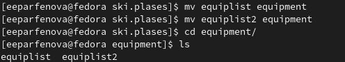{ #fig:012 width=70% }

## Перемещение и переименование каталога

После было необходимо создать каталог newdir командой ***mkdir*** и переместить его в ski.plases, используя ***mv***. С помощью команды ***mv newdir plans*** переименовываем каталог. (рис. [-@fig:013])

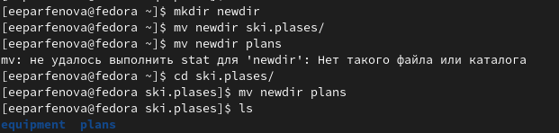{ #fig:013 width=70% }

## Изменение прав доступа к каталогам

Создаем каталог australia c помощью ***mkdir*** и командой ***chmod 744 australia*** изменяем выделенные права доступа на те, которые указаны в задании. (рис. [-@fig:014])

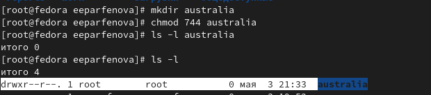{ #fig:014 width=50% }

Создаем каталог play. Командой ***сhmod 711 play*** изменяем права доступа. (рис. [-@fig:015])

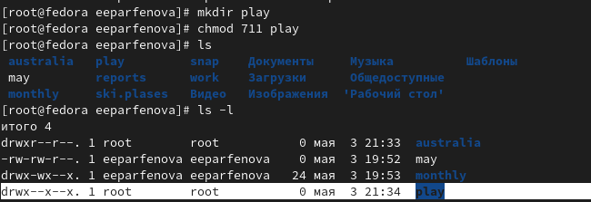{ #fig:015 width=50% }

## Изменение прав доступа к файлам

Создаем файл my_os командой ***touch***. Используя команду ***chmod 544 my_os***, изменяем права дступа на указанные. (рис. [-@fig:016])

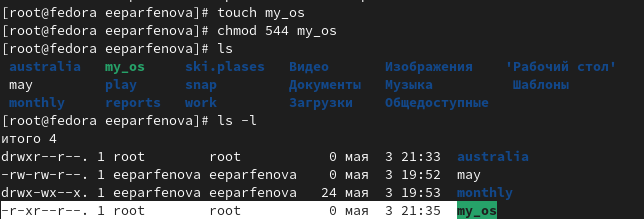{ #fig:016 width=50% }

Создав файл feathers, изменяем права доступа на нужные командой ***chmod 664***. (рис. [-@fig:017])

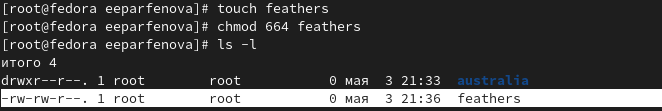{ #fig:017 width=50% }

## Команды ***cat*** и ***cp***

Следущим шагом смотрим содержимое файла /etc/password с помощью команды ***cat passwd***. (рис. [-@fig:018])

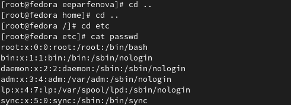{ #fig:018 width=50% }

Далее копируем  файл feathers в файл ~/file.old, который перед этим создаем, командой ***cp feathers file.old***. (рис. [-@fig:019])

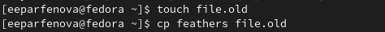{ #fig:019 width=50% }

## Команды ***mv*** и ***cp***

Перемещаем файл file.old в каталог ~/play, использовав ***mv file.old play***. (рис. [-@fig:020])

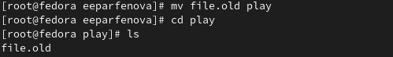{ #fig:020 width=50% }

После копируем каталог play в каталог ~/fun командой ***cp -r fun play***. (рис. [-@fig:021])

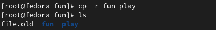{ #fig:021 width=50% }

## Команда ***mv***

Дальше перемещаем каталог fun в каталог ~/play командой ***mv fun play*** и называем его games, использовав ***mv fun games***. (рис. [-@fig:022])

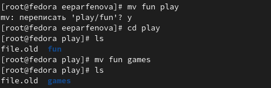{ #fig:022 width=70% }

## Команда ***chmod***. Право на чтение

После командой ***chmod u-r feathers*** лишаем владельца права на чтение. (рис. [-@fig:023])

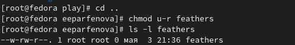{ #fig:023 width=70% }

После этого, если мы пытаемся просмотреть файл feathers с помощью ***cat***, этого не получается, так как права на чтение у владельца нет.  (рис. [-@fig:024])

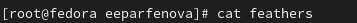{ #fig:024 width=70% }

## Команда ***chmod***. Право на чтение

Если мы пытаемся скопировать файл, используя ***cp***, то все проходит успешно и он копируется. (рис. [-@fig:025])

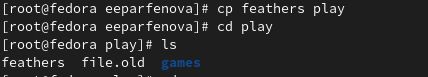{ #fig:025 width=50% }

Возвращаем владельцу право на чтение командой ***chmod u+r feathers***. (рис. [-@fig:026])

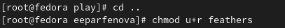{ #fig:026 width=50% }

## Команда ***chmod***. Право на выполнение

После командой ***chmod u-x play*** лишаем владельца права на выполнение. (рис. [-@fig:027])

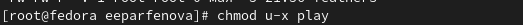{ #fig:027 width=40% }

Мы переходим в каталог play с помощью ***cd*** и все получается. (рис. [-@fig:028])

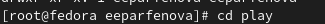{ #fig:028 width=40% }

Возрвращаем владельцу право на выполнение командой ***chmod u+x play***. (рис. [-@fig:029])

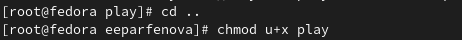{ #fig:029 width=40% }

## Справка о командах

Последним заданием было с помощью ***man*** прочитать справки по командам mount, fsck, mkfs, kill и кратко их охарактеризовать. 

- mount - команда для монтирования файловой системы в Linux. Команда позволяет присоединить хранящиеся на разных носителях файлы к общему дереву каталогов.

- fsck - команда, которая позволяет проверять согласованность и интерактивное исправление в одной или нескольких файловых систсемах. То есть она проверяет файловую систему на наличие ошибок и нерешенных проблем. 

## Справка о командах

- mkfs - команда, использующаяся для управления устройствами хранения файлов в Linux.  Она может создать файловую систему на некотором устройстве, например, в разделе жесткого диска

- kill - команда, которая посылает сигналы процессам по их идентификаторам. Обычно исользуется для устранения процессов.  

## Вывод

Мы ознакомились с файловой системой Linux, её структурой, именами и содержанием каталогов. Приобрели практические навыки по применению команд для работы с файлами и каталогами, по управлению процессами (и работами), по проверке использования диска и обслуживанию файловой системы.
