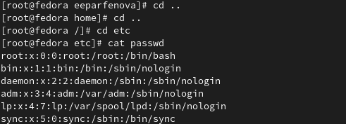

---
## Front matter
title: "Лабораторная работа №5"
subtitle: "Анализ файловой системы Linux. Команды для работы с файлами и каталогами"
author: "Парфенова Елизавета Евгеньевна"

## Generic otions
lang: ru-RU
toc-title: "Содержание"

## Bibliography
bibliography: bib/cite.bib
csl: pandoc/csl/gost-r-7-0-5-2008-numeric.csl

## Pdf output format
toc: true # Table of contents
toc-depth: 2
lof: true # List of figures
lot: true # List of tables
fontsize: 12pt
linestretch: 1.5
papersize: a4
documentclass: scrreprt
## I18n polyglossia
polyglossia-lang:
  name: russian
  options:
	- spelling=modern
	- babelshorthands=true
polyglossia-otherlangs:
  name: english
## I18n babel
babel-lang: russian
babel-otherlangs: english
## Fonts
mainfont: PT Serif
romanfont: PT Serif
sansfont: PT Sans
monofont: PT Mono
mainfontoptions: Ligatures=TeX
romanfontoptions: Ligatures=TeX
sansfontoptions: Ligatures=TeX,Scale=MatchLowercase
monofontoptions: Scale=MatchLowercase,Scale=0.9
## Biblatex
biblatex: true
biblio-style: "gost-numeric"
biblatexoptions:
  - parentracker=true
  - backend=biber
  - hyperref=auto
  - language=auto
  - autolang=other*
  - citestyle=gost-numeric
## Pandoc-crossref LaTeX customization
figureTitle: "Рис."
tableTitle: "Таблица"
listingTitle: "Листинг"
lofTitle: "Список иллюстраций"
lotTitle: "Список таблиц"
lolTitle: "Листинги"
## Misc options
indent: true
header-includes:
  - \usepackage{indentfirst}
  - \usepackage{float} # keep figures where there are in the text
  - \floatplacement{figure}{H} # keep figures where there are in the text
---

# Цель работы

Ознакомление с файловой системой Linux, её структурой, именами и содержанием каталогов. Приобретение практических навыков по применению команд для работы с файлами и каталогами, по управлению процессами (и работами), по проверке использования диска и обслуживанию файловой системы.

# Задание

1. Выполните все примеры, приведённые в первой части описания лабораторной работы.
2. Выполните следующие действия, зафиксировав в отчёте по лабораторной работе используемые при этом команды и результаты их выполнения:

    2.1. Скопируйте файл /usr/include/sys/io.h в домашний каталог и назовите его
equipment. Если файла io.h нет, то используйте любой другой файл в каталоге /usr/include/sys/ вместо него.

    2.2. В домашнем каталоге создайте директорию ~/ski.plases.

   2.3. Переместите файл equipment в каталог ~/ski.plases.

   2.4. Переименуйте файл ~/ski.plases/equipment в ~/ski.plases/equiplist.

   2.5. Создайте в домашнем каталоге файл abc1 и скопируйте его в каталог ~/ski.plases, назовите его equiplist2.

   2.6. Создайте каталог с именем equipment в каталоге ~/ski.plases.

   2.7. Переместите файлы ~/ski.plases/equiplist и equiplist2 в катало ~/ski.plases/equipment.

   2.8. Создайте и переместите каталог ~/newdir в каталог ~/ski.plases и назовите его plans.

3. Определите опции команды chmod, необходимые для того, чтобы присвоить перечисленным ниже файлам выделенные права доступа, считая, что в начале таких прав
нет:

   3.1. drwxr--r-- ... australia

   3.2. drwx--x--x ... play

   3.3. -r-xr--r-- ... my_os

   3.4. -rw-rw-r-- ... feathers

   При необходимости создайте нужные файлы.

4. Проделайте приведённые ниже упражнения, записывая в отчёт по лабораторной
работе используемые при этом команды:

   4.1. Просмотрите содержимое файла /etc/password.

    4.2. Скопируйте файл ~/feathers в файл ~/file.old.

    4.3. Переместите файл ~/file.old в каталог ~/play.

    4.4. Скопируйте каталог ~/play в каталог ~/fun.

    4.5. Переместите каталог ~/fun в каталог ~/play и назовите его games.

    4.6. Лишите владельца файла ~/feathers права на чтение.

    4.7. Что произойдёт, если вы попытаетесь просмотреть файл ~/feathers командой cat?

    4.8. Что произойдёт, если вы попытаетесь скопировать файл ~/feathers?

    4.9. Дайте владельцу файла ~/feathers право на чтение.

    4.10. Лишите владельца каталога ~/play права на выполнение.

    4.11. Перейдите в каталог ~/play. Что произошло?

    4.12. Дайте владельцу каталога ~/play право на выполнение.

5. Прочитайте man по командам mount, fsck, mkfs, kill и кратко их охарактеризуйте,
приведя примеры.

# Выполнение лабораторной работы

 Первым заданием было выполнить все примеры, описанные в лабораторной работе. (рис. [-@fig:001]) (рис. [-@fig:002]) (рис. [-@fig:003]) (рис. [-@fig:004]) (рис. [-@fig:005])

{ #fig:001 width=70% }

{ #fig:002 width=70% }

{ #fig:003 width=70% }

{ #fig:004 width=70% }

{ #fig:005 width=70% }

После я приступила ко второму заданию. Вначале проверила, сущетсвует ли файл io.h, а после скопировала его в домашний каталог командой ***cp io.h ~*** (рис. [-@fig:006]) и переимновала его командой ***mv io.h equipment***. (рис. [-@fig:007])

{ #fig:006 width=70% }

{ #fig:007 width=70% }
 
 Далее в домашнем каталоге создала директорию ~/ski.plases с помощью ***mkdir*** (рис. [-@fig:008]) и переместила туда файл equipment с помощью команды ***mv equipment ski.plases***

 { #fig:008 width=70% }

После я переименовала equipment в equiplist командой ***mv ski.plases/equipment в ski.plases/equiplist (рис. [-@fig:009])

{ #fig:009 width=70% }

После я создала в домашнем каталоге файл abc1 (команда ***touch***) и скопировала  его в каталог ~/ski.plases командой ***mv abc1 ski.plases/*** C помощью команды ***mv abc1  equiplist2*** я переименовала его.  (рис. [-@fig:010])

{ #fig:010 width=70% }

Следующим шагом я в ski.plases создала новый каталог equipment командой ***mkdir***. (рис. [-@fig:011])

{ #fig:011 width=70% }

После я перемстила файлы ~/ski.plases/equiplist и equiplist2 в созданный каталог командой ***mv***. (рис. [-@fig:012])

{ #fig:012 width=70% }

После я создала каталог newdir командой ***mkdir*** и перемтила его в ski.plases, используя ***mv***. С помощью команды ***mv newdir plans*** я переименовала каталог. (рис. [-@fig:013])

{ #fig:013 width=70% }

Создала каталог australia c помощью ***mkdir*** и командой ***chmod 744 australia*** изменила выделенные права доступа на те, которые указаны в задании. (рис. [-@fig:014])

{ #fig:014 width=70% }

Создала каталог play. Командой ***сhmod 711 play*** изменила права доступа. (рис. [-@fig:015])

{ #fig:015 width=70% }

Создала файл my_os командой ***touch***. Используя команду ***chmod 544 my_os***, изменила права дступа на указанные. (рис. [-@fig:016])

{ #fig:016 width=70% }

Создав файл feathers, изменила права доступа на нужные командой ***chmod 664***. (рис. [-@fig:017])

{ #fig:017 width=70% }

Следущим шагом я просмотрела содержимое файла /etc/password с помощью команды ***cat passwd***. (рис. [-@fig:018])

{ #fig:018 width=70% }

Далее я скопировала  файл feathers в файл ~/file.old, который перед этим создала с помощью ***touch***, командой ***cp feathers file.old***. (рис. [-@fig:019])

{ #fig:019 width=70% }

Переместила файл file.old в каталог ~/play, использовав ***mv file.old play***. (рис. [-@fig:020])

{ #fig:020 width=70% }

После скопировала каталог play в каталог ~/fun командой ***cp -r fun play***. (рис. [-@fig:021])

{ #fig:021 width=70% }

Дальше я переместила каталог fun в каталог ~/play командой ***mv fun play*** и назвала его games, использовав ***mv fun games***. (рис. [-@fig:022])

{ #fig:022 width=70% }

После командой ***chmod u-r feathers*** я лишила владельца права на чтение. (рис. [-@fig:023])

{ #fig:023 width=70% }

После этого попыталась просмотреть файл feathers с помощью ***cat***, однако это не вышло, так как права на чтение у меня нет.  (рис. [-@fig:024])

{ #fig:024 width=70% }

Я попыталась скопировать файл, используя ***cp***, и все проходит успешно и он скопировался. (рис. [-@fig:025])

{ #fig:025 width=70% }

Я вернула владельцу право на чтение командой ***chmod u+r feathers***. (рис. [-@fig:026])

{ #fig:026 width=70% }

Псоле командой ***chmod u-x play*** я лишила владельца права на выпоолнение. (рис. [-@fig:027])

{ #fig:027 width=70% }

Перешла в каталог play с помощью ***cd*** и все получилось. (рис. [-@fig:028])

{ #fig:028 width=70% }

Возрвратила владельцу право на выполнение командой ***chmod u+x play***. (рис. [-@fig:029])

{ #fig:029 width=70% }

Последним заданием было с помощью ***man*** прочитать справки по командам mount, fsck, mkfs, kill и кратко их охарактеризовать. (рис. [-@fig:030])

- mount - команда для монтирования файловой системы в Linux. Команда позволяет присоединить хранящиеся на разных носителях файлы к общему дереву каталогов.

- fsck - команда, которая позволяет проверять согласованность и интерактивное исправление в одной или нескольких файловых систсемах. То есть она проверяет файловую систему на наличие ошибок и нерешенных проблем. 

- mkfs - команда, использующаяся для управления устройствами хранения файлов в Linux.  Она может создать файловую систему на некотором устройстве, например, в разделе жесткого диска

- kill - команда, которая посылает сигналы процессам по их идентификаторам. Обычно исользуется для устранения процессов.  

{ #fig:030 width=70% }

# Выводы

Мы ознакомились с файловой системой Linux, её структурой, именами и содержанием каталогов. Приобрели практические навыки по применению команд для работы с файлами и каталогами, по управлению процессами (и работами), по проверке использования диска и обслуживанию файловой системы.

# Контрольные вопросы

1. Дайте характеристику каждой файловой системе, существующей на жёстком диске компьютера, на котором вы выполняли лабораторную работу.

С помощью команды df –T, мы можем познакомиться с файловыми системами · Файловая система devtmpfs была разработана для решения проблемы с доступностью устройств во время загрузки. Ядро создает файлы устройств по мере надобности, а также уведомляет менеджер udevd о том, что доступно новое устройство. После получения такого сигнала менеджер udevd не создает файлы устройств, а выполняет инициализацию устройства и отправляет уведомление процессу. Кроме того, он создает несколько символических ссылок в каталоге /dev для дальнейшей идентификации устройств. · Tmpfs — временное файловое хранилище в Unix . Предназначена для монтирования файловой системы, но размещается в ОЗУ вместо физического диска. Подобная конструкция является RAM диском.Все данные в Tmpfs являются временными, в том смысле, что ни одного файла не будет создано на жёстком диске. После перезагрузки все данные, содержащиеся в Tmpfs, будут утеряны. · Fourth extended file system , сокр. ext4, или ext4fs — журналируемая ФС, используемая в ОС с ядром Linux. Основана на ФС ext3, ранее использовавшейся по умолчанию во многих дистрибутивах GNU/Linux. · Распределенная сетевая файловая система AFS (Andrew File System) внедрена с целью создания единого файлового пространства пользователей при работе на различных фермах или рабочих станциях ОИЯИ, где домашний каталог пользователя определен как каталог в -AFS. Использование системы AFS позволяет пользователям осуществлять прямой доступ к файловому пространству других организаций, где эта система используется и где пользователь имеет регистрацию в AFS.

2.Приведите общую структуру файловой системы и дайте характеристику каждой директории первого уровня этой структуры.

Все каталоги можно разделить на две группы: для статической (редко меняющейся) информации – /bin, /usr и динамической (часто меняющейся) информации – /var, /tmp. Исходя из этого администраторы могут разместить каждый из этих каталогов на собственном носителе, обладающем соответствующими характеристиками. · Корневой каталог. Корневой каталог / является основой любой ФС UNIX. Все остальные каталоги и файлы располагаются в рамках структуры (дерева), порождённой корневым каталогом, независимо от их физического местонахождения. · /bin. В этом каталоге находятся часто употребляемые команды и утилиты системы общего пользования. Сюда входят все базовые команды, доступные даже если была примонтирована только корневая файловая система. Примерами таких команд являются:Ls,cp и т.д. · /boot. Директория содержит всё необходимое для процесса загрузки операционной системы: программу-загрузчик, образ ядра операционной системы и т.п.. · /dev. Каталог содержит специальные файлы устройств, являющиеся интерфейсом доступа к периферийным устройствам. Наличие такого каталога не означает, что специальные файлы устройств нельзя создавать в другом месте, просто достаточно удобно иметь один каталог для всех файлов такого типа. · /etc. В этом каталоге находятся системные конфигурационные файлы. В качестве примеров можно привести файлы /etc/fstab, содержащий список монтируемых файловых систем, и /etc/ resolv.conf, который задаёт правила составления локальных DNS-запросов. Среди наиболее важных файлов – скрипты инифиализации и деинициализации системы. В системах, наследующих особенности UNIX System V, для них отведены каталоги с /etc/rc0.d по /etc/rc6.d и общий для всех файл описания – /etc/inittab. · /home (необязательно). Директория содержит домашние директории пользователей. Её существование в корневом каталоге не обязательно и её содержимое зависит от особенностей конкретной UNIX-подобной операционной системы. · /lib. Каталог для статических и динамических библиотек, необходимых для запуска программ, находящихся-в директориях/bin,/sbin. · /mnt. Стандартный каталог для временного монтирования файловых систем – например, гибких и флэш-дисков, компакт-дисков и т. п. · /root (необязательно). Директория содержит домашюю директорию суперпользователя. Её существование в корневом каталоге не обязательно. · /sbin. В этом каталоге находятся команды и утилиты для системного администратора. Примерами таких команд являются: route, halt, init и др. Для аналогичных целей применяются директории /usr/sbin и /usr/local/sbin. · /usr. Эта директория повторяет структуру корневой директории – содержит каталоги /usr/ bin, /usr/lib, /usr/sbin, служащие для аналогичных целей. Каталог /usr/include содержит заголовочные файлы языка C для всевозможные библиотек, расположенных в системе. · /usr/local является следующим уровнем повторения корневого каталога и служит для хранения программ, установленных администратором в дополнение к стандартной поставке операционной системы. · /usr/share хранит неизменяющиеся данные для установленных программ. Особый интерес представляет каталог /usr/share/doc, в который добавляется документация ко всем установленным программам. · /var, /tmp. Используются для хранения временных данных процессов – системных и пользовательских соответственно.

3.Какая операция должна быть выполнена,чтобы содержимое некоторой файловой системы было доступно операционной системе?

С помощью команды cd мы переходим в каталог, в котором находится файл. С помощью less мы открываем этот файл.

4.Назовите основные причины нарушения целостности файловой системы. Какустранить повреждения файловой системы?

Основные причины нарушения целостности файловой системы: · Из-за прерывания операций ввода-вывода выполняемых непосредственно с диском; · Сбоя питания; · Краха ОС; · Нарушения работы дискового КЭШа; Устранение поврежденных файлов:В большинстве случаев, проверка файловой системы способна обнаружить и выполнить ремонт такой ошибки автоматически, и после завершения процесс начальной загрузки продолжится как обычно. Если проблема файловой системы более серьезна, проверка файловой системы не может решить проблему автоматически. В этом случае процесс надо будет запустить вручную.

5.Как создаётся файловая система?

Обычно при установке Linux создание файловых систем - компетенция инсталлятора, который осуществляет его с некоторыми опциями по умолчанию. Изменить характеристики, определенные для файловой системы при ее создании, невозможно без повторного выполнения этого процесса . Файловая система Ext2fs может быть создана любой из следующих команд - /sbin/mke2fs, / sbin/mkfs, /sbin/mkfs.ext2 с указанием файла устройства в качестве аргумента. Для создания XFS -mkfs.xfs (из пакета xfsprogs). Для создания файловой системы ext3fs -mke2fs с опцией j. Файловая система ReiserFS - /sbin/mkreiserfs из пакета reiserfsprogs.

6. Дайте характеристику командам, которые позволяют просмотреть текстовые файлы.

 Для просмотра небольших файлов -cat. (cat имя-файла) · Для просмотра больших файлов-less . (less имя-файла) · Для просмотра начала файла-head. По умолчанию она выводит первые 10 строк файла. (head [-n] имя-файла), n — количество выводимых строк. · Команда tail . выводит несколько (по умолчанию 10) последних строк файла. (tail [-n] имя-файла),n — количество выводимых строк.

7. Приведите основные возможности команды cp в Linux
При помощи команды cp осуществляется копирование файлов и каталогов (cp[-опции] исходный_файл целевой_файл)

Возможности команды ср: · копирование файла в текущем каталоге · копирование нескольких файлов в каталог · копирование файлов в произвольном каталоге · опция i в команде cp поможет избежать уничтожения информации в случае, если на место целевого файла вы поставите имя уже существующего файла(т.е. система попросит подтвердить, что вы хотите перезаписать этот файл) · Команда cp с опцией r (recursive) позволяет копировать каталоги вместе с входящими в них файлами и каталогами.

8. Назовите и дайте характеристику командам перемещения и переименованияфайлов и каталогов.

Команды mv и mvdir предназначены для перемещения и переименования файлов и каталогов. (mv [-опции] старый_файл новый_файл) Для получения предупреждения перед переписыванием файла стоит использовать опцию i.

9. Что такое права доступа? Как они могут быть изменены?

Права доступа - совокупность правил, регламентирующих порядок и условия доступа субъекта к объектам информационной системы (информации, её носителям, процессам и другим ресурсам) установленных правовыми документами или собственником, владельцем информации. Для изменения прав доступа к файлу или каталогу используется команда-chmod.( chmod режим имя_файла) Права доступа к файлу может поменять только владелец и администратор. Режим (в формате команды) имеет следующую структуру и способ записи: · = установить право · - лишить права · + дать право · r чтение · w запись · x выполнение · u (user) владелец файла · g (group) группа, к которой принадлежит владелец файла · (others) все остальные.

