---
## Front matter
lang: ru-RU
title: Лабораторная работа №6. Поиск файлов. Перенаправление ввода-вывода. Просмотр запущенных процессов.
author: Парфенова Елизаевта Евгеньевна
institute: RUDN University, Moscow, Russian Federation

## Formatting
toc: false
slide_level: 2
theme: metropolis
header-includes: 
 - \metroset{progressbar=frametitle,sectionpage=progressbar,numbering=fraction}
 - '\makeatletter'
 - '\beamer@ignorenonframefalse'
 - '\makeatother'
aspectratio: 43
section-titles: true
---

## Цель работы

Ознакомление с инструментами поиска файлов и фильтрации текстовых данных. Приобретение практических навыков: по управлению процессамим(и заданиями),по проверке использования диска и обслуживанию файловых систем.

## Задание

1. Осуществите вход в систему, используя соответствующее имя пользователя.
2. Запишите в файл file.txt названия файлов, содержащихся в каталоге /etc. Допишите в этот же файл названия файлов, содержащихся в вашем домашнем каталоге.
3. Выведите имена всех файлов из file.txt, имеющих расширение .conf, после чего
запишите их в новый текстовой файл conf.txt.
4. Определите, какие файлы в вашем домашнем каталоге имеют имена, начинавшиеся
с символа c? Предложите несколько вариантов, как это сделать.
5. Выведите на экран (по странично) имена файлов из каталога /etc, начинающиеся
с символа h.
6. Запустите в фоновом режиме процесс, который будет записывать в файл ~/logfile файлы, имена которых начинаются с log.

## Задание

7. Удалите файл ~/logfile.
8. Запустите из консоли в фоновом режиме редактор gedit.
9. Определите идентификатор процесса gedit, используя команду ps, конвейер и фильтр
grep. Как ещё можно определить идентификатор процесса?
10. Прочтите справку (man) команды kill, после чего используйте её для завершения
процесса gedit.
11. Выполните команды df и du, предварительно получив более подробную информацию
об этих командах, с помощью команды man.
12. Воспользовавшись справкой команды find, выведите имена всех директорий, имеющихся в вашем домашнем каталоге.

# Выполнение работы

## Запись фалов в file.txt

Первым шагом необходимо войти в систему с root правами.

 Далее, чтобы записать файлы из каталога /etc и домашнего каталога в file.txt неоходимо воспользоваться командами ***ls /etc >> /home/eeparfenova/file.txt*** и ***ls >> file.txt*** соответсвенно. (рис. [-@fig:001])

 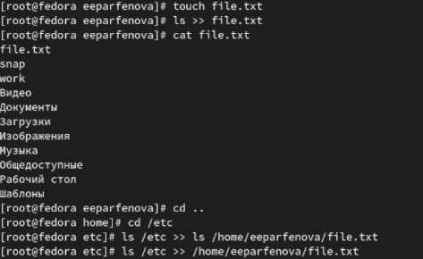{ #fig:001 width=60% }

## Запись файлов в conf.txt

Далее по заданию мы должны записать файлы из file.txt с раширением '.conf' в файл conf.txt. Это можно сделать с помощью команды ***grep'\.conf' file.txt >> conf.txt***. (рис. [-@fig:002])

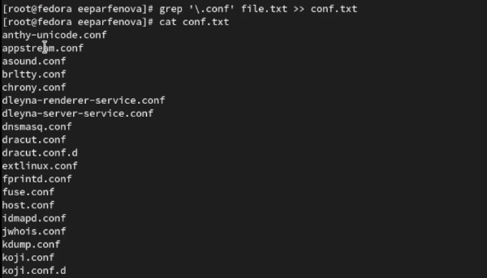{ #fig:002 width=70% }

## Поиск файлов, начинающихся на 'c'

После нам необходимо найти файлы домашнего каталог, которые начинаются на 'c'. Это можно сделать двумя способами. Первый - командой ***find -name "c*" -print***. (рис. [-@fig:003]) Второй - командой ***ls -R | grep ^c***. (рис. [-@fig:004])

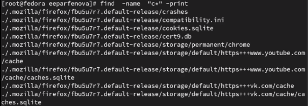{ #fig:003 width=40% }

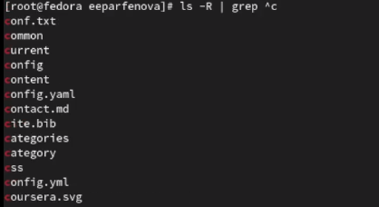{ #fig:004 width=40% }

## Поиск файлов, начинающихся на 'h'

Следующим шагом необходимо, перейдя в катлог /etc, постранично вывести его файлы, имена которых начинаются на h. Это можно выполнить командой ***grep h****. (рис. [-@fig:005])

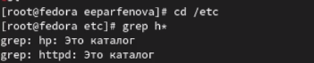{ #fig:005 width=70% }

## Работа с logfile

Командой ***find -name "log*" -print >> logfile &**  в фоновом режиме нужно заупстить процесс, который записывает в logfile все файлы, начинающиеся с 'log'. (рис. [-@fig:006]) После мы должны удалить logfile командой ***rm***. (рис. [-@fig:007])

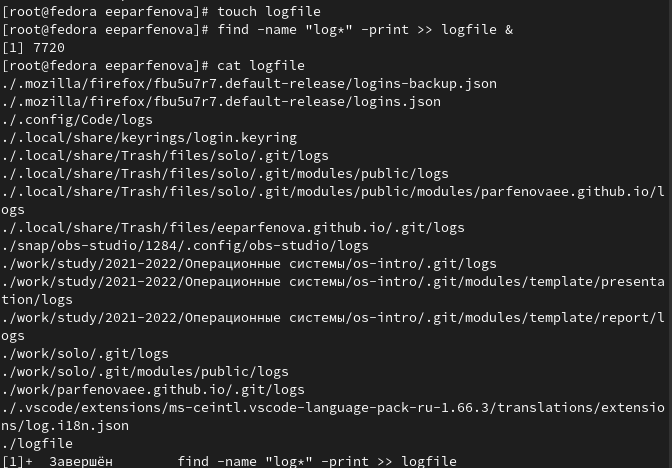{ #fig:006 width=40% }

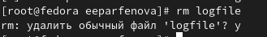{ #fig:007 width=50% }

## Процесс в фоновом режиме. Идентификатор

Следующим заданием нужно было  в фоновом режиме запустить редактор gedit. Это мы делаем комнадой ***gedit &***. (рис. [-@fig:008]). Идентификатор процесса сразу же высветился в терминале. Индентефикатор - 6249.

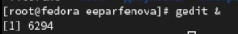{ #fig:008 width=40% }

 Однако его можно найти и другими способами. Можно ввести команду ***ps aux | grep gedit*** и посмотреть его. (рис. [-@fig:009]).  Либо же ввести просто ***ps aux*** и тогда найти нужный процесс среди всех, запущенных в системе. 

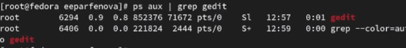{ #fig:009 width=40% }

## Устранение процесса

Следующим шагом нужно вызвать справку комнады ***kill*** с помощью ***man*** ипосмотрев синтаксис, устранить фоновый процесс, который запустила ранее. Для этого мы используем команду ***kill 6249***, где 6249 - идентификатор процесса. (рис. [-@fig:010])

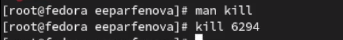{ #fig:010 width=70% }

##  Команды df и du

Далее мы узнаем подробнее о команде ***df***, используя ***man*** и выполняем команду ***df -vi*** из примера. (рис. [-@fig:011])

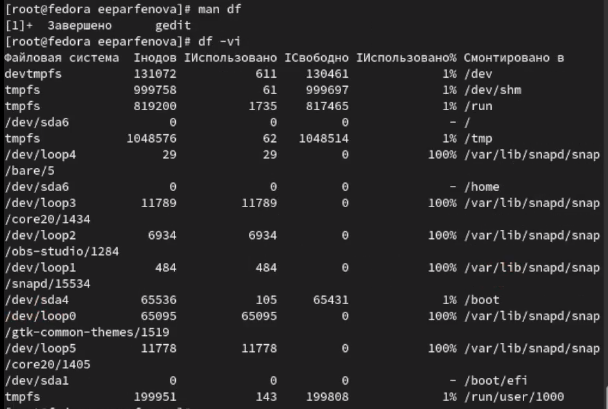{ #fig:011 width=30% }

Таким же способом узнаем о команде ***du*** и выполняем ***du -a ~/***. (рис. [-@fig:012])

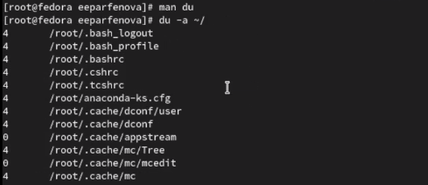{ #fig:012 width=30% }

## Имена директорий домашнего каталога

Последним заданием было вывести имена всех директорий, имеющихся в домашнем каталоге, с помощью ***find***. Используя ***man***, мы находим нужную опцию и вводим команду ***find -maxdepth 1***. (рис. [-@fig:013])

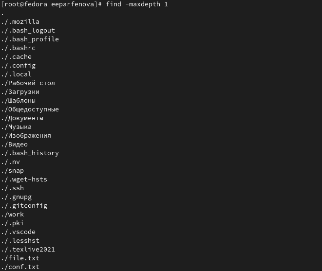{ #fig:013 width=60% }

## Вывод

Таким образом, мы ознакомились с инструментами поиска файлов и фильтрации тектсовых данных и приобрели прктические навыки по:

 - управлению процессамим(и заданиями)

 - проверке использования диска и обслуживанию файловых систем.