---
## Front matter
title: "Лабораторная работа №6"
subtitle: "Поиск файлов. Перенаправление ввода-вывода. Просмотр запущенных процессов"
author: "Парфенова Елизавета Евгеньевна"

## Generic otions
lang: ru-RU
toc-title: "Содержание"

## Bibliography
bibliography: bib/cite.bib
csl: pandoc/csl/gost-r-7-0-5-2008-numeric.csl

## Pdf output format
toc: true # Table of contents
toc-depth: 2
lof: true # List of figures
lot: true # List of tables
fontsize: 12pt
linestretch: 1.5
papersize: a4
documentclass: scrreprt
## I18n polyglossia
polyglossia-lang:
  name: russian
  options:
	- spelling=modern
	- babelshorthands=true
polyglossia-otherlangs:
  name: english
## I18n babel
babel-lang: russian
babel-otherlangs: english
## Fonts
mainfont: PT Serif
romanfont: PT Serif
sansfont: PT Sans
monofont: PT Mono
mainfontoptions: Ligatures=TeX
romanfontoptions: Ligatures=TeX
sansfontoptions: Ligatures=TeX,Scale=MatchLowercase
monofontoptions: Scale=MatchLowercase,Scale=0.9
## Biblatex
biblatex: true
biblio-style: "gost-numeric"
biblatexoptions:
  - parentracker=true
  - backend=biber
  - hyperref=auto
  - language=auto
  - autolang=other*
  - citestyle=gost-numeric
## Pandoc-crossref LaTeX customization
figureTitle: "Рис."
tableTitle: "Таблица"
listingTitle: "Листинг"
lofTitle: "Список иллюстраций"
lotTitle: "Список таблиц"
lolTitle: "Листинги"
## Misc options
indent: true
header-includes:
  - \usepackage{indentfirst}
  - \usepackage{float} # keep figures where there are in the text
  - \floatplacement{figure}{H} # keep figures where there are in the text
---

# Цель работы

Ознакомление с инструментами поиска файлов и фильтрации текстовых данных. Приобретение практических навыков: по управлению процессамим(и заданиями),по проверке использования диска и обслуживанию файловых систем.

# Задание

1. Осуществите вход в систему, используя соответствующее имя пользователя.
2. Запишите в файл file.txt названия файлов, содержащихся в каталоге /etc. Допишите в этот же файл названия файлов, содержащихся в вашем домашнем каталоге.
3. Выведите имена всех файлов из file.txt, имеющих расширение .conf, после чего
запишите их в новый текстовой файл conf.txt.
4. Определите, какие файлы в вашем домашнем каталоге имеют имена, начинавшиеся
с символа c? Предложите несколько вариантов, как это сделать.
5. Выведите на экран (по странично) имена файлов из каталога /etc, начинающиеся
с символа h.
6. Запустите в фоновом режиме процесс, который будет записывать в файл ~/logfile файлы, имена которых начинаются с log.
7. Удалите файл ~/logfile.
8. Запустите из консоли в фоновом режиме редактор gedit.
9. Определите идентификатор процесса gedit, используя команду ps, конвейер и фильтр
grep. Как ещё можно определить идентификатор процесса?
10. Прочтите справку (man) команды kill, после чего используйте её для завершения
процесса gedit.
11. Выполните команды df и du, предварительно получив более подробную информацию
об этих командах, с помощью команды man.
12. Воспользовавшись справкой команды find, выведите имена всех директорий, имеющихся в вашем домашнем каталоге.

# Выполнение лабораторной работы

Первым шагом я вошла в систему с root правами. (рис. [-@fig:001])

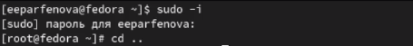{ #fig:001 width=70% }

После я перешла в домашний каталог (/home/eeparfenova) и создала там файл file.txt. Далее с помощью команды ***ls >> file.txt*** я записала названия файлов домашнего каталога в созданный ранее файл. Командой ***cat*** проверила, все ли прошло успешно. Потом я перешла в катлог /etc и командой ***ls /etc >> /home/eeparfenova/file.txt*** я переписала названия файлов оттуда в файл file.txt.(рис. [-@fig:002])

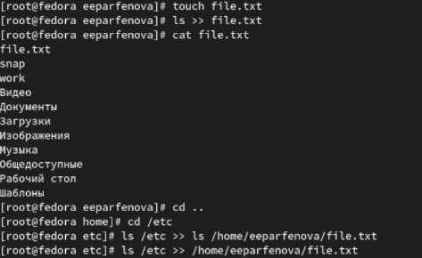{ #fig:002 width=70% }

Далее я командой ***cat*** проверила содержимое file.txt. Все нужные файлы там были. (рис. [-@fig:003])

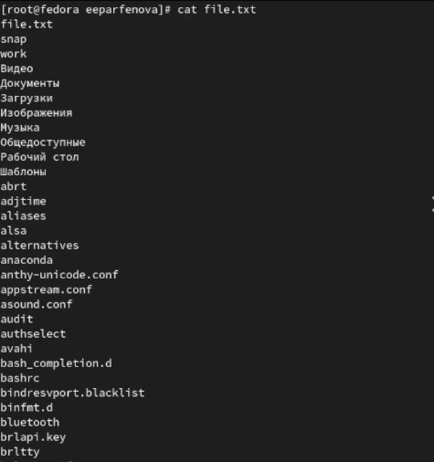{ #fig:003 width=70% }

Следующим шагом, вернувшись в домашний каталог, я создала файл conf.txt и командой ***grep'\.conf' file.txt*** нашла все файлы в file.txt, имеющие расширение .conf. (рис. [-@fig:004])

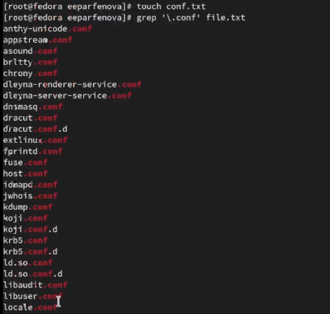{ #fig:004 width=70% }

После я записала все найденные файлы в conf.txt командой ***grep'\.conf' file.txt >> conf.txt***.  Команда ***cat*** проверила выполнение. (рис. [-@fig:005])

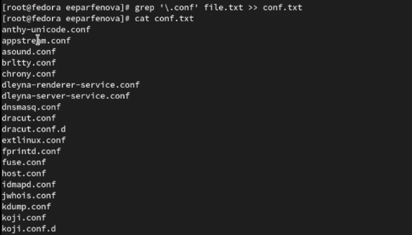{ #fig:005 width=70% }

Далее, по заднию, командой ***find -name "c*" -print*** я нашла все файлы домашнего каталога, которые начинаются на 'c'. (рис. [-@fig:006])

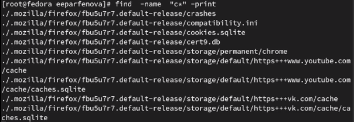{ #fig:006 width=70% }

Требовалось найти такие фалы разными способами, поэтому я нашла их еще одной командой ***ls -R | grep ^c***. (рис. [-@fig:007])

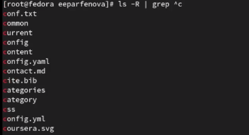{ #fig:007 width=70% }

Следующим шагом я, перейдя в катлог /etc, постранично вывела его файлы, имена которых начинались на h командой ***grep h****. (рис. [-@fig:008])

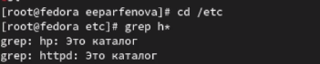{ #fig:008 width=70% }

Далее я вернулась в домашний каталог и создала там файл logfile. Командой ***find -name "log*" -print >> logfile &** я в фоновом режиме запустила процесс, который записывает в logfile все файлы, начинающиеся с 'log'. Команда ***cat*** проверила выполнение.  (рис. [-@fig:009])

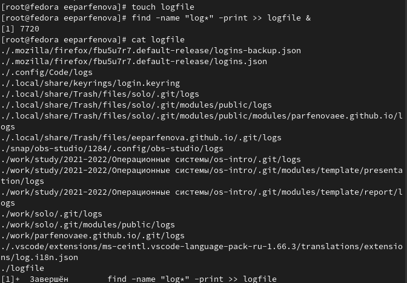{ #fig:009 width=70% }

После я удалила logfile командой ***rm***. (рис. [-@fig:010])

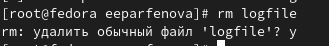{ #fig:010 width=70% }

Следующим заданием было в фоновом режиме запустить редактор gedit. Это я сделала комнадой ***gedit &***. (рис. [-@fig:011])

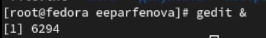{ #fig:011 width=70% }

Далее требовлось определить идентефикатор этого процесса. Вообще, он после запуска процесса сам появился на экране. Но также его можно определить, введя команду ***ps aux | grep gedit***. Индентефикатор - 6249. (рис. [-@fig:012])

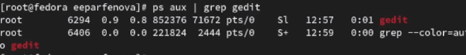{ #fig:012 width=70% }

Можно было ввести команду без grep ***ps aux*** и тогда найти нужный процесс среди всех, запущенных в системе. (рис. [-@fig:013]) (рис. [-@fig:014])

{ #fig:013 width=70% }

{ #fig:014 width=70% }

Следующим шагом я вызвала справку комнады ***kill*** с помощью ***man*** и устранила фоновый процесс, который запустила ранее. Для этого использовала команду ***kill 6249***, где 6249 - идентификатор процесса.
(рис. [-@fig:015])

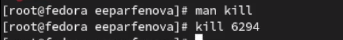{ #fig:015 width=70% }

Узнала подробнее о команде ***df***, используя ***man*** и выполнила команду ***df -vi*** из примера. (рис. [-@fig:016])

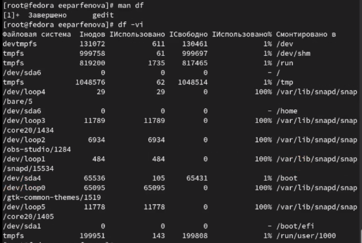{ #fig:016 width=70% }

Таким же способом узнала о команде ***du*** и выполнила ***du -a ~/***. (рис. [-@fig:017])

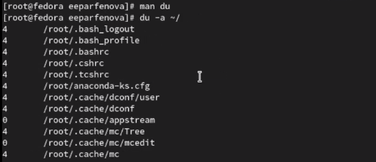{ #fig:017 width=70% }

Последним заданием было вывести имена всех директорий, имеющихся в домашнем каталоге, с помощью ***find***. Используя ***man***, я нашла нужную опцию и ввела команду ***find -maxdepth 1***. (рис. [-@fig:018])

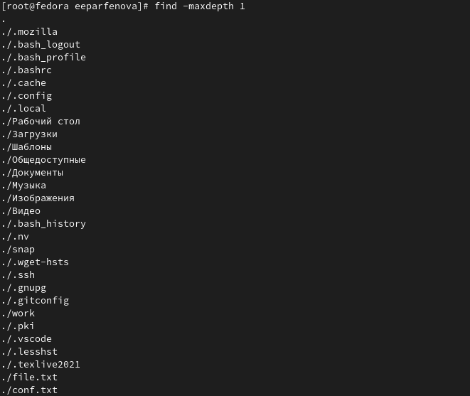{ #fig:018 width=70% }

# Выводы

Таким образом, мы ознакомились с инструментами поиска файлов и фильтрации тектсовых данных и приобрели прктические навыки по:

 - управлению процессамим(и заданиями)

 - проверке использования диска и обслуживанию файловых систем.

# Контрольные вопросы

1. Какие потоки ввода вывода вы знаете?

В системе по умолчанию открыто три специальных потока:

– stdin — стандартный поток ввода (по умолчанию: клавиатура), файловый дескриптор 0;

– stdout — стандартный поток вывода (по умолчанию: консоль), файловый дескриптор 1;

– stderr — стандартный поток вывод сообщений об ошибках (по умолчанию: консоль), файловый дескриптор 2.

2. Объясните разницу между операцией > и >>.

- Операция > перезаписывает существующие файлы или создает новые, если файла с указанным именем не существует.
- Операция >> добавляет существующий файл или создает новый, если файл с указанным именем отсутствует.

3. Что такое конвейер?

Конвейр - способ объединения простых команд или утилит в цепочки, в которых результат работы предыдущей команды передаётся последующей.

4. Что такое процесс? Чем это понятие отличается от программы?

Процесс - это программа, выполняющаяся в отдельном виртуальном адресном пространстве. По сути, каждый процесс - это экзепляр программы, выполняемой компьютером, а программа - набор инструкци для выполнения какой-то задачи. Процесс, в отличие от программы, живет меньше и требует определенные ресурсы компьютера (память, устройтсво ввода-вывода, процессор)

5. Что такое PID и GID?

PID (Process ID) - идентификтаор процесса.

GID (Group ID) -идентификатор группы.

6. Что такое задачи и какая команда позволяет ими управлять?

Задачи - запущенные в фоновом ржиме программы. Ими можно управлять с помощью команды jobs.

7. Найдите информацию об утилитах top и htop. Каковы их функции?

top - консольная команда, которая выводит список работающих в системе процессов и информацию о них. По умолчанию она в реальном времени сортирует их по нагрузке на процессор. 

htop - аналог top. Она показывает динамический список системных процессов, список обычно выравнивается по использованию ЦПУ. В отличие от top, htop показывает все процессы в системе. Также показывает время непрерывной работы, использование процессоров и памяти. 

8. Назовите и дайте характеристику команде поиска файлов. Приведите примеры использования этой команды.

Поиск файлов осущесвляется с помощью команды find. Она может вывести файлы, соответсвующи е заданной строке символов. Синтаксис: find путь [ -опции ]. Путь определяет каталог, начиная с которого по всем подкаталогам будет вестись
поиск.

Примеры:

find -name "for*" -print

Данная команда в текущем каталоге найдет файлы, начинающиеся с for и выведет их на экран. Также примеры можно увидеть в выполнении лабораторной работы.

9. Можно ли по контексту (содержанию) найти файл? Если да, то как?

Можно, это делается с помощью команды grep. Данная команда позволяет найти в текстовом файле указанную строку символов.

10. Как определить объем свободной памяти на жёстком диске?

Jбъем свободной памяти на жёстком диске можно определить с помощью команды ***df***

11. Как определить объем вашего домашнего каталога?

Объем домашнего каталога можно определить с помощью команды ***du***

12. Как удалить зависший процесс?

Удалить завиший процесс можно командой ***kill***, указав идентификтаор процесса или командой ***kilall***

