---
## Front matter
lang: ru-RU
title: Лабораторная работа №7. Командная оболочка Midnight Commander.
author: Парфенова Елизаевта Евгеньевна
institute: RUDN University, Moscow, Russian Federation

## Formatting
toc: false
slide_level: 2
theme: metropolis
header-includes: 
 - \metroset{progressbar=frametitle,sectionpage=progressbar,numbering=fraction}
 - '\makeatletter'
 - '\beamer@ignorenonframefalse'
 - '\makeatother'
aspectratio: 43
section-titles: true
---

## Цель работы

Освоение основных возможностей командной оболочки Midnight Commander. Приобретение навыков практической работы по просмотру каталогов и файлов; манипуляций с ними.

## Задание

7.3.1. Задание по mc

1. Изучите информацию о mc, вызвав в командной строке man mc.

2. Запустите из командной строки mc, изучите его структуру и меню.

3. Выполните несколько операций в mc, используя управляющие клавиши (операции с панелями; выделение/отмена выделения файлов, копирование/перемещение файлов, получение информации о размере и правах доступа на файлы и/или каталоги и т.п.)

4. Выполните основные команды меню левой (или правой) панели. Оцените степень подробности вывода информации о файлах.

5. Используя возможности подменю Файл , выполните:

    – просмотр содержимого текстового файла;

    – редактирование содержимого текстового файла (без сохранения результатов редактирования);

    – создание каталога;

    – копирование в файлов в созданный каталог.

## Задание

6. С помощью соответствующих средств подменю Команда осуществите:

    – поиск в файловой системе файла с заданными условиями (например, файла с расширением .c или .cpp, содержащего строку main);

   – выбор и повторение одной из предыдущих команд;

   – переход в домашний каталог;

   – анализ файла меню и файла расширений.

7. Вызовите подменю Настройки . Освойте операции, определяющие структуру экрана mc
(Full screen, Double Width, Show Hidden Files и т.д.)ю

  7.3.2. Задание по встроенному редактору mc

1. Создайте текстовой файл text.txt.

2. Откройте этот файл с помощью встроенного в mc редактора.

3. Вставьте в открытый файл небольшой фрагмент текста, скопированный из любого другого файла или Интернета.

## Задание

4. Проделайте с текстом следующие манипуляции, используя горячие клавиши:

    4.1. Удалите строку текста.

    4.2. Выделите фрагмент текста и скопируйте его на новую строку.

    4.3. Выделите фрагмент текста и перенесите его на новую строку.

    4.4. Сохраните файл.

    4.5. Отмените последнее действие.

    4.6. Перейдите в конец файла (нажав комбинацию клавиш) и напишите некоторый текст.

    4.7. Перейдите в начало файла (нажав комбинацию клавиш) и напишите некоторый текст.

    4.8. Сохраните и закройте файл.

5. Откройте файл с исходным текстом на некотором языке программирования (например C или Java)

6. Используя меню редактора, включите подсветку синтаксиса, если она не включена,
или выключите, если она включена.

# Выполнение работы

## Справка об mc

Первым задание было посмотреть справку об mc. Делаем это с помощью команды ***man mc***. (рис. [-@fig:001])

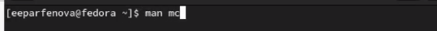{ #fig:001 width=60% }

Далее открываем командную оболочку через комнаду в терминале ***mc***. (рис. [-@fig:002])

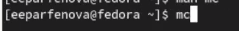{ #fig:002 width=60% }

## Структура и меню mc

Смотрим его структуру. Справа и слева открыты каталоги, которые можно выбрать. Внизу есть командная строка, с помощью которой можно проводить различные манипуляции с выбранными каталогами. В самом низу указаны горячие клавиши. Самая верхня строчка представляет собой меню. Обратиться к нему можно через *F9*. В этой строке есть пять подменю. С помощью *Enter* эти подменю можно посмотреть подробнее. (рис. [-@fig:003])

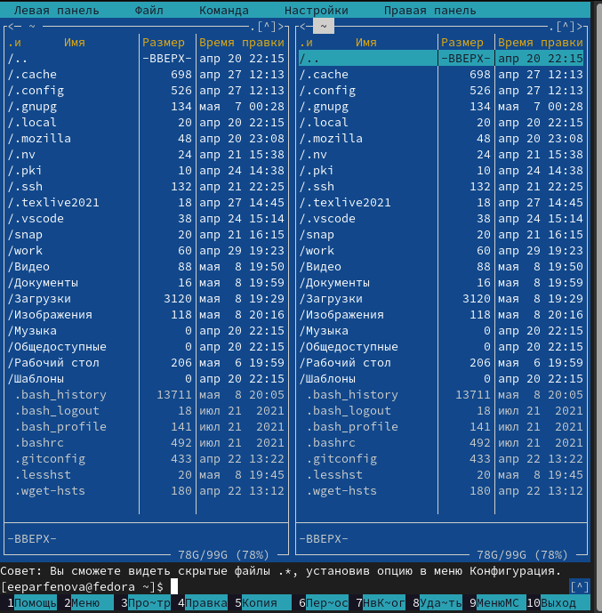{ #fig:003 width=30% }

## Операции с панелями

Выполним различные операции с помощью горячих клавиш mc.
Комбинация клавиш *Ctrl+U* меняет панели местами. (рис. [-@fig:004])

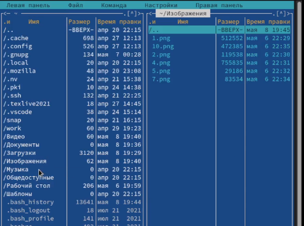{ #fig:004 width=40% }

## Операции с панелями

Комбинация *Ctrl+O* выключает обе панели и оставляет только командную строку, причем находиться вы будете в том каталоге, в котором находитесь в mc. (рис. [-@fig:005])

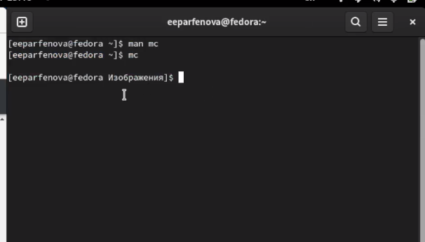{ #fig:005 width=40% }

## Выделение файлов

Работа с файлами. *Ctrl+T* помогает выделить один или несколько файлов, причем выделять их можно не попорядку.  (рис. [-@fig:006])

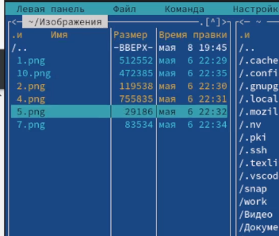{ #fig:006 width=50% }

## Копирование файлов

Копирование файлов осуществляется засчет *F5*.Выделенный файл обычно копируется в тот ктаалог, который открыт в другой панели. (рис. [-@fig:007])

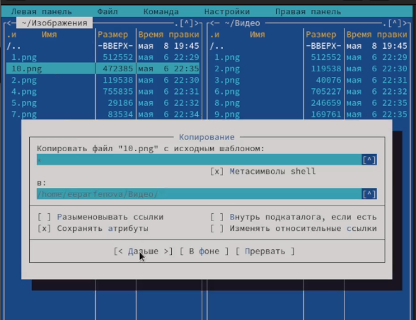{ #fig:007 width=40% }

## Перемещение файлов

Перемещать файлы можно с помощью *F6*. (рис. [-@fig:008])

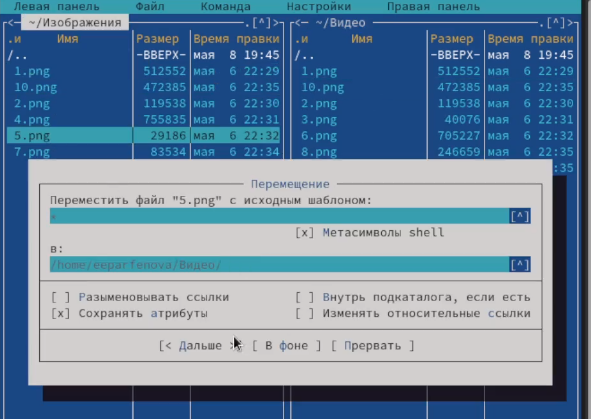{ #fig:008 width=40% }

## Права доступа к файлу

В mc также возможно изменить права доступа. Это делается с помощью клавиш *Ctrl+x c*  (рис. [-@fig:009])

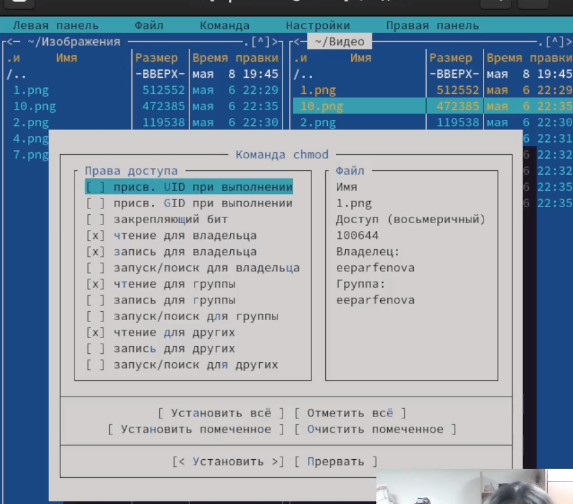{ #fig:009 width=50% }

## Информация о каталоге

Далее я начала работать с панелями. Об открытых в них каталогах можно вывести информацию с помощью *Ctrl+x i* или открыв нужное в Меню. Менеджер выводит информацию на одной из панелей, и она достаточно полная. (рис. [-@fig:010])

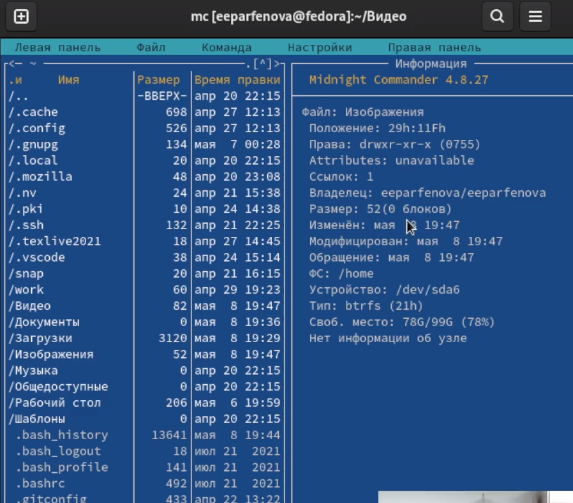{ #fig:010 width=50% }

## Открытие файла в режиме просмотра

 Просмотреть содержимое файла можно с помощью *F3*. (рис. [-@fig:011])

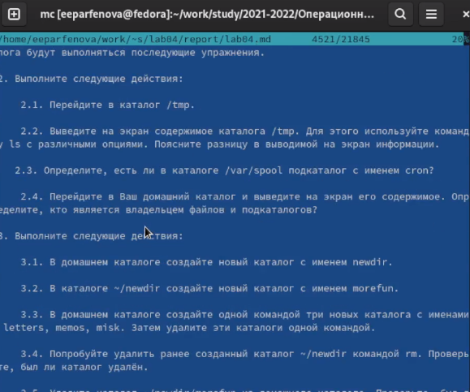{ #fig:011 width=50% }

## Открытие файла в режиме редактирования

Открыть же файл в режиме редактирования можно, измпользуя клавишу *F4*. (рис. [-@fig:012])

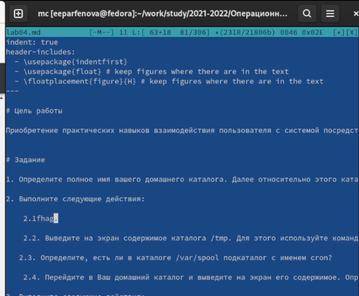{ #fig:012 width=50% }

## Создание каталога

Далее было необходимо создать новый каталог. Это делаем с помощью *F7*. Можно назвать его new. (рис. [-@fig:013])

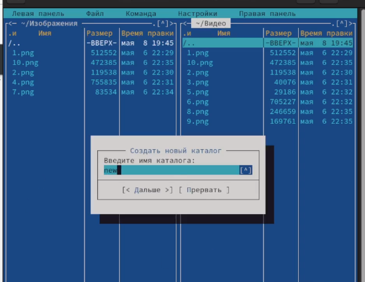{ #fig:013 width=70% }

## Заполнение каталога

После копируем в него файлы, открыв на одной из панелей нужный каталог, а на другой файлы, которые нужно скопировать. Делаем это, использовав *F5*. (рис. [-@fig:014])

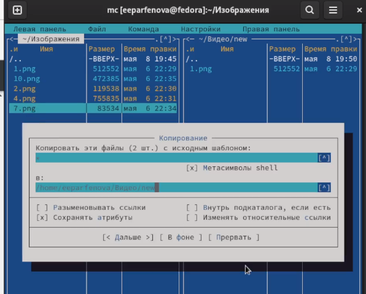{ #fig:014 width=50% }

## Поиск файлов в mc

Работа с командной строкой. Необходимо было в выбранном каталоге найти какие-то файлы. Это мы делаем командой ***find -name '*.png' -print. Можно, как выполнилась команда, временно закрыв панели известным способом.  (рис. [-@fig:015])

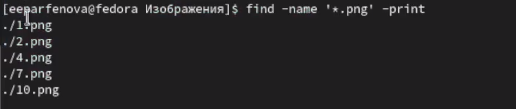{ #fig:015 width=70% }

## Команда из истории

Чтобы повторить команду, которую делали ранее, снова нажмаем *Ctrl+O*, закрыв панели, и стрелкой *вверх* переходим на предыдущие команды. Повторить можно только сделанную команду. Также осуществить переход на предыдущую команду можно с помощью *Alt+P*, не закрывая панели. (рис. [-@fig:016])

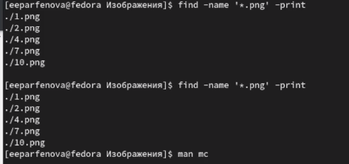{ #fig:016 width=70% }

## Домашний каталог, файл расширений и файл меню

Перйети в домашний каталог можно привычным способом. Находясь в каком-то другом подкаталоге, мы просто вводим в командную строку ***cd***.

После с помощью подменю Команда я посмотрела файл раширений, в котором указана информация о расширениях в mc. 

А потом там же открыла файл меню, выбрав пользовательский формат. В файле написан код, по которому работает Меню. 

## Настройки

Вызываем подменю Настройки и изучаем его. В нем можно скорректировать настройки работы с панелями; поменять  внешний вид и настройку панелей; протестировать функциональные клавиши; установить или убрать окно, которое запрашивает подтверждение действий после какой-либо операции; задать формат обработки ифнормации локальным терминалом. (рис. [-@fig:017])

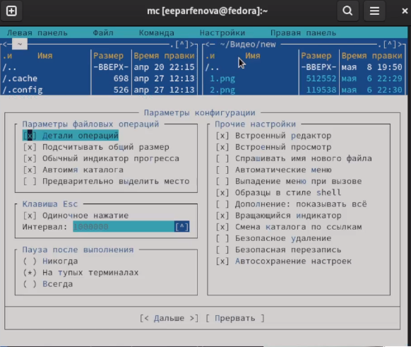{ #fig:017 width=40% }

## Создание файла в mc

Следующим задание была работа со втроенным редактором mc.
Вначале мы  создаем файл с помощью команды ***touch text.txt*** в командной строке менеджера, выбрав перед этим каталог, в котором будет лежать файл. (рис. [-@fig:018]) 

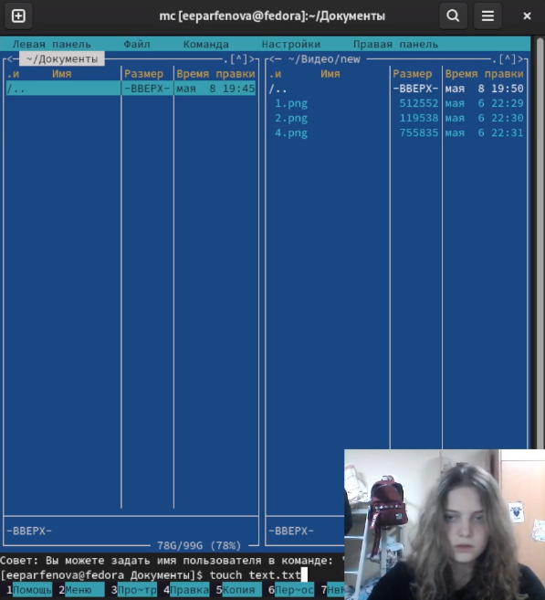{ #fig:018 width=40% }

## Открытие файла 

Далее открываем файл в текстовом редакторе через *F4* (в режиме правки) и вставляем туда любой текст (рис. [-@fig:019])

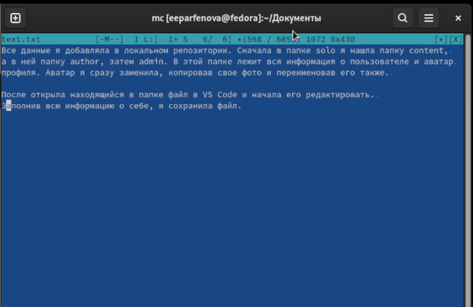{ #fig:019 width=40% }

## Удаление строки

После было необходимо удалить строку текста с помощью горячих клавиш. Нужно установить курсор на нужной строке и комбинацией *Ctrl+Y* удалить ее. (рис. [-@fig:020])

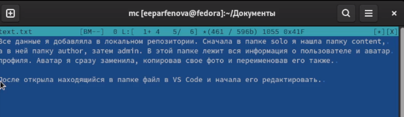{ #fig:020 width=40% }

## Копирование и перенос текста

После, использовав *F3* и стрелку *вправо*, выделяем нужный фрагмент текста, нажимаем *Enter* и с помощью *F5* копируем его. (рис. [-@fig:021])

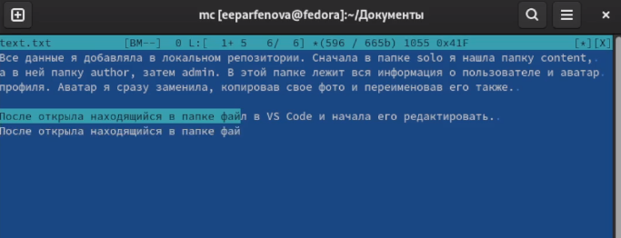{ #fig:021 width=40% }

После таким же способом выделяем другой кусочек текста и, исполльзовав *F6*, переносим его на новую строку (рис. [-@fig:022])

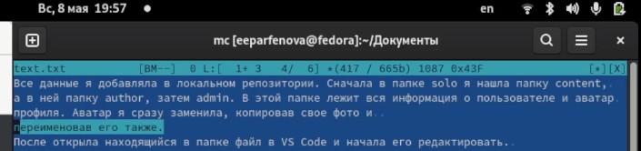{ #fig:022 width=40% }

## Сохранение и отмена последнего действия

Далее сохраняем файл, нажав *F2* и подтвердив запрос.  (рис. [-@fig:023])

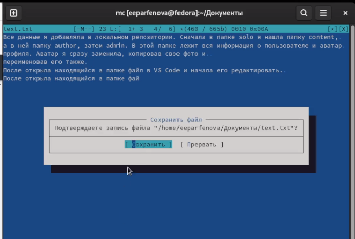{ #fig:023 width=40% }

После отменяем последнее действие (перенос текста на новую строку) с помощью комбинации клавиш *Ctrl+U*. (рис. [-@fig:024])

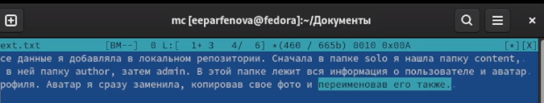{ #fig:024 width=40% }

## Переход в начало и в конец файла

Потом переходим в конец файла комбинацией *Ctrl+pgdn* (можно использовать *Ctrl+end* ) и записываем там некоторый текст.  Далее комбинацией *Ctrl+home* (можно использовать *Ctrl+pgup* ) переходим в начало текста и пишем там строку. (рис. [-@fig:025])

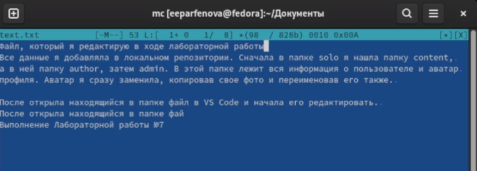{ #fig:025 width=70% }

## Сохранение и закрытие файла

После сохраняем файл также через *F2* и закрываем его с помощью *esc*. (рис. [-@fig:026])

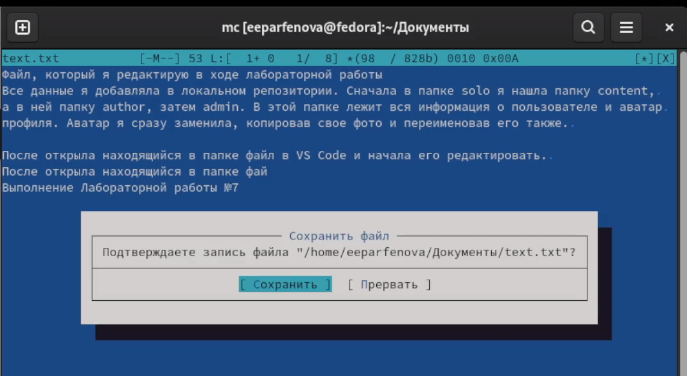{ #fig:026 width=70% }

## Загрузка файла с кодом

Следующим шагом заходим любой код программы и открываем этот файл в редакторе. У меня подсветки синтаксиса там изначально не было. (рис. [-@fig:027])

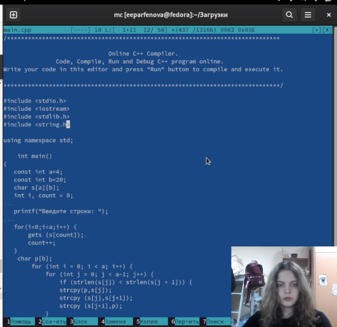{ #fig:027 width=50% }

## Включение подсветки

Подсветку можно включить либо в подменю Файл, либо с помощью комбинации клавиш *Ctrl+S*. (рис. [-@fig:028])

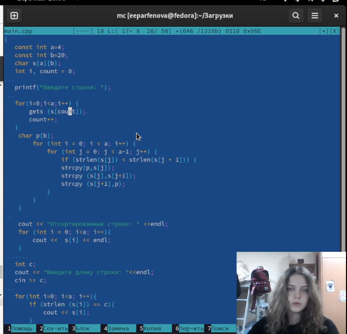{ #fig:028 width=50% }

## Вывод

Мы освоили основные возможности командной оболочки Midnight Commander и приобрели навыки практической работы по просмотру каталогов и файлов; манипуляций с ними.