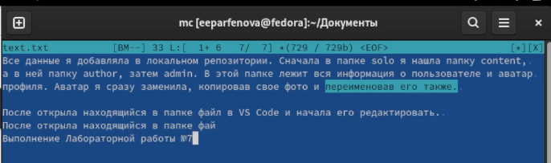

---
## Front matter
title: "Лабораторная работа №7"
subtitle: "Командная оболочка Midnight Commander"
author: "Парфенова Елизавета Евгеньевна"

## Generic otions
lang: ru-RU
toc-title: "Содержание"

## Bibliography
bibliography: bib/cite.bib
csl: pandoc/csl/gost-r-7-0-5-2008-numeric.csl

## Pdf output format
toc: true # Table of contents
toc-depth: 2
lof: true # List of figures
lot: true # List of tables
fontsize: 12pt
linestretch: 1.5
papersize: a4
documentclass: scrreprt
## I18n polyglossia
polyglossia-lang:
  name: russian
  options:
	- spelling=modern
	- babelshorthands=true
polyglossia-otherlangs:
  name: english
## I18n babel
babel-lang: russian
babel-otherlangs: english
## Fonts
mainfont: PT Serif
romanfont: PT Serif
sansfont: PT Sans
monofont: PT Mono
mainfontoptions: Ligatures=TeX
romanfontoptions: Ligatures=TeX
sansfontoptions: Ligatures=TeX,Scale=MatchLowercase
monofontoptions: Scale=MatchLowercase,Scale=0.9
## Biblatex
biblatex: true
biblio-style: "gost-numeric"
biblatexoptions:
  - parentracker=true
  - backend=biber
  - hyperref=auto
  - language=auto
  - autolang=other*
  - citestyle=gost-numeric
## Pandoc-crossref LaTeX customization
figureTitle: "Рис."
tableTitle: "Таблица"
listingTitle: "Листинг"
lofTitle: "Список иллюстраций"
lotTitle: "Список таблиц"
lolTitle: "Листинги"
## Misc options
indent: true
header-includes:
  - \usepackage{indentfirst}
  - \usepackage{float} # keep figures where there are in the text
  - \floatplacement{figure}{H} # keep figures where there are in the text
---

# Цель работы

Освоение основных возможностей командной оболочки Midnight Commander. Приобретение навыков практической работы по просмотру каталогов и файлов; манипуляций с ними.

# Задание

7.3.1. Задание по mc

1. Изучите информацию о mc, вызвав в командной строке man mc.

2. Запустите из командной строки mc, изучите его структуру и меню.

3. Выполните несколько операций в mc, используя управляющие клавиши (операции с панелями; выделение/отмена выделения файлов, копирование/перемещение файлов, получение информации о размере и правах доступа на файлы и/или каталоги и т.п.)

4. Выполните основные команды меню левой (или правой) панели. Оцените степень подробности вывода информации о файлах.

5. Используя возможности подменю Файл , выполните:

    – просмотр содержимого текстового файла;

    – редактирование содержимого текстового файла (без сохранения результатов редактирования);

    – создание каталога;

    – копирование в файлов в созданный каталог.

6. С помощью соответствующих средств подменю Команда осуществите:

    – поиск в файловой системе файла с заданными условиями (например, файла с расширением .c или .cpp, содержащего строку main);

   – выбор и повторение одной из предыдущих команд;

   – переход в домашний каталог;

   – анализ файла меню и файла расширений.

7. Вызовите подменю Настройки . Освойте операции, определяющие структуру экрана mc
(Full screen, Double Width, Show Hidden Files и т.д.)ю

  7.3.2. Задание по встроенному редактору mc

1. Создайте текстовой файл text.txt.

2. Откройте этот файл с помощью встроенного в mc редактора.

3. Вставьте в открытый файл небольшой фрагмент текста, скопированный из любого другого файла или Интернета.

4. Проделайте с текстом следующие манипуляции, используя горячие клавиши:

    4.1. Удалите строку текста.

    4.2. Выделите фрагмент текста и скопируйте его на новую строку.

    4.3. Выделите фрагмент текста и перенесите его на новую строку.

    4.4. Сохраните файл.

    4.5. Отмените последнее действие.

    4.6. Перейдите в конец файла (нажав комбинацию клавиш) и напишите некоторый текст.

    4.7. Перейдите в начало файла (нажав комбинацию клавиш) и напишите некоторый текст.

    4.8. Сохраните и закройте файл.

5. Откройте файл с исходным текстом на некотором языке программирования (например C или Java)
6. Используя меню редактора, включите подсветку синтаксиса, если она не включена,
или выключите, если она включена.

# Выполнение лабораторной работы

 Первым задание было посмотреть справку об mc. Я сделалаэто с помощью команды ***man mc***. (рис. [-@fig:001])

{ #fig:001 width=70% }

Далее открыла командную оболочку через комнаду в терминале ***mc***. (рис. [-@fig:002])

{ #fig:002 width=70% }

Посмотрела его структуру. Справа и слева открыты каталоги, которые можно выбрать. Внизу есть командная строка, с помощью которой можно проводить различные манипуляции с выбранными каталогами. В самом низы указаны горячие клавиши. Самая верхня строчка представляет собой меню. Обратиться к нему можно через *F9*. В этой строке есть пять подменю: Левая панель, Файл, Команда, настройки и Правая панель. С помощью *Enter* эти подменю можно посмотреть подробнее. (рис. [-@fig:003])

{ #fig:003 width=70% }

После я выполнила различные операции с помощью горячих клавиш mc.

Начала я с левой и правой панелей. Комбинацией клавиш *Ctrl+U* можно менять панели местами. (рис. [-@fig:004])

{ #fig:004 width=70% }

Комбинацией *Ctrl+O* можно выключить обе панели и оставить только командную строку, причем находиться вы будете в том каталоге, в котором находитесь в mc. (рис. [-@fig:005])

{ #fig:005 width=70% }

После я перешла к файлам. *Ctrl+T* помогает выделить один или несколько файлов, причем выделять их можно не попорядку.  (рис. [-@fig:006])

{ #fig:006 width=70% }

Копирование файлов осуществляется засчет *F5*. Выделенный файл обычно копируется в тот ктаалог, который открыт в другой панели. (рис. [-@fig:007])

{ #fig:007 width=70% }

Перемещала файлы я с помощью *F6*. (рис. [-@fig:008])

{ #fig:008 width=70% }

В mc также возможно изменить права доступа. Это делается с помощью клавиш *Ctrl+x c*  (рис. [-@fig:009])

{ #fig:009 width=70% }

Далее я начала работать с панелями. Об открытых в них каталогах можно вывести информацию с помощью *Ctrl+x i* или открыв нужное в Меню. Менеджер выводит информацию на одной из панелей, и она достаточно полная. Указаны имя каталога, права доступа, владелец. Также указано то, когда каталог изменен и модифицирован. Можно увидеть, в каком каталоге находится этот подкаталог и размер подкаталога. Также указан тип, устройство, на котором расположен, и свободное место на устройстве.  (рис. [-@fig:010])

{ #fig:010 width=70% }

Далее я осваивала работу с файлами. Просмотреть содержимое файла можно с помощью *F3*. (рис. [-@fig:011])

{ #fig:011 width=70% }

Открыть же файл в режиме редактирования можно, измпользуя клавишу *F4*. (рис. [-@fig:012])

{ #fig:012 width=70% }

Далее было необходимо создать новый каталог. Это я сделала с помощью *F7* и назвала его new. (рис. [-@fig:013])

{ #fig:013 width=70% }

После скопировала в него файлы, открыв на одной из панелей нужный каталог, а на другой файлы, которые хотела скопировать. Сделала это, использовав *F5*. (рис. [-@fig:014])

{ #fig:014 width=70% }

Потом начала работу с командной строкой. Необходимо было в выбранном каталоге найти какие-то файлы. Я решила сделать в каталоге Изображения, который был открыт. Я вошла в этот каталог в Левой панели и в строке ввела команду ***find -name '*.png' -print. После посмотрела, как выполнилась команда, временно закрыв панели известным способом.  (рис. [-@fig:015])

{ #fig:015 width=70% }

Чтобы повторить команду, которую делали ранее, я снова нажала *Ctrl+O*, закрыв панели, и стрелкой *вверх* перешла на предыдущие команды. В ходе лабораторной делала я их немного, поэтому повторила только что сделанную команду. Также осуществить переход на предыдущую команду можно с помощью *Alt+P*, не закрывая панели. (рис. [-@fig:016])

{ #fig:016 width=70% }

Перйети в домашний каталог можно привычным способом. Находясь в каком-то другом подкаталоге, мы просто вводим в командную строку ***cd***.

После с помощью подменю Команда я посмотрела файл раширений, в котором указана информация о расширениях в mc. (рис. [-@fig:017])

{ #fig:017 width=70% }

А потом там же открыла файл меню, выбрав пользовательский формат. В файле написан код, по которому работает Меню. (рис. [-@fig:018])

{ #fig:018 width=70% }

Вызываем подменю Настройки и изучаем его. В нем можно скорректировать настройки работы с панелями; поменять  внешний вид и настройку панелей; протестировать функциональные клавиши; установить или убрать окно, которое запрашивает подтверждение действий после какой-либо операции; задать формат обработки ифнормации локальным терминалом. (рис. [-@fig:019])

{ #fig:019 width=70% }

Следующим задание была работу со втроенным редактором mc.
Первым делом я создала файл с помощью команды ***touch text.txt*** в командной строке менеджера, выбрав перед этим каталог, в котором будет лежать файл. (рис. [-@fig:020]) (рис. [-@fig:021])

{ #fig:020 width=70% }

{ #fig:021 width=70% }

Далее открыла файл в текстовом редакторе через *F4* (в режиме правки) и вставила туда небольшой текст из одного из отчетов по лабораторной работе. (рис. [-@fig:022])

{ #fig:022 width=70% }

После было необходимо удалить строку текста с помощью горячих клавиш. Я установила курсор на нужной строке и комбинацией *Ctrl+Y* удалила ее. (рис. [-@fig:023])

{ #fig:023 width=70% }

После, использовав *F3* и стрелку *вправо*, я выделила нужный фрагмент текста, нажала *Enter* и с помощью *F5* скопировала его. (рис. [-@fig:024])

{ #fig:024 width=70% }

После таким же способом выделила другой кусочек текста и, исполльзовав *F6* перенесла его на новую строку (на новую строку перешла через *Enter* ) (рис. [-@fig:025])

{ #fig:025 width=70% }

Далее сохранила файл, нажав *F2* и подтвердив запрос.  (рис. [-@fig:026])

{ #fig:026 width=70% }

После я отменила последнее действие (перенос текста на новую строку) с помощью комбинации клавиш *Ctrl+U*. (рис. [-@fig:027])

{ #fig:027 width=70% }

Потом я перешла в конец файла комбинацией *Ctrl+pgdn* (можно использовать *Ctrl+end* ) и записала там некоторый текст. (рис. [-@fig:028])

{ #fig:028 width=70% }

Далее комбинацией *Ctrl+home* (можно использовать *Ctrl+pgup* ) я перешла в начало текста и написала там строку. (рис. [-@fig:029])

{ #fig:029 width=70% }

После я сохранила файл также через *F2* и закрыла его с помощью *esc*. (рис. [-@fig:030])

{ #fig:030 width=70% }

Следующим шагом я нашал код программы на С++, которую я писала на другом предмете, и открыла этот файл в редакторе. Подсветки синтаксиса там изначально не было. (рис. [-@fig:031])

{ #fig:031 width=70% }

Ее можно включить либо в подменю Файл, либо с помощью комбинации клавиш *Ctrl+S*. Я сделала вторым способом. (рис. [-@fig:032])

{ #fig:032 width=70% }

# Выводы

МЫ освоили основные возможности командной оболочки Midnight Commander и приобрели навыки практической работы по просмотру каталогов и файлов; манипуляций с ними.

# Контрольные вопросы

1. Какие режимы работы есть в mc. Охарактеризуйте их.

Стандартный режим работы mc - двые включенные панели, левая и правая, в которых отображаются каталоги.  Также командную оболочку можно включить и в других режимах. 

Режим быстрого просмотра - режим, в котором панель переключается на отображение содержимого файла, подсвеченного в другой панели. 

Режим информации -режим, в котором на панель выводится информация о подсвеченном в другой панели файле и о текущей файловой системе (указаны имя каталога, права доступа, владелец; также указано то, когда каталог изменен и модифицирован; можно увидеть, в каком каталоге находится этот подкаталог и размер подкаталога; акже указан тип, устройство, на котором расположен, и свободное место на устройстве)

Режим дерева - режим, в котором показывается иерархия кататлогов в виде соединенного списка.

2. Какие операции с файлами можно выполнить как с помощью команд shell, так и с помощью меню (комбинаций клавиш) mc? Приведите несколько примеров.

Shell и mc имеют очень много одинаковых команд, которые можно выполнить. Примеры: копирование файлов, поиск.

3. Опишите структура меню левой (или правой) панели mc, дайте характеристику командам.

В левой и правой панелях показываются каталоги, которые мы выбрали. Список фалов позволяет посмотреть файлы в домашнем каталоге; Быстрый просмотр позволяет выполнить быстрый просмотр содержимого панели; Информация позволяет посмотреть информацию о файле или каталоге; Можно выбрать Формат списка с помощью соответсвующего подпункта;  Порядок сортировки позволяет задать критерии сортировки при выводе списка файлов и каталогов: без сортировки, по имени, расширенный, время правки, время доступа, время изменения атрибута, размер, узел.

4. Опишите структура меню Файл mc, дайте характеристику командам.

Подменю Файл состоит из подпунктов: 

– Просмотр ( F3 ) — позволяет посмотреть содержимое текущего (или выделенного) файла без возможности редактирования.

– Просмотр вывода команды ( М + ! ) — функция запроса команды с параметрами (аргумент к текущему выбранному файлу).

– Правка ( F4 ) — открывает текущий (или выделенный) файл для его редактирования.

– Копирование ( F5 ) — осуществляет копирование одного или нескольких файлов или каталогов в указанное пользователем во всплывающем окне место.

– Права доступа ( Ctrl-x c ) — позволяет указать (изменить) права доступа к одному или нескольким файлам или каталогам 

– Жёсткая ссылка ( Ctrl-x l ) — позволяет создать жёсткую ссылку к текущему (или
выделенному) файлу1
.
– Символическая ссылка ( Ctrl-x s ) — позволяет создать символическую ссылку к текущему (или выделенному) файлу2
.
– Владелец/группа ( Ctrl-x o ) — позволяет задать (изменить) владельца и имя группы для одного или нескольких файлов или каталогов.

– Права (расширенные) — позволяет изменить права доступа и владения для одного или нескольких файлов или каталогов.

– Переименование ( F6 ) — позволяет переименовать (или переместить) один или несколько файлов или каталогов.

– Создание каталога ( F7 ) — позволяет создать каталог.

– Удалить ( F8 ) — позволяет удалить один или несколько файлов или каталогов.

– Выход ( F10 ) — завершает работу mc.

5. Опишите структура меню Команда mc, дайте характеристику командам.

В меню Команда содержатся более общие команды для работы с mc 

Команды меню Команда :

– Дерево каталогов — отображает структуру каталогов системы.

– Поиск файла — выполняет поиск файлов по заданным параметрам.

– Переставить панели — меняет местами левую и правую панели.

– Сравнить каталоги ( Ctrl-x d ) — сравнивает содержимое двух каталогов.

– Размеры каталогов — отображает размер и время изменения каталога (по умолчанию в mc размер каталога корректно не отображается).

– История командной строки — выводит на экран список ранее выполненных в оболочке команд.

– Каталоги быстрого доступа ( Ctrl-\ ) — пр вызове выполняется быстрая смена текущего каталога на один из заданного списка.

– Восстановление файлов — позволяет восстановить файлы на файловых системах ext2 и ext3.

– Редактировать файл расширений — позволяет задать с помощью определённого синтаксиса действия при запуске файлов с определённым расширением (например, какое
программного обеспечение запускать для открытия или редактирования файлов с расширением doc или docx).

– Редактировать файл меню — позволяет отредактировать контекстное меню пользователя, вызываемое по клавише F2 .

– Редактировать файл расцветки имён — позволяет подобрать оптимальную для пользователя расцветку имён файлов в зависимости от их типа.

6. Опишите структура меню Настройки mc, дайте характеристику командам.

Меню Настройки содержит ряд дополнительных опций по внешнему виду и функциональности mc.

Меню Настройки содержит:

– Конфигурация — позволяет скорректировать настройки работы с панелями.

– Внешний вид и Настройки панелей — определяет элементы (строка меню, командная строка, подсказки и прочее), отображаемые при вызове mc, а также геометрию
расположения панелей и цветовыделение.

– Биты символов — задаёт формат обработки информации локальным терминалом.

– Подтверждение — позволяет установить или убрать вывод окна с запросом подтверждения действий при операциях удаления и перезаписи файлов, а также при выходе
из программы.

– Распознание клавиш — диалоговое окно используется для тестирования функциональных клавиш, клавиш управления курсором и прочее.

– Виртуальные ФС –– настройки виртуальной файловой системы: тайм-аут, пароль и прочее.

7. Назовите и дайте характеристику встроенным командам mc.

F1 - Вызов контекстно-зависимой подсказки

F2 - Вызов пользовательского меню с возможностью создания и/или дополнения дополнительных функций

F3 - Просмотр содержимого файла, на который указывает подсветка в активной панели (без возможности редактирования)

F4 - Вызов встроенного в mc редактора для изменения содержания файла, на который указывает подсветка в активной панели

F5 - Копирование одного или нескольких файлов, отмеченных в первой (активной) панели, в каталог, отображаемый на второй панели

F6 - Перенос одного или нескольких файлов, отмеченных в первой (активной) панели, в каталог, отображаемый на второй панели

F7 - Создание подкаталога в каталоге, отображаемом в активной панели

F8 - Удаление одного или нескольких файлов (каталогов), отмеченных в первой (активной) панели файлов

F9 - Вызов меню mc

F10 - Выход из mc

8. Назовите и дайте характеристику командам встроенного редактора mc.

Ctrl-y - удалить строку

Ctrl-u - отмена последней операции

Ins - вставка/замена

F7 - поиск (можно использовать регулярные выражения)

Shift-F7 - повтор последней операции поиска

F4 - замена

F3 - первое нажатие — начало выделения, второе — окончание
выделения

F5 - копировать выделенный фрагмент

F6 - переместить выделенный фрагмент

F8 - удалить выделенный фрагмент

F2 - записать изменения в файл

F10 - выйти из редактора

9. Дайте характеристику средствам mc, которые позволяют создавать меню, определяемые пользователем.

Один из четырех форматов списка в Midnight Commander –пользовательский, определённый самим пользователем позволяет ему редактировать меню любого из двух списков. А меню пользователя – это меню, состоящее из команд, определенных пользователем. При вызове меню используется файл ~/.mc.menu. Если такого файла нет, то по умолчанию используется системный файл меню /usr/lib/mc/mc.menu. Все строки в этих файлах , начинающиеся с пробела или табуляции, являются командами, которые выполняются при выборе записи.

10. Дайте характеристику средствам mc, которые позволяют выполнять действия, определяемые пользователем, над текущим файлом. 

Когда мы выделяем файл не являющегося исполняемым, Midnight Commander сравнивает расширение выбранного файла с расширениями, прописанными в «файле расширений» ~/ mc.ext. Если в файле расширений найдется подраздел, задающий процедуры обработки файлов с данным расширением, то обработка файла производится в соответствии с заданными в этом подразделе командами и файлами: · файл помощи для MC. /usr/lib/mc.hlp · файл расширений, используемый по умолчанию. /usr/lib/mc/mc.ext · файл расширений, конфигурации редактора. $HOME/.mc.ext · системный инициализационный файл. /usr/lib/mc/mc.ini · фаил который содержит основные установки. /usr/lib/mc/mc.lib · инициализационный файл пользователя. Если он существует, то системный файл mc.ini игнорируется. $HOME/.mc.ini · этот файл содержит подсказки, отображаемые в нижней части экрана. /usr/lib/mc/mc.hint · системный файл меню MC, используемый по умолчанию. /usr/lib/mc/mc.menu · файл меню пользователя. Если он существует, то системный файл меню игнорируется. $HOME/.mc.menu · инициализационный файл пользователя. Если он существует, то системный файл mc.ini игнорируется. $HOME/.mc.tree

