---
## Front matter
lang: ru-RU
title: Лабораторная работы №8. Текстовой редактор vi.
author: Парфенова Елизавета Евгеньевна
institute: RUDN University, Moscow, Russian Federation

## Formatting
toc: false
slide_level: 2
theme: metropolis
header-includes: 
 - \metroset{progressbar=frametitle,sectionpage=progressbar,numbering=fraction}
 - '\makeatletter'
 - '\beamer@ignorenonframefalse'
 - '\makeatother'
aspectratio: 43
section-titles: true
---

## Цель работы

Познакомиться с операционной системой Linux. Получить практические навыки работы с редактором vi, установленным по умолчанию практически во всех дистрибутивах.

## Задание

Задание 1. Создание нового файла с использованием vi

1. Создайте каталог с именем ~/work/os/lab06.

2. Перейдите во вновь созданный каталог.

3. Вызовите vi и создайте файл hello.sh

4. Нажмите клавишу i и вводите текст.

5. Нажмите клавишу Esc для перехода в командный режим после завершения ввода текста.

6. Нажмите : для перехода в режим последней строки и внизу вашего экрана появится приглашение в виде двоеточия.

7. Нажмите w (записать) и q (выйти), а затем нажмите клавишу Enter для сохранения вашего текста и завершения работы.

8. Сделайте файл исполняемым

## Задание

Задание 2. Редактирование существующего файла

1. Вызовите vi на редактирование файла

2. Установите курсор в конец слова HELL второй строки.

3. Перейдите в режим вставки и замените на HELLO. Нажмите Esc для возврата в командный режим.

4. Установите курсор на четвертую строку и сотрите слово LOCAL.

5. Перейдите в режим вставки и наберите следующий текст: local, нажмите Esc для возврата в командный режим.

6. Установите курсор на последней строке файла. Вставьте после неё строку, содержащую следующий текст: echo $HELLO.

7. Нажмите Esc для перехода в командный режим.

8. Удалите последнюю строку.

9. Введите команду отмены изменений u для отмены последней команды.

10. Введите символ : для перехода в режим последней строки. Запишите произведённые изменения и выйдите из vi.

# Выполнение работы

## Создание каталога и переход в него. Создание файла.

Первым шагом создаем каталог ~/work/os/lab06 с помощью команды ***mkdir -p***. Переходим в созданный каталог командой ***cd /work/os/lab06***.  (рис. [-@fig:001])

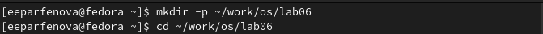{ #fig:001 width=50% }

Далее вызываем текстовый редактор vi и создала файл hello.sh. (рис. [-@fig:002])

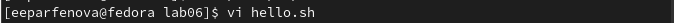{ #fig:002 width=50% }

## Набор текста

После в открывшемся файле нажимаем клавишу *i* и набираем нужный текст (он указан в файле Лабораторной работы) (рис. [-@fig:003])

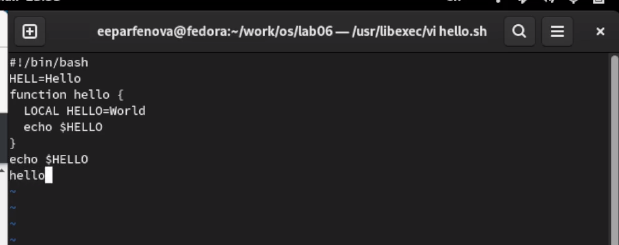{ #fig:003 width=70% }

## Сохранение и закрытие редактора

Нажимаем клавишу *Esc* для перехода в командный режим, и для перехода в режим последней строки нажимаем *:*. Внизу появляется приглашение. Там набираем *w* и *q*, чтобы записать изменения и выйти. После нажимаем клавишу Enter, чтобы запустить команду. (рис. [-@fig:004])

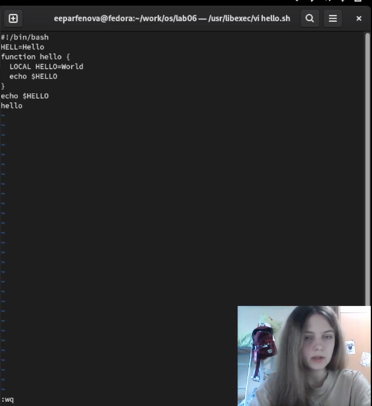{ #fig:004 width=30% }

## Исполняемый файл

Следующим шагом делаем файл исполняемым с помощью команды ***chmod +x hello.sh***. (рис. [-@fig:005])

{ #fig:005 width=70% }

## Открытие файла в редакторе

Переходим ко второму заданию. Вначале открываем файл в текстовом редакторе vi, использовав команду ***vi ~/work/os/lab06/hello.sh*** (рис. [-@fig:006])

{ #fig:006 width=70% }

## Замена слова

После с помощью комбинации *2 G* переходим на вторую строку текста и клавишей *l* продвигаемся к концу слова "HELL". Далее я с помощью *а* переходим в режим вставки и заменяем искомое слово на "HELLO". (рис. [-@fig:007]) Нажимаем *Esc* для возврата в командный режим.

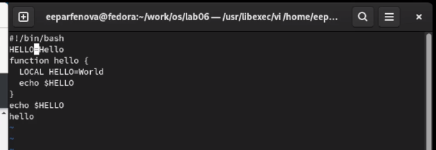{ #fig:007 width=40% }

## Удаление слова

Устанавливаем курсор на 4 строку, использовав *4 G*, и стираем слово "LOCAL" комбинацией *d w*. (рис. [-@fig:008])

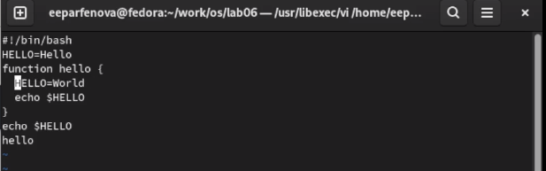{ #fig:008 width=70% }

## Написание нового слова

После пишем слово "local", с помощью *а* перейдя в режим вставки.  (рис. [-@fig:009]) Нажимаем *Esc* для возврата в командный режим.

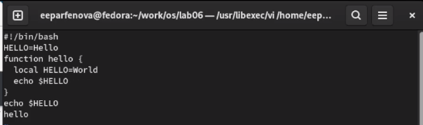{ #fig:009 width=70% }

## Вставка текста после последней строки

Следующим шагом, нажав *G*, переводим курсор на последнюю строку, и, использовав *o*, чтобы вставлять текст ниже курсора, пишем текст "echo $HELLO". (рис. [-@fig:010]) Нажимаем *Esc* для возврата в командный режим.

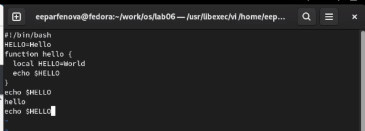{ #fig:010 width=70% }

## Удаление строки и отмена операции

Использовав *d d*, удаляем набранную строку (курссор был на ней). (рис. [-@fig:011]) А после возвращаем ее клавишей *u*, служащей для отмены последней операции. (рис. [-@fig:012])

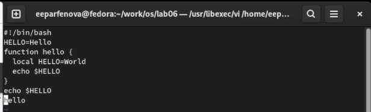{ #fig:011 width=50% }

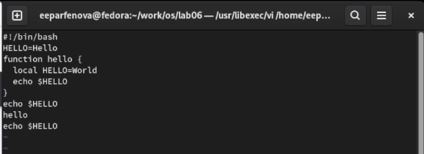{ #fig:012 width=50% }

## Сохранение и выход из редактора

После вводим символ *:*, чтобы перейти в режим последней строки и нажимаем *w*, *q*, чтобы записать изменения и выйти из редактора. Нажимаем *Enter*, чтобы выполнить команду. (рис. [-@fig:013])

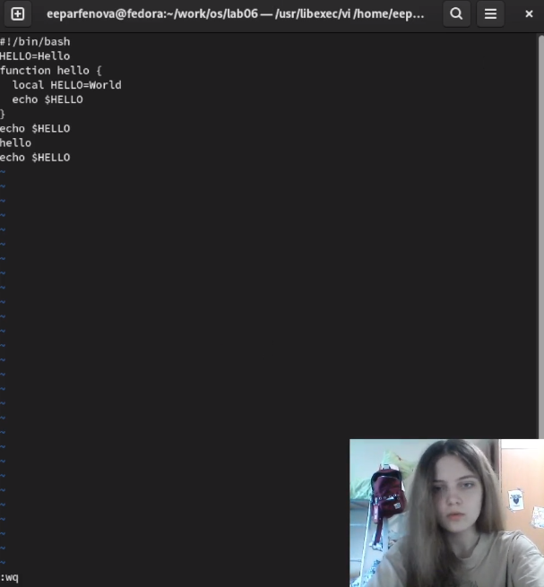{ #fig:013 width=30% }

## Выводы

Мы познакомились с операционной системой Linuxи получили практические навыки работы с редактором vi, установленным по умолчанию практически во всех дистрибутивах.
