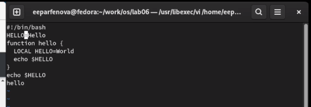
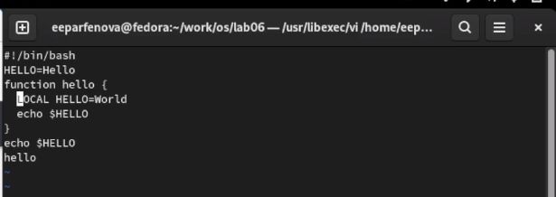
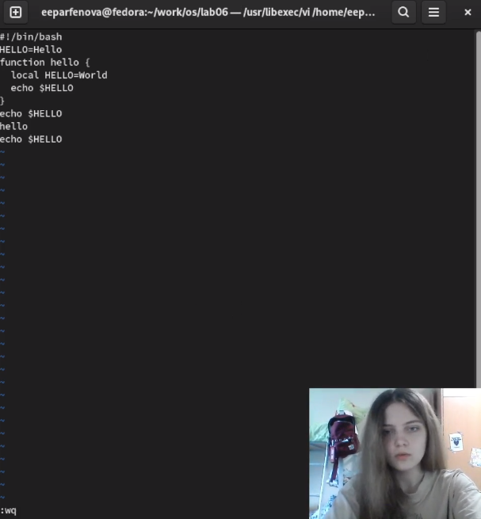

---
## Front matter
title: "Лабораторная работа №8"
subtitle: "Текстовой редактор vi"
author: "Парфенова Елизавета Евгеньевна"

## Generic otions
lang: ru-RU
toc-title: "Содержание"

## Bibliography
bibliography: bib/cite.bib
csl: pandoc/csl/gost-r-7-0-5-2008-numeric.csl

## Pdf output format
toc: true # Table of contents
toc-depth: 2
lof: true # List of figures
lot: true # List of tables
fontsize: 12pt
linestretch: 1.5
papersize: a4
documentclass: scrreprt
## I18n polyglossia
polyglossia-lang:
  name: russian
  options:
	- spelling=modern
	- babelshorthands=true
polyglossia-otherlangs:
  name: english
## I18n babel
babel-lang: russian
babel-otherlangs: english
## Fonts
mainfont: PT Serif
romanfont: PT Serif
sansfont: PT Sans
monofont: PT Mono
mainfontoptions: Ligatures=TeX
romanfontoptions: Ligatures=TeX
sansfontoptions: Ligatures=TeX,Scale=MatchLowercase
monofontoptions: Scale=MatchLowercase,Scale=0.9
## Biblatex
biblatex: true
biblio-style: "gost-numeric"
biblatexoptions:
  - parentracker=true
  - backend=biber
  - hyperref=auto
  - language=auto
  - autolang=other*
  - citestyle=gost-numeric
## Pandoc-crossref LaTeX customization
figureTitle: "Рис."
tableTitle: "Таблица"
listingTitle: "Листинг"
lofTitle: "Список иллюстраций"
lotTitle: "Список таблиц"
lolTitle: "Листинги"
## Misc options
indent: true
header-includes:
  - \usepackage{indentfirst}
  - \usepackage{float} # keep figures where there are in the text
  - \floatplacement{figure}{H} # keep figures where there are in the text
---

# Цель работы

Познакомиться с операционной системой Linux. Получить практические навыки работы с редактором vi, установленным по умолчанию практически во всех дистрибутивах.

# Задание

Задание 1. Создание нового файла с использованием vi

1. Создайте каталог с именем ~/work/os/lab06.

2. Перейдите во вновь созданный каталог.

3. Вызовите vi и создайте файл hello.sh

4. Нажмите клавишу i и вводите текст.

5. Нажмите клавишу Esc для перехода в командный режим после завершения ввода текста.

6. Нажмите : для перехода в режим последней строки и внизу вашего экрана появится приглашение в виде двоеточия.

7. Нажмите w (записать) и q (выйти), а затем нажмите клавишу Enter для сохранения вашего текста и завершения работы.

8. Сделайте файл исполняемым

Задание 2. Редактирование существующего файла

1. Вызовите vi на редактирование файла

2. Установите курсор в конец слова HELL второй строки.

3. Перейдите в режим вставки и замените на HELLO. Нажмите Esc для возврата в командный режим.

4. Установите курсор на четвертую строку и сотрите слово LOCAL.

5. Перейдите в режим вставки и наберите следующий текст: local, нажмите Esc для возврата в командный режим.

6. Установите курсор на последней строке файла. Вставьте после неё строку, содержащую следующий текст: echo $HELLO.

7. Нажмите Esc для перехода в командный режим.

8. Удалите последнюю строку.

9. Введите команду отмены изменений u для отмены последней команды.

10. Введите символ : для перехода в режим последней строки. Запишите произведённые изменения и выйдите из vi.

# Выполнение лабораторной работы

Первым шагом я создала каталог ~/work/os/lab06 с помощью команды ***mkdir -p***, так как каталога os у меня тоже не было. Я сразу перешла в созданный каталог командой ***cd /work/os/lab06***.  (рис. [-@fig:001])

{ #fig:001 width=70% }

Далее я вызвала текстовый редактор vi и создала файл hello.sh. (рис. [-@fig:002])

{ #fig:002 width=70% }

После в открывшемся файле я нажала клавишу *i* и набрала нужный текст (он указан в файле Лабораторной работы) (рис. [-@fig:003])

{ #fig:003 width=70% }

Потом я нажала клавишу *Esc* для перехода в командный режим, и для перехода в режим последней строки я нажала *:* и внизу появилось приглашение. Там я набрала *w* и *q*, чтобы записать изменения и выйти. После нажала клавишу Enter, чтобы запустить команду. (рис. [-@fig:004])

{ #fig:004 width=70% }

Следующим шагом я сделала файл исполняемым с помощью команды ***chmod +x hello.sh***. (рис. [-@fig:005])

{ #fig:005 width=70% }

Переходим ко второму заданию. Вначале я открыла файл в текстовом редакторе vi, использовав команду ***vi ~/work/os/lab06/hello.sh*** (рис. [-@fig:006])

{ #fig:006 width=70% }

После с помощью комбинации *2 G* я перешла на вторую строку текста и клавишей *l* продвинулась к концу слова "HELL". (рис. [-@fig:007]) Далее я с помощью *а* перешла в режим вставки и заменила искомое слово на "HELLO". (рис. [-@fig:008]) Нажала *Esc* для возврата в командный режим.

{ #fig:007 width=70% }

{ #fig:008 width=70% }

Я установила курсор на 4 строку, использовав *4 G*, (рис. [-@fig:009])  и стерла слово "LOCAL" комбинацией *d w*. (рис. [-@fig:010])

{ #fig:009 width=70% }

{ #fig:010 width=70% }

После я написала слово "local", с помощью *а* перейдя в режим вставки.  (рис. [-@fig:011]) Нажала *Esc* для возврата в командный режим.

{ #fig:011 width=70% }

Следующим шагом, нажав *G*, я перевела курсор на последнюю строку, (рис. [-@fig:012]) и, использовав *o*, чтобы вставлять текст ниже курсора, я написала текст "echo $HELLO". (рис. [-@fig:013]) Нажала *Esc* для возврата в командный режим.

{ #fig:012 width=70% }

{ #fig:013 width=70% }

Использовав *d d*, удалила набранную строку (курссор был на ней). (рис. [-@fig:014]) А после вернула ее клавишей *u*, служащей для отмены последней операции. (рис. [-@fig:015])

{ #fig:014 width=70% }

{ #fig:015 width=70% }

После ввела символ *:*, чтобы перейти в режим последней строки и нажала *w*, *q*, чтобы записать изменения и выйти из редактора. Нажала *Enter*, чтобы выполнить команду. (рис. [-@fig:016])

{ #fig:016 width=70% }

# Выводы

Мы познакомились с операционной системой Linuxи получили практические навыки работы с редактором vi, установленным по умолчанию практически во всех дистрибутивах.

# Контрольные вопросы

1. Дайте краткую характеристику режимам работы редактора vi.

Редактор vi имеет три режима работы:

    – командный режим — предназначен для ввода команд редактирования и навигации по редактируемому файлу;

    – режим вставки — предназначен для ввода содержания редактируемого файла;

    – режим последней (или командной) строки — используется для записи изменений в файл и выхода из редактора.

2. Как выйти из редактора, не сохраняя произведённые изменения?

Нужно просто перейти в режим командной строки и нажать *q* (или *q!*), после *Enter*.

3. Назовите и дайте краткую характеристику командам позиционирования.

    – 0 (ноль) — переход в начало строки;

    – $ — переход в конец строки;

    – G — переход в конец файла;

    – n G — переход на строку с номером n

4. Что для редактора vi является словом?

Слово - строка символов, которая может состоять из букв, цифр и символов подчеркивания.

5. Каким образом из любого места редактируемого файла перейти в начало (конец) файла?

В начало файла можно перйти комбинацией *1 G*, а в конец клавишей *G*.

6. Назовите и дайте краткую характеристику основным группам команд редактирования.

Вставка текста:

    – а — вставить текст после курсора;

    – А — вставить текст в конец строки;

    – i — вставить текст перед курсором;

    – 𝑛 i — вставить текст 𝑛 раз;

    – I — вставить текст в начало строки.

Вставка строки:

    – о — вставить строку под курсором;

    – О — вставить строку над курсором.

Удаление текста:

    – x — удалить один символ в буфер;

    – d w — удалить одно слово в буфер;

    – d $ — удалить в буфер текст от курсора до конца строки;

    – d 0 — удалить в буфер текст от начала строки до позиции курсора;

    – d d — удалить в буфер одну строку;

    – n d d — удалить в буфер n строк.

Отмена и повтор произведённых изменений: 

    – u — отменить последнее изменение;

    – . — повторить последнее изменение.

Копирование текста в буфер:

    – Y — скопировать строку в буфер;

    – 𝑛 Y — скопировать 𝑛 строк в буфер;

    – y w — скопировать слово в буфер.

Вставка текста из буфера:

    – p — вставить текст из буфера после курсора;

    – P — вставить текст из буфера перед курсором.

Замена текста:

    – c w — заменить слово;

    – 𝑛 c w — заменить 𝑛 слов;

    – c $ — заменить текст от курсора до конца строки;

    – r — заменить слово;

    – R — заменить текст.

Поиск текста:

    – / текст — произвести поиск вперёд по тексту указанной строки символов текст;

    – ? текст — произвести поиск назад по тексту указанной строки символов текст.

7. Необходимо заполнить строку символами $. Каковы ваши действия?

Вначале перходим в режим вставки (*a*), а после заполняем строку нужными символами.

8. Как отменить некорректное действие, связанное с процессом редактирования?

Клавиша *u* отменяет последнее сделанное действие

9. Назовите и дайте характеристику основным группам команд режима последней строки.

Копирование и перемещение текста:

    – : 𝑛,𝑚 d — удалить строки с 𝑛 по 𝑚;

    – : 𝑖,𝑗 m 𝑘 — переместить строки с 𝑖 по 𝑗, начиная со строки 𝑘;

    – : 𝑖,𝑗 t 𝑘 — копировать строки с 𝑖 по 𝑗 в строку 𝑘;

    – : 𝑖,𝑗 w имя-файла — записать строки с 𝑖 по 𝑗 в файл с именем имя-файла.

Запись в файл и выход из редактора:

    – : w — записать изменённый текст в файл, не выходя из vi;

    – : w имя-файла — записать изменённый текст в новый файл с именем имя-файла;

    – : w ! имя-файла — записать изменённый текст в файл с именем имя-файла;

    – : w q — записать изменения в файл и выйти из vi;

    – : q — выйти из редактора vi;

    – : q ! — выйти из редактора без записи;

    – : e ! — вернуться в командный режим, отменив все изменения, произведённые со времени последней записи.

10. Как определить, не перемещая курсора, позицию, в которой заканчивается строка?

Знак *$* перемещает курсор в конец строки.

11. Выполните анализ опций редактора vi (сколько их, как узнать их назначение и т.д.).

Опции редактора vi позволяют настроить рабочую среду. Для задания опций используется команда set (в режиме последней строки):

    – : set all — вывести полный список опций;

    – : set nu — вывести номера строк;

    – : set list — вывести невидимые символы;

    – : set ic — не учитывать при поиске, является ли символ прописным или строчным.

Если вы хотите отказаться от использования опции, то в команде set перед именем опции надо поставить no.

12. Как определить режим работы редактора vi?

Нажатие клавиши *Esc* всегда переводит редактор в режим командной строки. Если вы уже находитесь в этом режиме, то компьютер напомнит вам об этом. Этот режим универслаен и удобен, если вы не помните,  в каком режиме находились. 

13. Постройте граф взаимосвязи режимов работы редактора vi.

Командный режим -> Режим вставки -> Режим командной строки