---
## Front matter
lang: ru-RU
title: Лабораторная работа №9. Текстовой редактор emacs
author: Парфенова Елизавета Евгеньевна
institute: RUDN University, Moscow, Russian Federation

## Formatting
toc: false
slide_level: 2
theme: metropolis
header-includes: 
 - \metroset{progressbar=frametitle,sectionpage=progressbar,numbering=fraction}
 - '\makeatletter'
 - '\beamer@ignorenonframefalse'
 - '\makeatother'
aspectratio: 43
section-titles: true
---

## Цель работы

Познакомиться с операционной системой Linux. Получить практические навыки работы с редактором Emacs.

## Задание

1. Открыть emacs.

2. Создать файл lab07.sh с помощью комбинации Ctrl-x Ctrl-f (C-x C-f).
3. Наберите нужный текст
4. Сохранить файл с помощью комбинации Ctrl-x Ctrl-s (C-x C-s).
5. Проделать с текстом стандартные процедуры редактирования, каждое действие должно осуществляться комбинацией клавиш.

      5.1. Вырезать одной командой целую строку (С-k).

      5.2. Вставить эту строку в конец файла (C-y).

      5.3. Выделить область текста (C-space).

      5.4. Скопировать область в буфер обмена (M-w).

      5.5. Вставить область в конец файла.

      5.6. Вновь выделить эту область и на этот раз вырезать её (C-w).

      5.7. Отмените последнее действие (C-/).

## Задание

6. Научитесь использовать команды по перемещению курсора.

      6.1. Переместите курсор в начало строки (C-a).

      6.2. Переместите курсор в конец строки (C-e).

      6.3. Переместите курсор в начало буфера (M-<).

      6.4. Переместите курсор в конец буфера (M->).

7. Управление буферами.

      7.1. Вывести список активных буферов на экран (C-x C-b).

      7.2. Переместитесь во вновь открытое окно (C-x) o со списком открытых буферов и переключитесь на другой буфер.
      7.3. Закройте это окно (C-x 0).

      7.4. Теперь вновь переключайтесь между буферами, но уже без вывода их списка на экран (C-x b).

## Задание

8. Управление окнами.

      8.1. Поделите фрейм на 4 части: разделите фрейм на два окна по вертикали (C-x 3), а затем каждое из этих окон на две части по горизонтали (C-x 2)

      8.2. В каждом из четырёх созданных окон откройте новый буфер (файл) и введите несколько строк текста.

9. Режим поиска

      9.1. Переключитесь в режим поиска (C-s) и найдите несколько слов, присутствующих в тексте.

      9.2. Переключайтесь между результатами поиска, нажимая C-s.

      9.3. Выйдите из режима поиска, нажав C-g.

      9.4. Перейдите в режим поиска и замены (M-%), введите текст, который следует найти и заменить, нажмите Enter , затем введите текст для замены. После того как будут
подсвечены результаты поиска, нажмите ! для подтверждения замены.

      9.5. Испробуйте другой режим поиска, нажав M-s o. Объясните, чем он отличается отобычного режима?

# Выполнение работы

## Вызов текстового редактора

Первым шагом нужно вызвать в терминале текстовый редактор emacs, набрав одноименную команду. (рис. [-@fig:001])

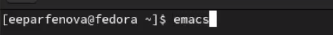{ #fig:001 width=70% }

## Создание файла

После создаем новый файл с помощью комбинации клавиш *Ctrl+x* *Ctrl+f*. Называем его, как указано в файле Лабораторной работы, - lab07.sh. (рис. [-@fig:002])

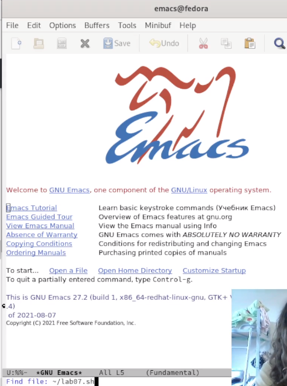{ #fig:002 width=40% }

## Запись текста в файл

Далее пишем в созданном файле нужный текст, который также был указан в файле Лабораторной работы. (рис. [-@fig:003])

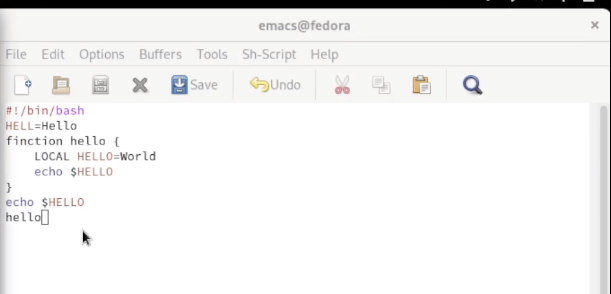{ #fig:003 width=70% }

## Сохранение файла

Далее схраняем файл комбинацией клавиш *Ctrl+x* *Ctrl+s*. (рис. [-@fig:004])

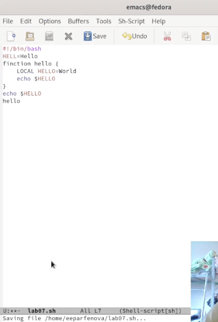{ #fig:004 width=30% }

## Вырезание строки

Следующим заданием было проделать с текстом процедуры редактирования. Вначале вырезаем строку клавишами *Ctrl+k* (рис. [-@fig:005])

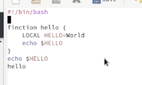{ #fig:005 width=70% }

## Вставка вырезанной строки

После вставляем вырезанную строку в конец текста клавишами *Ctrl+y*. (рис. [-@fig:006])

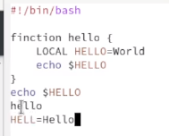{ #fig:006 width=70% }

## Выделение текста и его копирование

Затем выделяем область текста с помощью *Ctrl+Space* (рис. [-@fig:007]), клавишами *Alt+w* копируем его и с поомщью *Ctrl+y* втсавляем в конец текста. (рис. [-@fig:008])

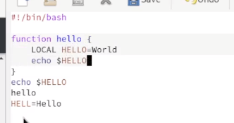{ #fig:007 width=30% }

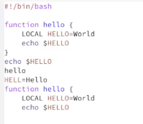{ #fig:008 width=30% }

## Вырезание текста и отмена последней операции

Далее вновь выделяем эту же область *Ctrl+Space* и вырезаем ее с помощью *Ctrl+w*. (рис. [-@fig:009]) Отменяем последнюю оперцию, использовав *Ctrl+/*. (рис. [-@fig:010])

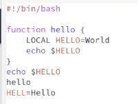{ #fig:009 width=20% }

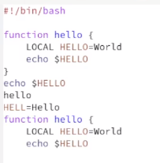{ #fig:010 width=20% }

## Перемещение курсора

После было необходимо перемщать курсор клавишами. Вначале перемещаем его в начало строки через *Ctrl+a*. (рис. [-@fig:011]) 

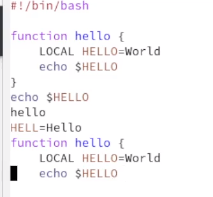{ #fig:011 width=50% }

## Перемещение курсора

После - в конец строки, использовав *Ctrl+е*. (рис. [-@fig:012]) 

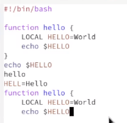{ #fig:012 width=50% }

## Перемещение курсора

Далее перемещаем курсор в начало буфера с помощью *Alt+-<* (рис. [-@fig:013])

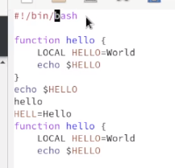{ #fig:013 width=50% }

## Перемещение курсора

В конец буфера - *Alt+->*  (рис. [-@fig:014])

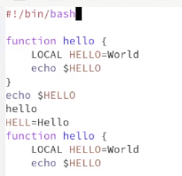{ #fig:014 width=50% }

## Список активных буферов

Следующим шагом выводим список активных буферов на экран с помощью *Ctrl+x* *Ctrl+b*. (рис. [-@fig:015])

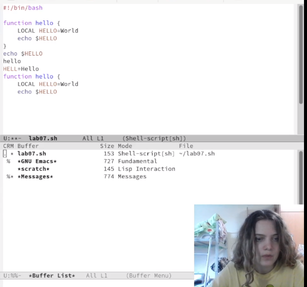{ #fig:015 width=50% }

## Переход в один из буферов

После переходим в один из активных буферов. (рис. [-@fig:016]) 

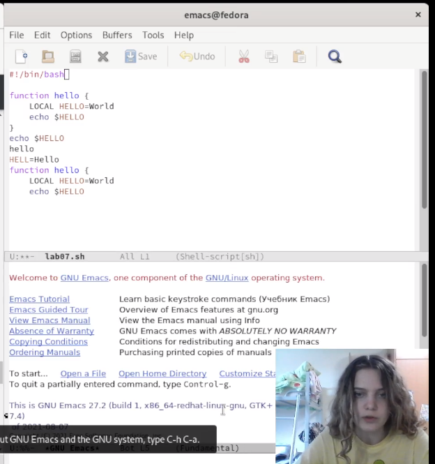{ #fig:016 width=50% }

## Закрытие второго буфера

Далее, использовав *Ctrl+x 0*, закрываем буфер 'lab07.sh'. (рис. [-@fig:017])

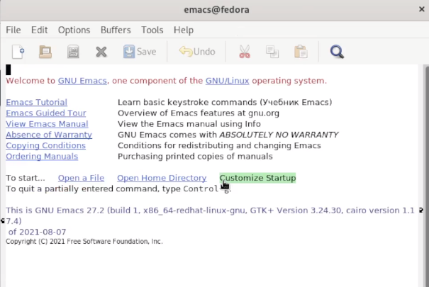{ #fig:017 width=50% }

## Переход в другой буфер

После перекючаемся на буфер '*GNU Emacs*' уже без открытия окна активных буферов, нажав *Ctrl+x b* и вписав нужное название. (рис. [-@fig:018]) 

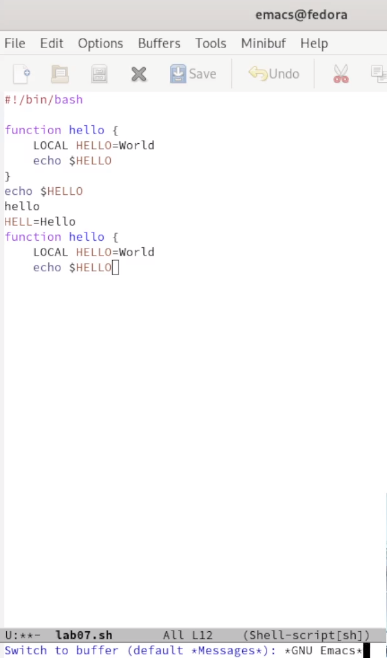{ #fig:018 width=20% }

## Разделени е фрейма на 4 части

Следующим шагом делим фрейм на 4 части. Чтобы разделить его по вертикали используем *Ctrl+x 3*, а чтобы разделить по горизонтали - *Ctrl+x 2*, выполнив комбинацию на каждой из частей. (рис. [-@fig:019])

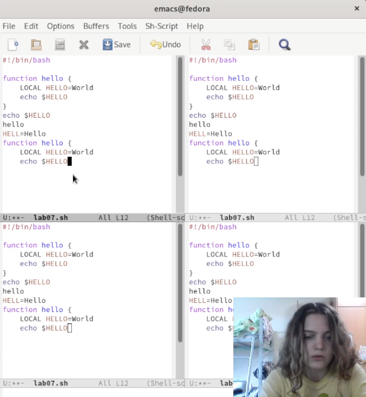{ #fig:019 width=40% }

## Создание новых файлов и запись текста

После в каждом из окон создаем новый буфер и записываем по строчке текста.(рис. [-@fig:020])

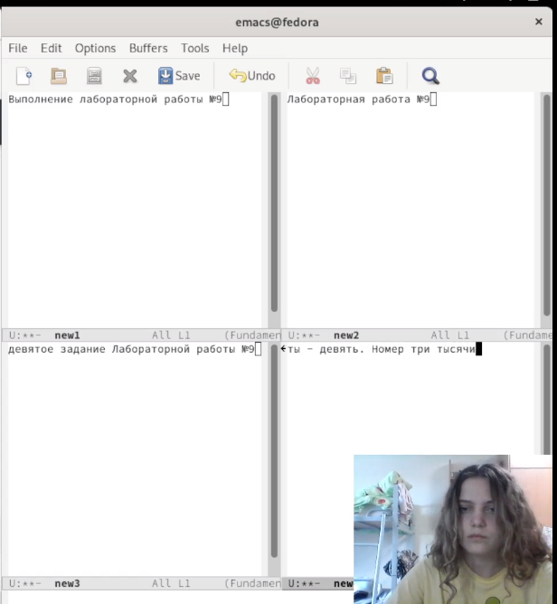{ #fig:020 width=50% }

## Поиск слова

Потом переключаемся в режим поиска с помощью *Ctrl+s* и в 4 файле запускаем поиск слова "номер". Найденные совпадения подсветились. Среди них можно переключаться с помощью того же *Ctrl+s*. (рис. [-@fig:021]) После выходим из режима поиска, нажав *Ctrl+q*.

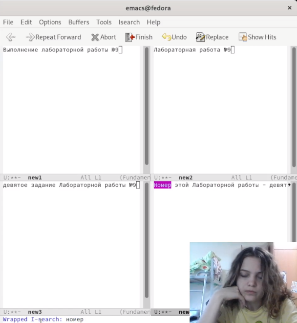{ #fig:021 width=40% }

## Замена слова

Далее было необходимо перейти в режим поиска и замена, нажав *Alt+%*. Заменим слово "Выполнение" на слово "Подготовка" в 1 окне. Это слово вводим в нижней строке. (рис. [-@fig:022]) 

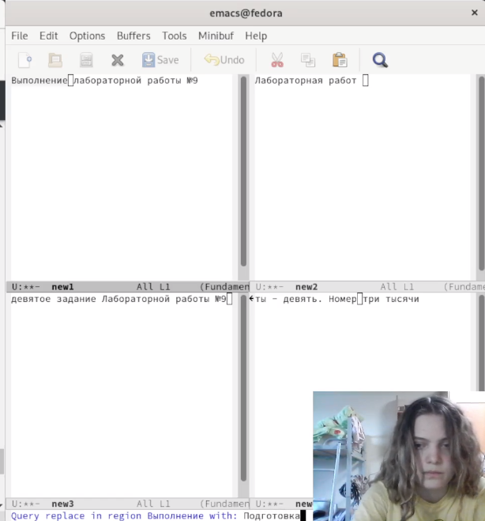{ #fig:022 width=50% }

## Результаты замены слова

Затем нажимаем *!* и замена была произведена. (рис. [-@fig:023])

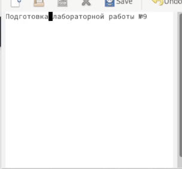{ #fig:023 width=50% }

## Поиск текса другим способом

Последним заданием было произвести поиск дургим способом. Ищем в 4 окне все то же слово "номер", но уже с помощью *Alt+s o*. Результаты этого поиска были выведены в другом буфере, причем с описание, которое содержало информацию о том , сколько слов было найдено,  в какой линии какого буфера. Также была приведена строчка, в которой нашлись совпадения. Это и есть существенное отличие двух режимов поиска. (рис. [-@fig:024])

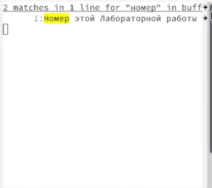{ #fig:024 width=30% }

## Вывод

Мы познакомились с операционной системой Linux и получили практические навыки работы с редактором Emacs.