---
## Front matter
title: "Лабораторная работа №9"
subtitle: "Текстовой редактор emacs"
author: "Парфенова Елизавета Евгеньевна"

## Generic otions
lang: ru-RU
toc-title: "Содержание"

## Bibliography
bibliography: bib/cite.bib
csl: pandoc/csl/gost-r-7-0-5-2008-numeric.csl

## Pdf output format
toc: true # Table of contents
toc-depth: 2
lof: true # List of figures
lot: true # List of tables
fontsize: 12pt
linestretch: 1.5
papersize: a4
documentclass: scrreprt
## I18n polyglossia
polyglossia-lang:
  name: russian
  options:
	- spelling=modern
	- babelshorthands=true
polyglossia-otherlangs:
  name: english
## I18n babel
babel-lang: russian
babel-otherlangs: english
## Fonts
mainfont: PT Serif
romanfont: PT Serif
sansfont: PT Sans
monofont: PT Mono
mainfontoptions: Ligatures=TeX
romanfontoptions: Ligatures=TeX
sansfontoptions: Ligatures=TeX,Scale=MatchLowercase
monofontoptions: Scale=MatchLowercase,Scale=0.9
## Biblatex
biblatex: true
biblio-style: "gost-numeric"
biblatexoptions:
  - parentracker=true
  - backend=biber
  - hyperref=auto
  - language=auto
  - autolang=other*
  - citestyle=gost-numeric
## Pandoc-crossref LaTeX customization
figureTitle: "Рис."
tableTitle: "Таблица"
listingTitle: "Листинг"
lofTitle: "Список иллюстраций"
lotTitle: "Список таблиц"
lolTitle: "Листинги"
## Misc options
indent: true
header-includes:
  - \usepackage{indentfirst}
  - \usepackage{float} # keep figures where there are in the text
  - \floatplacement{figure}{H} # keep figures where there are in the text
---

# Цель работы

Познакомиться с операционной системой Linux. Получить практические навыки работы с редактором Emacs.

# Задание

1. Открыть emacs.

2. Создать файл lab07.sh с помощью комбинации Ctrl-x Ctrl-f (C-x C-f).
3. Наберите нужный текст
4. Сохранить файл с помощью комбинации Ctrl-x Ctrl-s (C-x C-s).
5. Проделать с текстом стандартные процедуры редактирования, каждое действие должно осуществляться комбинацией клавиш.

      5.1. Вырезать одной командой целую строку (С-k).

      5.2. Вставить эту строку в конец файла (C-y).

      5.3. Выделить область текста (C-space).

      5.4. Скопировать область в буфер обмена (M-w).

      5.5. Вставить область в конец файла.

      5.6. Вновь выделить эту область и на этот раз вырезать её (C-w).

      5.7. Отмените последнее действие (C-/).

6. Научитесь использовать команды по перемещению курсора.

      6.1. Переместите курсор в начало строки (C-a).

      6.2. Переместите курсор в конец строки (C-e).

      6.3. Переместите курсор в начало буфера (M-<).

      6.4. Переместите курсор в конец буфера (M->).

7. Управление буферами.

      7.1. Вывести список активных буферов на экран (C-x C-b).

      7.2. Переместитесь во вновь открытое окно (C-x) o со списком открытых буферов и переключитесь на другой буфер.
      7.3. Закройте это окно (C-x 0).

      7.4. Теперь вновь переключайтесь между буферами, но уже без вывода их списка на экран (C-x b).

8. Управление окнами.

      8.1. Поделите фрейм на 4 части: разделите фрейм на два окна по вертикали (C-x 3), а затем каждое из этих окон на две части по горизонтали (C-x 2)

      8.2. В каждом из четырёх созданных окон откройте новый буфер (файл) и введите несколько строк текста.

9. Режим поиска

      9.1. Переключитесь в режим поиска (C-s) и найдите несколько слов, присутствующих в тексте.

      9.2. Переключайтесь между результатами поиска, нажимая C-s.

      9.3. Выйдите из режима поиска, нажав C-g.

      9.4. Перейдите в режим поиска и замены (M-%), введите текст, который следует найти и заменить, нажмите Enter , затем введите текст для замены. После того как будут
подсвечены результаты поиска, нажмите ! для подтверждения замены.

      9.5. Испробуйте другой режим поиска, нажав M-s o. Объясните, чем он отличается отобычного режима?

# Выполнение лабораторной работы

Первым шагом я вызвала в терминале текстовый редактор emacs, набрав одноименную команду. (рис. [-@fig:001])

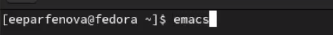{ #fig:001 width=70% }

После я создала новый файл с помощью комбинации клавиш *Ctrl+x* *Ctrl+f*. Назвала его, как указано в файле Лабораторной работы, - lab07.sh. (рис. [-@fig:002])

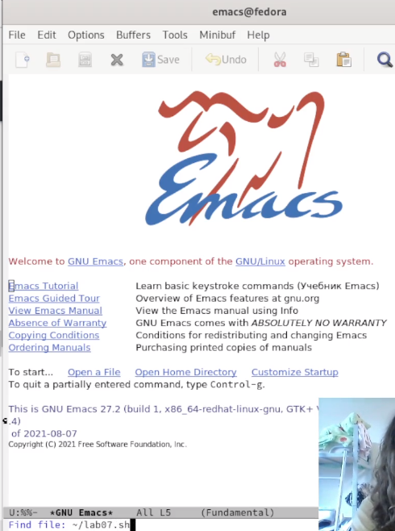{ #fig:002 width=70% }

Далее я написала в созданном файле нужный текст, который также был указан в файле Лабораторной работы. (рис. [-@fig:003])

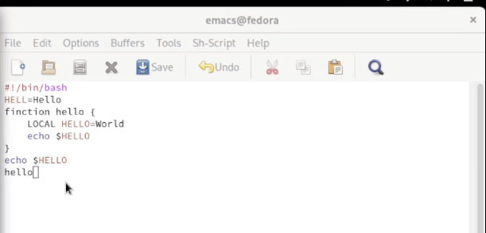{ #fig:003 width=70% }

Далее я сохранила файл комбинацией клавиш *Ctrl+x* *Ctrl+s*. (рис. [-@fig:004])

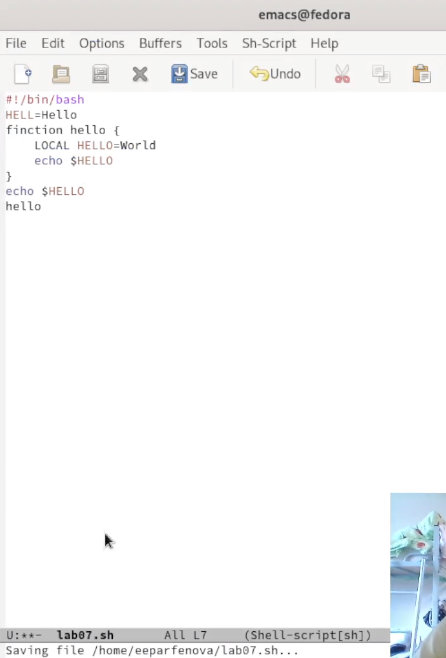{ #fig:004 width=70% }

Следующим заданием было проделать с текстом процедуры редактирования. Вначале я вырезала строку клавишами *Ctrl+k* (рис. [-@fig:005])

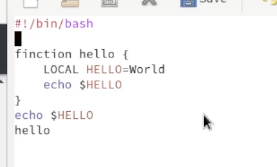{ #fig:005 width=70% }

После я вставила вырезанную строку в конец текста клавишами *Ctrl+y*. (рис. [-@fig:006])

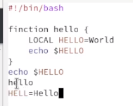{ #fig:006 width=70% }

Затем я выделила область текста с помощью *Ctrl+Space* (рис. [-@fig:007]), клавишами *Alt+w* скопировала его и с поомщью *Ctrl+y* втсавила в конец текста. (рис. [-@fig:008])

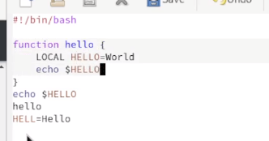{ #fig:007 width=70% }

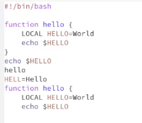{ #fig:008 width=70% }

Далее я вновь выделила эту же область *Ctrl+Space* и вырезала ее с помощью *Ctrl+w*. (рис. [-@fig:009]) Отменила последнюю оперцию, использовав *Ctrl+/*. (рис. [-@fig:010])

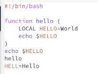{ #fig:009 width=70% }

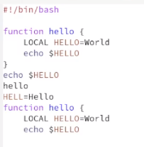{ #fig:010 width=70% }

После я перемещала курсор клавишами. Вначале переместила его в начало строки через *Ctrl+a*. (рис. [-@fig:011]) После - в конец строки, использовав *Ctrl+е*. (рис. [-@fig:012]) Далее переместила курсор в начало буфера с помощью *Alt+-<* и в конец буфера - *Alt+->* (рис. [-@fig:013]) (рис. [-@fig:014])

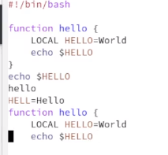{ #fig:011 width=70% }

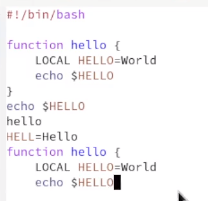{ #fig:012 width=70% }

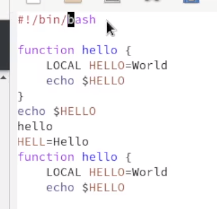{ #fig:013 width=70% }

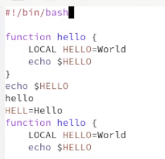{ #fig:014 width=70% }

Следующим шагом я вывела список активных буферов на экран с помощью *Ctrl+x* *Ctrl+b*. (рис. [-@fig:015])

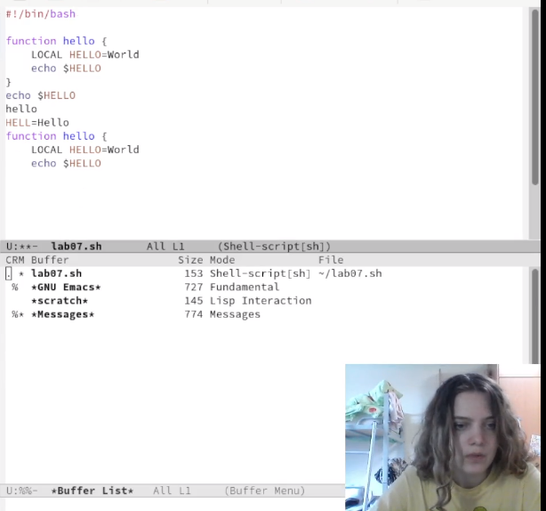{ #fig:015 width=70% }

После я перешла в один из активных буферов. Я выбрала '*GNU Emacs*'. (рис. [-@fig:016]) Далее я, использовав *Ctrl+x 0*, закрыла буфер 'lab07.sh'. (рис. [-@fig:017])

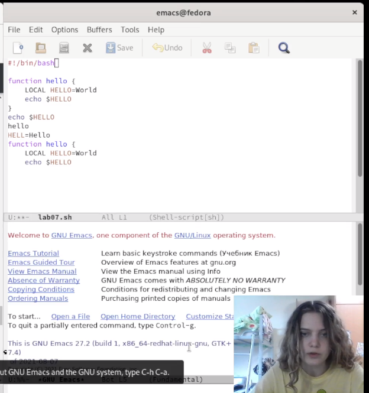{ #fig:016 width=70% }

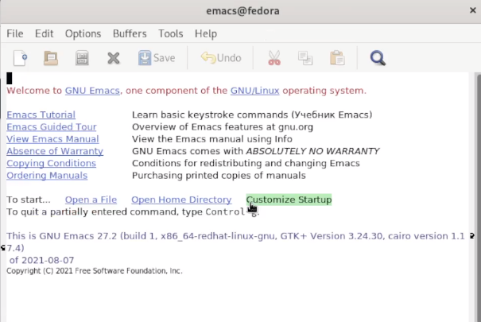{ #fig:017 width=70% }

После я переключилась на буфер '*GNU Emacs*' уже без открытия окна активных буферов, нажав *Ctrl+x b* и вписав нужное название. (рис. [-@fig:018]) Таким же образом я вернулась к исходному буферу.

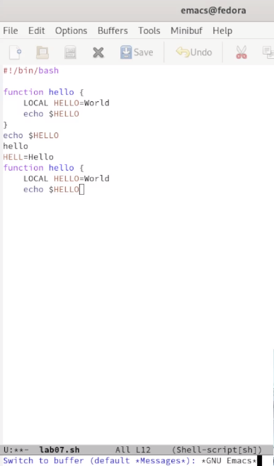{ #fig:018 width=50% }

Следующим шагом я разделила фрейм на 4 части. Чтобы разделить его по вертикали я использовала *Ctrl+x 3*, а чтобы разделить по горизонтали - *Ctrl+x 2*, выполнив комбинацию на каждой из частей. (рис. [-@fig:019])

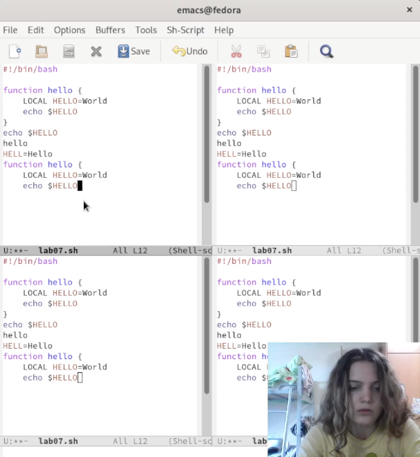{ #fig:019 width=70% }

После в каждом из окон я создала новый буфер и записала по строчке текста.(рис. [-@fig:020])

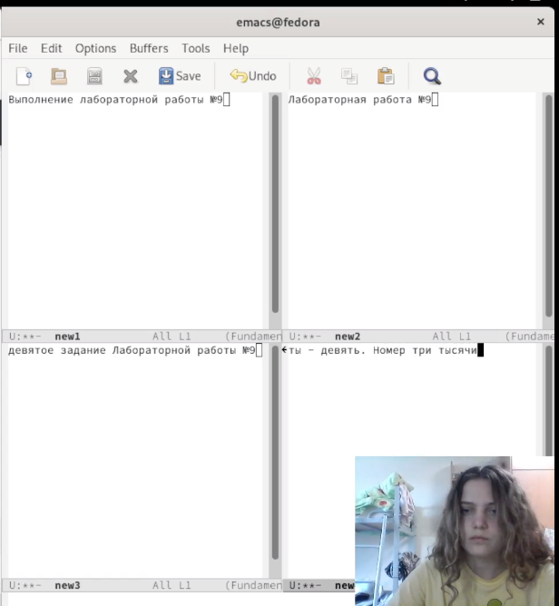{ #fig:020 width=70% }

Потом я переключилась в режим поиска с помощью *Ctrl+s* и в 4 файле запустила поиск слова "номер". Найденные совпадения подсветились. Среди них можно переключаться с помощью того же *Ctrl+s*. (рис. [-@fig:021]) После я вышла из режима поиска, нажав *Ctrl+q*.

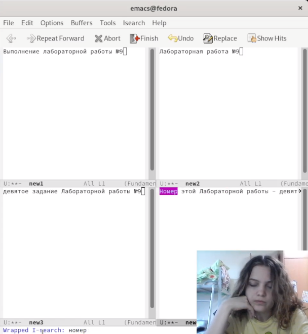{ #fig:021 width=70% }

Далее было необходимо перейти в режим поиска и замена, нажав *Alt+%*, однако у меня комбинация клавиш упрямо не хотела работать поэтому я перешла в режим поиска, нашла слово которое хочу заменить и, подсветив ее, выбрала опцию замены в меню в верхней части редактора. Я решила заменить слово "Выполнение" на слово "Подготовка" в 1 окне. Это слово я и ввела в нижней строке. (рис. [-@fig:022]) Затем я нажала *!* и замена была произведена. (рис. [-@fig:023])

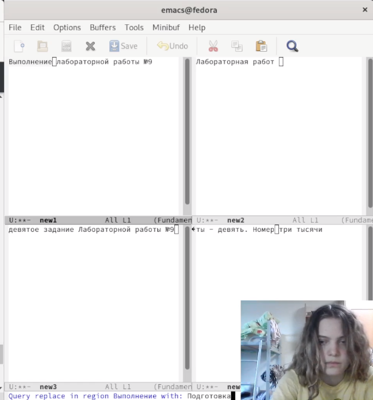{ #fig:022 width=70% }

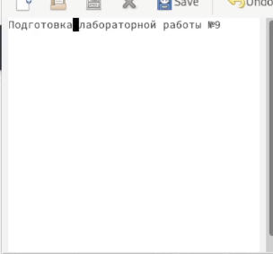{ #fig:023 width=70% }

Последним заданием было произвести поиск дургим способом. Я искала в 4 окне все то же слово "номер", но уже с помощью *Alt+s o*. Результаты этого поиска были выведены в другом буфере, причем с описание, которое содержало информацию о том , сколько слов было найдено,  в какой линии какого буфера. Также была приведена строчка, в которой нашлись совпадения. Это и есть существенное отличие двух режимов поиска. (рис. [-@fig:024])

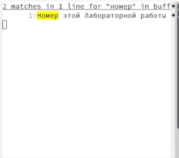{ #fig:024 width=70% }

# Выводы

Мы познакомились с операционной системой Linux и получили практические навыки работы с редактором Emacs.

# Контрольные вопросы

1. Кратко охарактеризуйте редактор emacs.

Emacs представляет собой мощный экранный редактор текста, написанный на языке высокого уровня Elisp.

2. Какие особенности данного редактора могут сделать его сложным для освоения новичком?

Для работы с emacs требуется знать много о его функциях и о том, какими комбинациями клавиш они могут быть вызваны. Этих функций, как и комбинаций соответсвенно, достаточно много. Также сложность могут вызвать несовместимость кнопок вашего ПК и кнопок, заложенных в функциях редактора. 

3. Своими словами опишите, что такое буфер и окно в терминологии emacs’а.

Буфер - это область, где пользователь набирает текст или как-то с ней работает, а окно - это область фрейма, в которой отображается этот буфер, либо же объединение буферов. 

4. Можно ли открыть больше 10 буферов в одном окне?

Да, можно.

5. Какие буферы создаются по умолчанию при запуске emacs?

'* GNU Emacs *, * Message *,* scratch *'

6. Какие клавиши вы нажмёте, чтобы ввести следующую комбинацию C-c | и C-c C-|?

Ctrl+c Shift+\ и Ctrl+c Ctrl + Shift+\

7. Как поделить текущее окно на две части?

По вертикали - *Ctrl+x 3*, по горизонтали - *Ctrl+x 2*

8. В каком файле хранятся настройки редактора emacs?

Файл Emacs

9. Какую функцию выполняет клавиша  и можно ли её переназначить?

Клавиша Backspace выполняет функцию клавиш Ctrl+k и ее можно переназначить.

10. Какой редактор вам показался удобнее в работе vi или emacs? Поясните почему.

Несмотря на то, что vi проще в использовании, мне больше понравился Emacs благодаря богатому интерфейсу и множеству разнообразных функций. Текст в нем редактируеся лучше и интерсней. 

