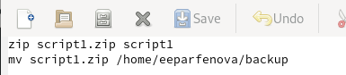
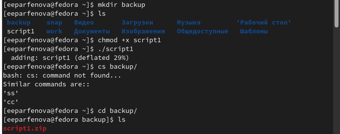
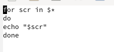
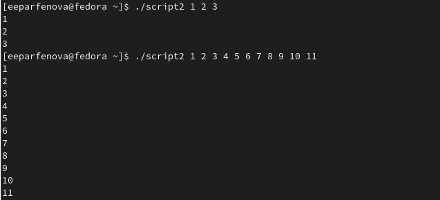
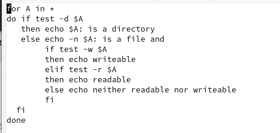
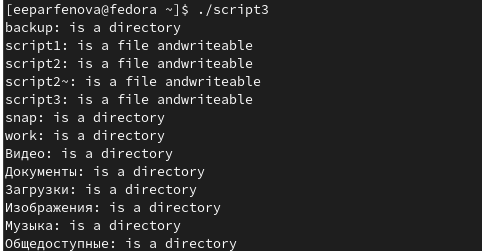
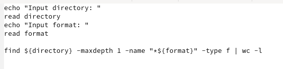
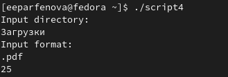

---
## Front matter
lang: ru-RU
title: Лабораторная работа №10. Программирование в командном процессоре ОС UNIX. Командные файлы
author: Парфенова Елизавета Евгеньевна
institute: RUDN University, Moscow, Russian Federation

## Formatting
toc: false
slide_level: 2
theme: metropolis
header-includes: 
 - \metroset{progressbar=frametitle,sectionpage=progressbar,numbering=fraction}
 - '\makeatletter'
 - '\beamer@ignorenonframefalse'
 - '\makeatother'
aspectratio: 43
section-titles: true
---

## Цель работы

Изучить основы программирования в оболочке ОС UNIX/Linux. Научиться писать небольшие командные файлы.

## Задание

1. Написать скрипт, который при запуске будет делать резервную копию самого себя (то есть файла, в котором содержится его исходный код) в другую директорию backup в вашем домашнем каталоге. При этом файл должен архивироваться одним из архиваторов на выбор zip, bzip2 или tar. Способ использования команд архивации необходимо узнать, изучив справку.

2. Написать пример командного файла, обрабатывающего любое произвольное число аргументов командной строки, в том числе превышающее десять. Например, скрипт может последовательно распечатывать значения всех переданных аргументов.

## Задание

3. Написать командный файл — аналог команды ls (без использования самой этой команды и команды dir). Требуется, чтобы он выдавал информацию о нужном каталоге и выводил информацию о возможностях доступа к файлам этого каталога.

4. Написать командный файл, который получает в качестве аргумента командной строки формат файла (.txt, .doc, .jpg, .pdf и т.д.) и вычисляет количество таких файлов в указанной директории. Путь к директории также передаётся в виде аргумента командной строки.

# Выполнение работы

## Справка о zip

Ознакомившись с теорией, можно приступать к первому скрипту.В нем было необходимо использовать архив zip, поэтому  с помощью команды ***man zip*** читаем справку о нем. (рис. [-@fig:001])

{ #fig:001 width=70% }

## Первый скрипт

Писать скрипты можно в любом редакторе. Создаем новый файл *script1*. После приступаем непосредственну к коду. Заархивировать файл можно с помощью ***zip***, а перенести его с помощью ***mv***. (рис. [-@fig:002]) 

{ #fig:002 width=70% }

## Работа первого скрипта

После взвращаемся в консоль, создаем каталог backup с помощью ***mkdir*** и делаем файл исполняемым с помощью команды ***chmod +x script1***. Вызываем скрипт с помощью ***./script1***. Он сработал успешно. (рис. [-@fig:003]) 
 
{ #fig:003 width=50% }

## Второй скрипт

Переходим ко второму заданию. В нем было необходимо написать командный файл, который бы обрабатывал значения аргументов и печтал их. Создаем файл script2 и  осуществляем это с помошью цикла for. (рис. [-@fig:004]) 

{ #fig:004 width=70% }

## Работа второго скрипта

Снова возвращаемся в терминал и делаем файл исполняемым той же командой, заменив только название. После проверяем скрипт (***./script2***), вписав вначале три аргумента, а затем свыше 10 (это требовалось проверить в задании) (рис. [-@fig:005]) 

{ #fig:005 width=70% }

## Третий скрипт

Переходим к третьему заданию. Создаем файл script3. В первой части кода мы проверяем директория это или файл, а во втором выводим права доступа c помощью циклов. (рис. [-@fig:006]) 

{ #fig:006 width=70% }

## Работа третьего скрипта

Сделав файл исполняемым, проверяем его, вызвав с помощью ***./script3***. Скрипт сработал успешно и вывел информацию по домашнему каталогу.(рис. [-@fig:007]) 

{ #fig:007 width=70% }

## Четвертый скрипт

Посследним заданием было вычислить количество файлов определенного формата в определенной директории. Вначале создаем файл script4.  В коде вначале просим пользователя ввести директорию и формат, а затем находим нужное с помощью команды ***find***.(рис. [-@fig:008]) 

{ #fig:008 width=70% }

## Работа четвертого скрипта

Далее делаем файл исполняемым и вызваем его, используя  ***./script4***. Проверяем файл, поискав в "Загрузках" файлы формата pdf. Скрипт сработал успешно. (рис. [-@fig:009]) 

{ #fig:009 width=70% }

## Вывод

Мы изучили основы программирования в оболочке ОС UNIX/Linux и научились писать небольшие командные файлы.