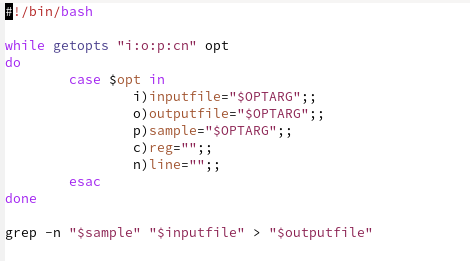
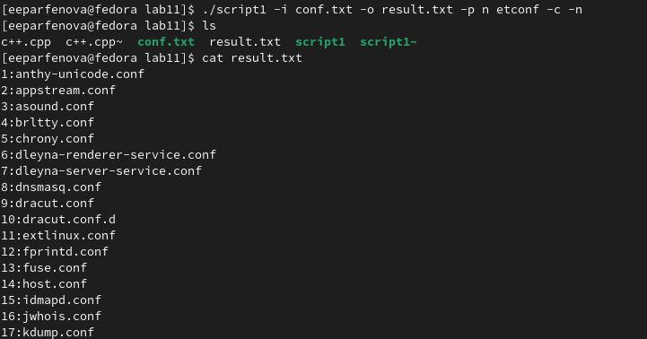
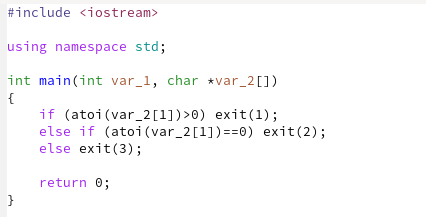
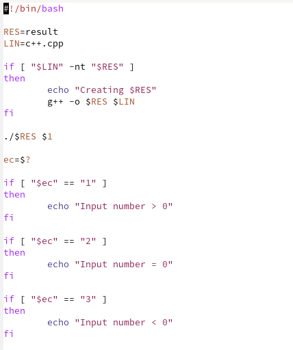
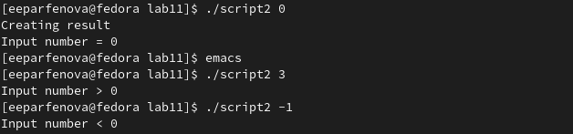
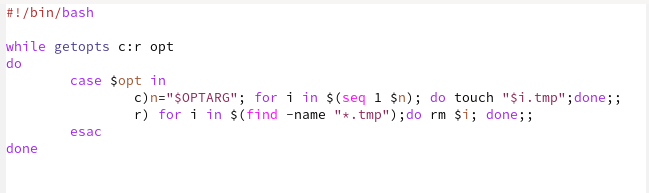
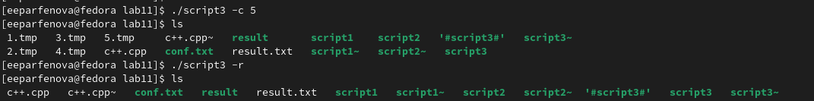
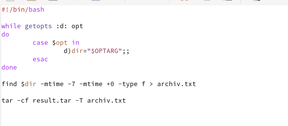
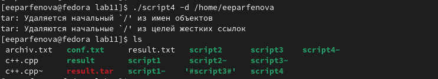
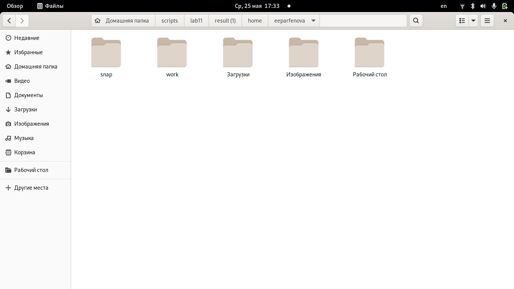

---
## Front matter
lang: ru-RU
title: Лабораторная работа №11. Программирование в командном процессоре ОС UNIX. Ветвления и циклы.
author: Парфенова Елизавета Евгеньвена
institute: RUDN University, Moscow, Russian Federation

## Formatting
toc: false
slide_level: 2
theme: metropolis
header-includes: 
 - \metroset{progressbar=frametitle,sectionpage=progressbar,numbering=fraction}
 - '\makeatletter'
 - '\beamer@ignorenonframefalse'
 - '\makeatother'
aspectratio: 43
section-titles: true
---

## Цель работы

Изучить основы программирования в оболочке ОС UNIX. Научится писать более сложные командные файлы с использованием логических управляющих конструкций и циклов.

## Задание

1. Используя команды getopts grep, написать командный файл, который анализирует
командную строку с ключами:

– -iinputfile — прочитать данные из указанного файла;

– -ooutputfile — вывести данные в указанный файл;

– -pшаблон — указать шаблон для поиска;

– -C — различать большие и малые буквы;

– -n — выдавать номера строк.

а затем ищет в указанном файле нужные строки, определяемые ключом -p.

2. Написать на языке Си программу, которая вводит число и определяет, является ли оно
больше нуля, меньше нуля или равно нулю. Затем программа завершается с помощью
функции exit(n), передавая информацию в о коде завершения в оболочку. Командный файл должен вызывать эту программу и, проанализировав с помощью команды $?, выдать сообщение о том, какое число было введено.

## Задание

3. Написать командный файл, создающий указанное число файлов, пронумерованных
последовательно от 1 до 𝑁 (например 1.tmp, 2.tmp, 3.tmp,4.tmp и т.д.). Число файлов,
которые необходимо создать, передаётся в аргументы командной строки. Этот же командный файл должен уметь удалять все созданные им файлы (если они существуют).

4. Написать командный файл, который с помощью команды tar запаковывает в архив
все файлы в указанной директории. Модифицировать его так, чтобы запаковывались
только те файлы, которые были изменены менее недели тому назад (использовать
команду find).

# Выполнение работы

## Первый командный файл

В первом задании было необходимо написать командный файл, который анализирует командную строку с ключами и ищет в указанном файле строки с ключом p. Осущесвляем это с помощью циклов и команды getopts. Поиск выполняем командой grep.  (рис. [-@fig:001])

{ #fig:001 width=50% }

## Первый командный файл

После предоставляем право на выполнение командой ***chmod +x script1*** и запускаем, написав в консоль название скрипта и указав все данные: ***./script1 -i conf.txt -o result.txt -p n etconf -c -n***. В результате в папке создается файл с заданным названием и в него перезаписываются все файлы с указанными характеристиками. (рис. [-@fig:002])

{ #fig:002 width=50% }

## Второй командный файл

Приступаем к написанию второго командного файла. Для него пишем проограмму на с++, которая опрделяет, больше нуля, меньше нуля или ранво нуля заданное число. (рис. [-@fig:003])

{ #fig:003 width=50% }

## Второй командный файл

После создаем файл script2 и осуществляю программу с помощью циклов if. Также используем компилятор g++. (рис. [-@fig:004])

{ #fig:004 width=50% }

## Второй командный файл

После делаем файл исполняемым и запускаем его командой ***./script2*** записывая в качестве входных данных любое число. Программа работает успешно и для положительный чисел, и для отрицательных, и для чисел равных нулю. (рис. [-@fig:005])

{ #fig:005 width=50% }

## Третий командный фал

Начинаем писать третий скрипт. Создаем файл "script3". Пишем код, используя команду getopts и два цикла for. Выбираем формат файлов, у меня это tmp. (рис. [-@fig:006])

{ #fig:006 width=50% }

## Третий командный файл

После делаем файл исполняемым и проверяем работу скрипта, используя ***./script3*** и одну из опций. Опцией -с создаем 5 файлов нужного формата (число вводим после опции) и проверяем их создание, а поцией -r удаляем эти файлы и снова проверяем успешность команды. Скрипт работает корректно. (рис. [-@fig:007])

{ #fig:007 width=50% }

## Четвертый командный файл

Приступаем к поеследнему заданию. В нем требовалось заархивировать файлы из указанного каталога, измененные не более, чем неделю назад. Архивируем с помощью tar. Снова используем getopts. Вот так выглядит код программы: (рис. [-@fig:008])

{ #fig:008 width=50% }

## Четвертый командный файл

Далее делаем файл исполняемым и запускаем скрипт командой ***./script4***.  В итоге создается архив с заданным названием, в котором находятся все файлы указанного каталога, которые были изменены в последнюю неделю. (рис. [-@fig:009]) (рис. [-@fig:010])

{ #fig:009 width=30% }

{ #fig:010 width=30% }

## Вывод

Мы изучили основы программирования в оболочке ОС UNIX и научились писать более сложные командные файлы с использованием логических управляющих конструкций и циклов.

