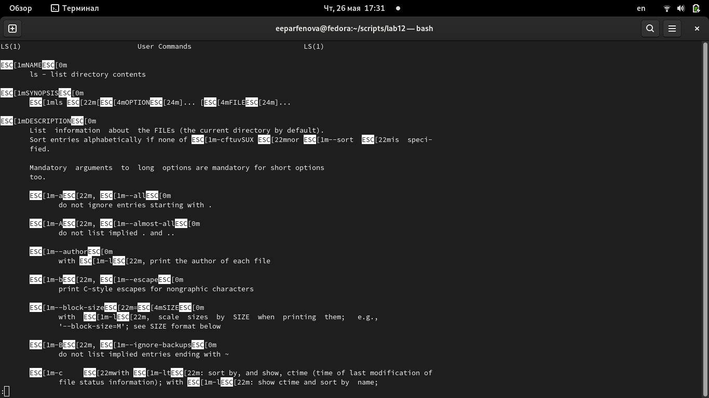

---
## Front matter
lang: ru-RU
title: Лабораторная работа №12. Программирование в командном процессоре ОС UNIX. Расширенное программирование
author: Парфенова Елизавета Евгеньевна
institute: RUDN University, Moscow, Russian Federation

## Formatting
toc: false
slide_level: 2
theme: metropolis
header-includes: 
 - \metroset{progressbar=frametitle,sectionpage=progressbar,numbering=fraction}
 - '\makeatletter'
 - '\beamer@ignorenonframefalse'
 - '\makeatother'
aspectratio: 43
section-titles: true
---

## Цель работы

Изучить основы программирования в оболочке ОС UNIX. Научиться писать более сложные командные файлы с использованием логических управляющих конструкций
и циклов.

## Задание

1. Написать командный файл, реализующий упрощённый механизм семафоров. Командный файл должен в течение некоторого времени t1 дожидаться освобождения
ресурса, выдавая об этом сообщение, а дождавшись его освобождения, использовать
его в течение некоторого времени t2<>t1, также выдавая информацию о том, что
ресурс используется соответствующим командным файлом (процессом). Запустить
командный файл в одном виртуальном терминале в фоновом режиме, перенаправив
его вывод в другой (> /dev/tty#, где # — номер терминала куда перенаправляется
вывод), в котором также запущен этот файл, но не фоновом, а в привилегированном
режиме. Доработать программу так, чтобы имелась возможность взаимодействия трёх
и более процессов.

## Задание

2. Реализовать команду man с помощью командного файла. Изучите содержимое каталога /usr/share/man/man1. В нем находятся архивы текстовых файлов, содержащих
справку по большинству установленных в системе программ и команд. Каждый архив
можно открыть командой less сразу же просмотрев содержимое справки. Командный
файл должен получать в виде аргумента командной строки название команды и в виде
результата выдавать справку об этой команде или сообщение об отсутствии справки,
если соответствующего файла нет в каталоге man1.

3. Используя встроенную переменную $RANDOM, напишите командный файл, генерирующий случайную последовательность букв латинского алфавита.

## Первый комнадный файл

Начинаем с первого задания. Вначала создаем файл script1 и записываем туда код командного файла. Осуществиляем его с помощью циклов if и while. (рис. [-@fig:001])

{ #fig:001 width=60% }

## Первый командный файл

После делаем файл исполняемым командой ***chmod +x script1*** и вызваем его, набрав ***./script1***. Файл сработал успешно.  (рис. [-@fig:002])

{ #fig:002 width=60% }

## Второй командный файл

Приступаем к созданию второго скрипта. В нем нужно было реализовать команду man. Делаем это с помощью getopts и разных циклов. (рис. [-@fig:003])

{ #fig:003 width=60% }

## Второй командный файл

Затем делаем файл исполняемым и запускаем его командой ***./script2 -m ls*, посмотрев справку команды ls. Справка успешно открылась. (рис. [-@fig:004]) (рис. [-@fig:005])

{ #fig:004 width=40% }

{ #fig:005 width=30% }

## Третий командный файл

Приступаем к написанию последнего командного файла. Создаем файл script3 и записываем туда код. Вначале выводим на экран нужную надпись а после, используя встроенную переменную, генерируем одну последовательность букв. (рис. [-@fig:006])

{ #fig:006 width=60% }

## Третий командный файл

После делаем файл исполняемым и несколько раз вызваем его командой ***./script3***. Скрипт сработал успешно. (рис. [-@fig:007])

{ #fig:007 width=50% }

## Вывод

Мы изучили основы программирования в оболочке ОС UNIX и научились писать более сложные командные файлы с использованием логических управляющих конструкций и циклов.