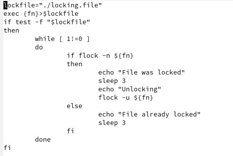
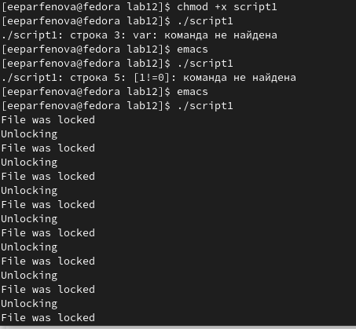
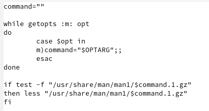

---
## Front matter
title: "Лабораторная работа №12"
subtitle: "Программирование в командном процессоре ОС UNIX. Расширенное программирование"
author: "Парфенова Елизавета Евгеньевна"

## Generic otions
lang: ru-RU
toc-title: "Содержание"

## Bibliography
bibliography: bib/cite.bib
csl: pandoc/csl/gost-r-7-0-5-2008-numeric.csl

## Pdf output format
toc: true # Table of contents
toc-depth: 2
lof: true # List of figures
lot: true # List of tables
fontsize: 12pt
linestretch: 1.5
papersize: a4
documentclass: scrreprt
## I18n polyglossia
polyglossia-lang:
  name: russian
  options:
	- spelling=modern
	- babelshorthands=true
polyglossia-otherlangs:
  name: english
## I18n babel
babel-lang: russian
babel-otherlangs: english
## Fonts
mainfont: PT Serif
romanfont: PT Serif
sansfont: PT Sans
monofont: PT Mono
mainfontoptions: Ligatures=TeX
romanfontoptions: Ligatures=TeX
sansfontoptions: Ligatures=TeX,Scale=MatchLowercase
monofontoptions: Scale=MatchLowercase,Scale=0.9
## Biblatex
biblatex: true
biblio-style: "gost-numeric"
biblatexoptions:
  - parentracker=true
  - backend=biber
  - hyperref=auto
  - language=auto
  - autolang=other*
  - citestyle=gost-numeric
## Pandoc-crossref LaTeX customization
figureTitle: "Рис."
tableTitle: "Таблица"
listingTitle: "Листинг"
lofTitle: "Список иллюстраций"
lotTitle: "Список таблиц"
lolTitle: "Листинги"
## Misc options
indent: true
header-includes:
  - \usepackage{indentfirst}
  - \usepackage{float} # keep figures where there are in the text
  - \floatplacement{figure}{H} # keep figures where there are in the text
---

# Цель работы

Изучить основы программирования в оболочке ОС UNIX. Научиться писать более сложные командные файлы с использованием логических управляющих конструкций
и циклов.

# Задание

1. Написать командный файл, реализующий упрощённый механизм семафоров. Командный файл должен в течение некоторого времени t1 дожидаться освобождения
ресурса, выдавая об этом сообщение, а дождавшись его освобождения, использовать
его в течение некоторого времени t2<>t1, также выдавая информацию о том, что
ресурс используется соответствующим командным файлом (процессом). Запустить
командный файл в одном виртуальном терминале в фоновом режиме, перенаправив
его вывод в другой (> /dev/tty#, где # — номер терминала куда перенаправляется
вывод), в котором также запущен этот файл, но не фоновом, а в привилегированном
режиме. Доработать программу так, чтобы имелась возможность взаимодействия трёх
и более процессов.

2. Реализовать команду man с помощью командного файла. Изучите содержимое каталога /usr/share/man/man1. В нем находятся архивы текстовых файлов, содержащих
справку по большинству установленных в системе программ и команд. Каждый архив
можно открыть командой less сразу же просмотрев содержимое справки. Командный
файл должен получать в виде аргумента командной строки название команды и в виде
результата выдавать справку об этой команде или сообщение об отсутствии справки,
если соответствующего файла нет в каталоге man1.

3. Используя встроенную переменную $RANDOM, напишите командный файл, генерирующий случайную последовательность букв латинского алфавита.

# Выполнение лабораторной работы

Начинаем с первого задания. Я пишу скрипты в редакторе emacs. Вначала создала файл script1 и записала туда код командного файла. Осуществила его с помощью циклов if и while. (рис. [-@fig:001])

{ #fig:001 width=70% }

*Листинг первого скрипта:*

lockfile="./locking.file"

exec {fn}>$lockfile

if test -f "$lockfile"

then

	while [ 1!=0 ]
	do
		if flock -n ${fn}
		then
			echo "File was locked"
			sleep 3
			echo "Unlocking"
			flock -u ${fn}
		else
			echo "File already locked"
			sleep 3
		fi
	done
fi

После сделала файл исполняемым командой ***chmod +x script1*** и вызвала его, набрав ***./script1***. Файл сработал успешно.  (рис. [-@fig:002])

{ #fig:002 width=70% }

Приступила к созданию второго скрипта. В нем нужно было реализовать команду man. Я сделала это с помощью getopts и разных циклов. (рис. [-@fig:003])

{ #fig:003 width=70% }

*Листинг второго скрипта:*

command=""

while getopts :m: opt

do

	case $opt in
	m)command="$OPTARG";;
	esac
done

if test -f "/usr/share/man/man1/$command.1.gz"

then less "/usr/share/man/man1/$command.1.gz"

fi

Затем я сделала файл исполняемым и запустила его командой ***./script2 -m ls*, посмотрев справку команды ls. Справка успешно открылась. (рис. [-@fig:004]) (рис. [-@fig:005])

{ #fig:004 width=70% }

{ #fig:005 width=70% }

Приступила к написанию последнего командного файла. Создала файл script3 и записала туда код. Вначале вывела на экран нужную надпись а после, используя встроенную переменную, сгенерировала одну последовательность букв. (рис. [-@fig:006])

{ #fig:006 width=70% }

*Листинг третьего скрипта:*

echo "Random letter sequence"

cat /dev/urandom | tr -dc "a-zA-Z0-9" | fold -w 15 | head -n 1

После сделал файл исполняемым и несколько раз вызвала его командой ***./script3***. Скрипт сработал успешно. (рис. [-@fig:007])

{ #fig:007 width=70% }

# Выводы

Мы изучили основы программирования в оболочке ОС UNIX и научились писать более сложные командные файлы с использованием логических управляющих конструкций и циклов.

# Контрольные вопросы

1. Найдите синтаксическую ошибку в следующей строке: while [$1 != "exit"]

Между выражением и квадратными скобками должны быть пробелы.

2. Как объединить (конкатенация) несколько строк в одну?

С помощью cat и | .

3. Найдите информацию об утилите seq. Какими иными способами можно реализовать её функционал при программировании на bash?

seq - утилита, способная сгенерировать последовательность чисел. Реализовать эту же фуекцию можно с помощью цикла for.

4. Какой результат даст вычисление выражения $((10/3))?

Результат: 3

5. Укажите кратко основные отличия командной оболочки zsh от bash.

Оболочка zsh больше подходит для, например, работы с файлами, так как она сильно урощает работу. Она имеет в некоторых  местах отличающийся синтаксис с обязательными правилами (например, пробле перед for). Если нужно написать скрипт, эффективно работающий о множества пользователей, то лучше использовать bash.

6. Проверьте, верен ли синтаксис данной конструкции for ((a=1; a <= LIMIT; a++))

Да

7. Сравните язык bash с какими-либо языками программирования. Какие преимущества
у bash по сравнению с ними? Какие недостатки?

Bash позволяет работать с файловой системой без лишних кострукций, однако его возиожности не так велики, как у остальных языков программирования. 