---
## Front matter
lang: ru-RU
title: Лабораторная работа №13. Средства, применяемые при разработке программного обеспечения в ОС типа UNIX/Linux.
author: Парфенова Елизавета Евгеньевна
institute: RUDN University, Moscow, Russian Federation

## Formatting
toc: false
slide_level: 2
theme: metropolis
header-includes: 
 - \metroset{progressbar=frametitle,sectionpage=progressbar,numbering=fraction}
 - '\makeatletter'
 - '\beamer@ignorenonframefalse'
 - '\makeatother'
aspectratio: 43
section-titles: true
---

## Цель работы

Приобрести простейшие навыки разработки, анализа, тестирования и отладки приложений в ОС типа UNIX/Linux на примере создания на языке программирования С калькулятора с простейшими функциями.

## Задание

1. В домашнем каталоге создайте подкаталог ~/work/os/lab_prog.

2. Создайте в нём файлы: calculate.h, calculate.c, main.c.
Это будет примитивнейший калькулятор, способный складывать, вычитать, умножать
и делить, возводить число в степень, брать квадратный корень, вычислять sin, cos, tan.
При запуске он будет запрашивать первое число, операцию, второе число. После этого
программа выведет результат и остановится.

3. Выполните компиляцию программы посредством gcc

## Задание

4. При необходимости исправьте синтаксические ошибки.

5. Создайте Makefile со следующим содержанием.

6. С помощью gdb выполните отладку программы calcul (перед использованием gdb исправьте Makefile)

7. С помощью утилиты splint попробуйте проанализировать коды файлов calculate.c и main.c.

## Создание каталогов и файлов

Первым шагом создаем каталог ~/work/os/lab_prog с помощью ***makdir -p*** и файлы calculate.h, calculate.c, main.c. с помощью ***touch***. (рис. [-@fig:001])

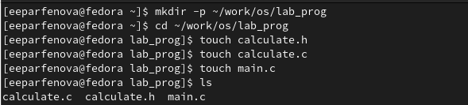{ #fig:001 width=50% }

## Компиляция программы

Далее записываем программы в эти файлы. Затем выполняем компиляцию программы посредством gcc, используя команды: ***gcc -c calculate.c***, ***gcc -c -g main.c***, **gcc calculate.o main.o -o calcul -lm*** (рис. [-@fig:002])

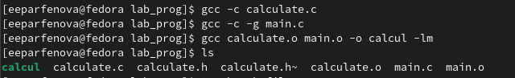{ #fig:002 width=50% }

## Makefile

Далее создаем Makefile с помощью ***touch*** и записываем туда код из файла Лабораторной работы, внеся некторые изменения в 6 и 19 строках. (рис. [-@fig:003])

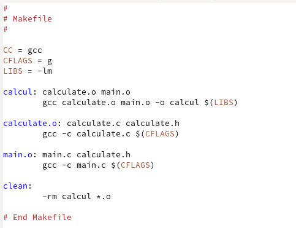{ #fig:003 width=50% }

## Запуск отладчика

После запускаем отладчик GDB командой ***gdb ./calcul***, загрузив в него программу для отладки.(рис. [-@fig:004])

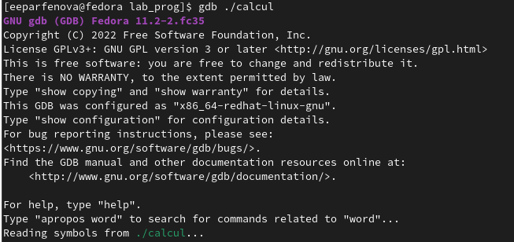{ #fig:004 width=50% }

## Запуск программы

Запускаем программу внутри отладчика, используя команду ***run***.(рис. [-@fig:005])

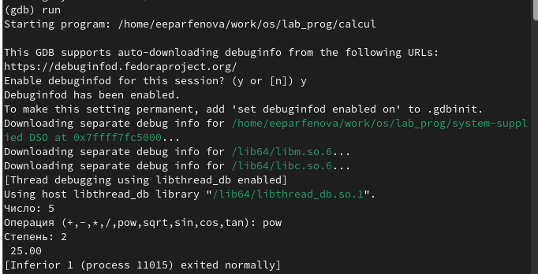{ #fig:005 width=50% }
 
## Просмотр исходного кода

Постранично смотрим код, используя ***list***, а после смотрим исходный код с 12 строки по 15 строку командой ***list 12,15***  (рис. [-@fig:006])

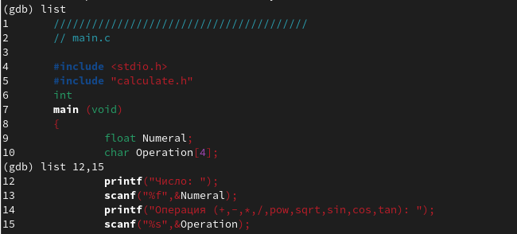{ #fig:006 width=50% }

## Точки останова

Затем установливаем точку останова в файле calculate.c на строке номер 14, сразу после ввода числа. Делаем это, используя команду ***break 14***. Смотрим информацию об имеющихся в проекте точка останова командой ***info breakpoints***. Запускаем программу и проверяем, когда она остановится. Она остановилась правильно, перед вводом операции. (рис. [-@fig:007])

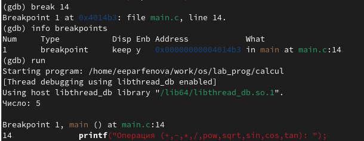{ #fig:007 width=40% }

## Значение переменной

Смотрим, чему равно на этом этапе значение переменной Numeral, введя ***print Numeral***. Оно равно пяти, так как ввели мы именно это число. Затем сравнваем с результатом вывода на экран, который делаем командой ***display Numeral***. Значения совпали. (рис. [-@fig:008])

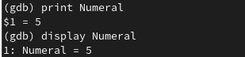{ #fig:008 width=50% }

## Удаление точки останова

После просто убираем точки останова, вызвав вначале информацию о них через ***info breakpoints***, а после удалив, используя ***delete 1*** (точка остановы номер 1) (рис. [-@fig:009])

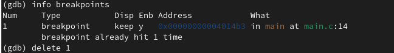{ #fig:009 width=50% }

## Утилита splint

Последним шагом с помощью утилиты splint анализируем коды файлов calculate.c и main.c. (рис. [-@fig:010]) (рис. [-@fig:011])

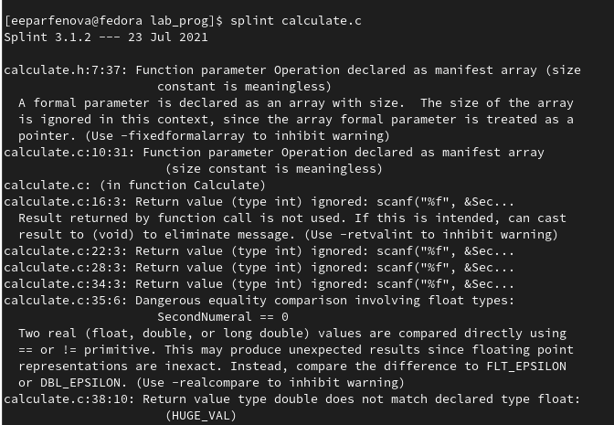{ #fig:010 width=30% }

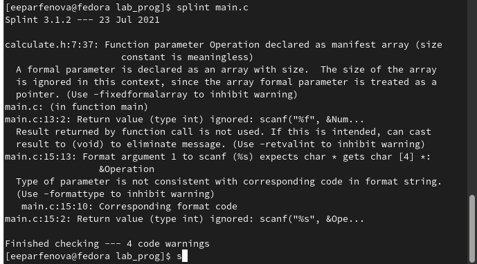{ #fig:011 width=30% }

## Вывод

Мы приобрели простейшие навыки разработки, анализа, тестирования и отладки приложений в ОС типа UNIX/Linux на примере создания на языке программирования С калькулятора с простейшими функциями.