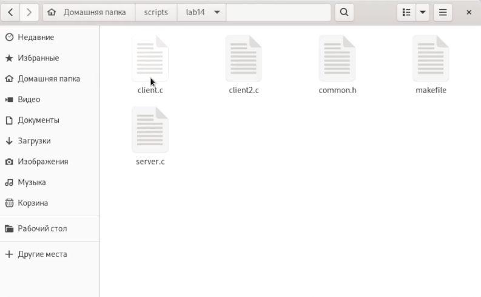
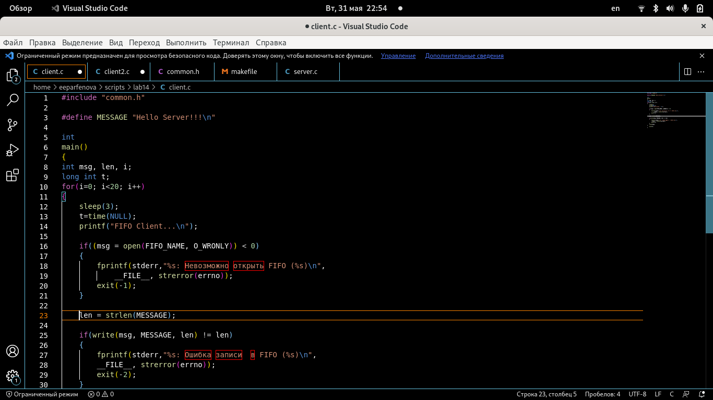
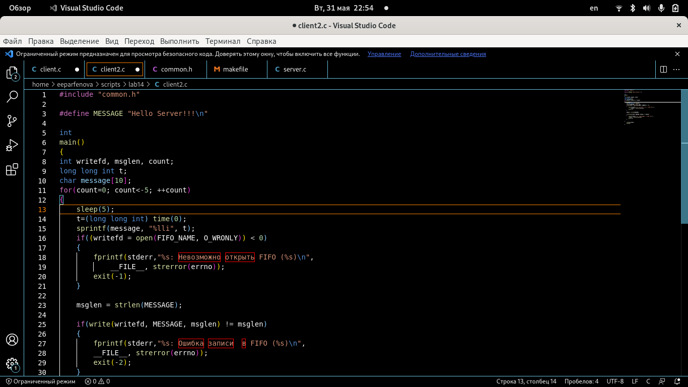
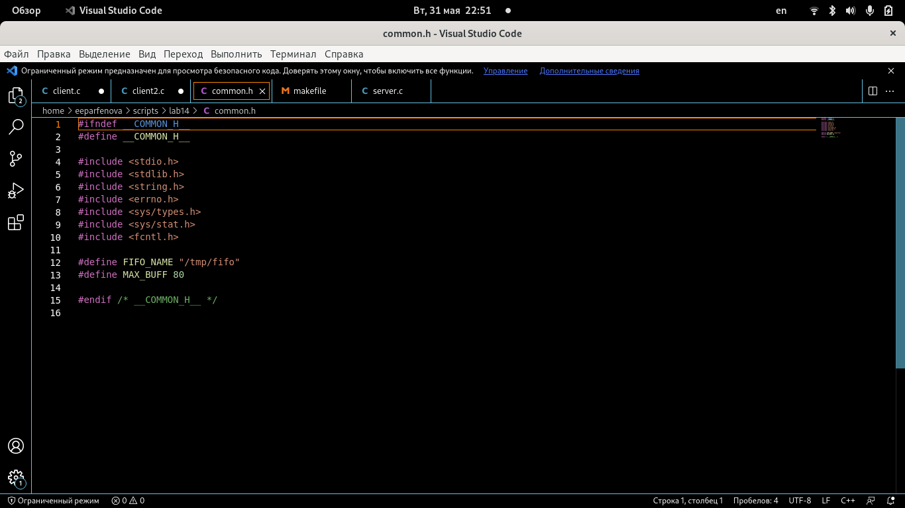
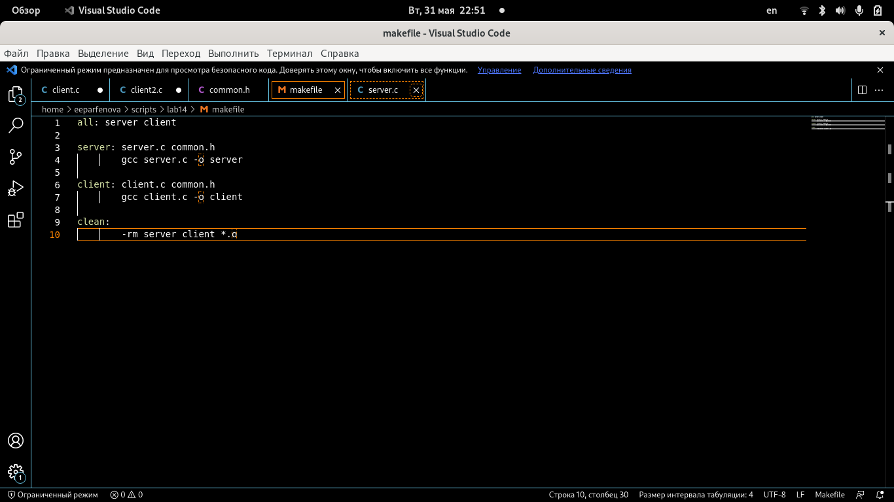
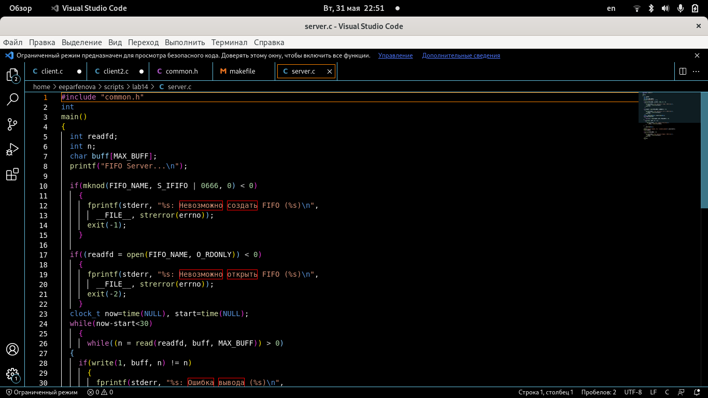
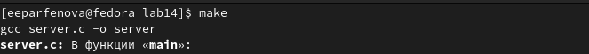
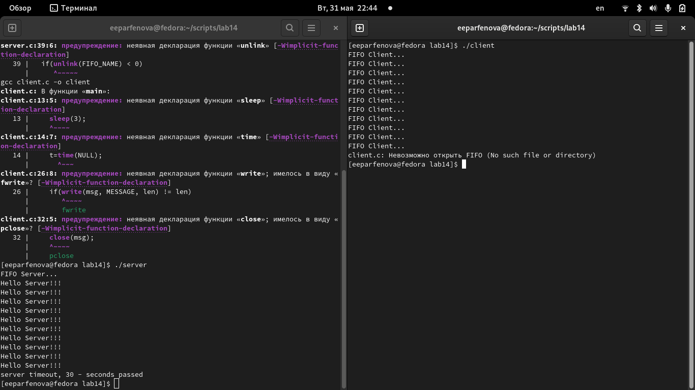

---
## Front matter
lang: ru-RU
title: Лабораторная работа №14. Именованные каналы
author: Парфенова Елизавета Евгеньевна
institute: RUDN University, Moscow, Russian Federation

## Formatting
toc: false
slide_level: 2
theme: metropolis
header-includes: 
 - \metroset{progressbar=frametitle,sectionpage=progressbar,numbering=fraction}
 - '\makeatletter'
 - '\beamer@ignorenonframefalse'
 - '\makeatother'
aspectratio: 43
section-titles: true
---

## Цель работы

Приобретение практических навыков работы с именованными каналами.

## Задание

Изучите приведённые в тексте программы server.c и client.c. Взяв данные примеры
за образец, напишите аналогичные программы, внеся следующие изменения:
1. Работает не 1 клиент, а несколько (например, два).
2. Клиенты передают текущее время с некоторой периодичностью (например, раз в пять
секунд). Используйте функцию sleep() для приостановки работы клиента.
3. Сервер работает не бесконечно, а прекращает работу через некоторое время (например, 30 сек). Используйте функцию clock() для определения времени работы сервера.
Что будет в случае, если сервер завершит работу, не закрыв канал?

## Программы в папке

Пишем анологичные программы и помещаем их в папку. (рис. [-@fig:001])

{ #fig:001 width=70% }

## client.c

1. client.c (рис. [-@fig:002])

{ #fig:002 width=70% }

## client2.c

2. client2.c (рис. [-@fig:003])

{ #fig:003 width=70% }

## common.h

3. common.h (рис. [-@fig:004])

{ #fig:004 width=70% }

## makefile

4. makefile (рис. [-@fig:005])

{ #fig:005 width=70% }

## server.c

5. server.c (рис. [-@fig:006])

{ #fig:006 width=70% }

## Запуск make

Следующим шагом открываем папку, в которой хранятся все файлы, в терминале и запускаем make одноименной командой. (рис. [-@fig:007])

{ #fig:007 width=70% }

## Работа сервера

Когда все завершилось, в этом же терминале запускаем команду ***./server***. Далее снова открываем эту же папку в терминале (нужно было новое окно) и запускаем команду ***./client***. Необходимо оставить оба терминала работающими. Сервер успешно запустился и закончил работу через 30 секунд. (рис. [-@fig:008])

{ #fig:008 width=50% }

## Вывод

Мы приобрели практические навыки работы с именованными каналами.