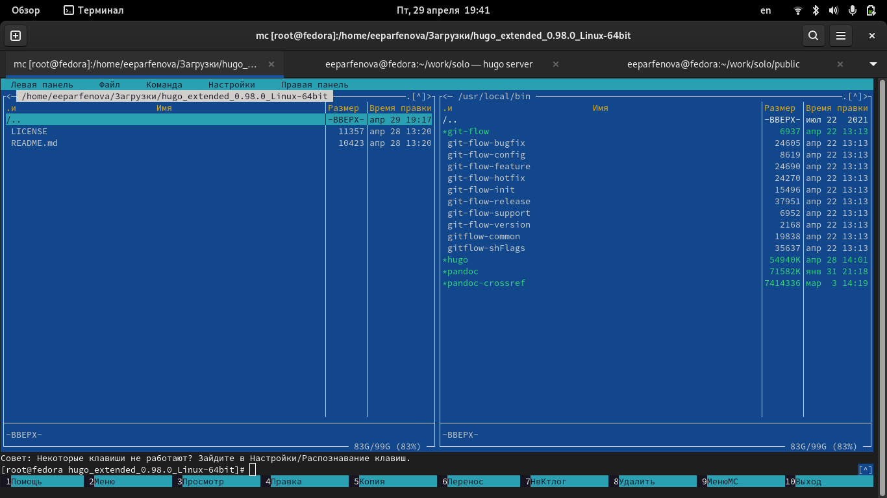
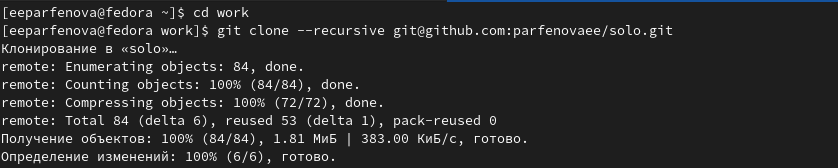
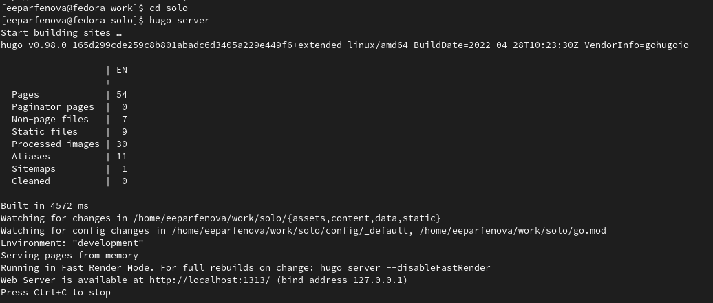
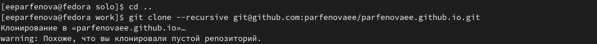
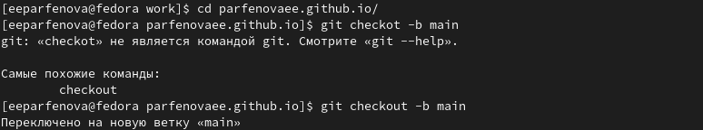
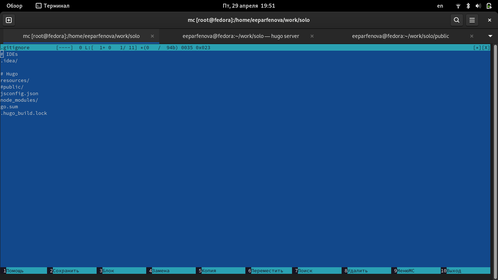
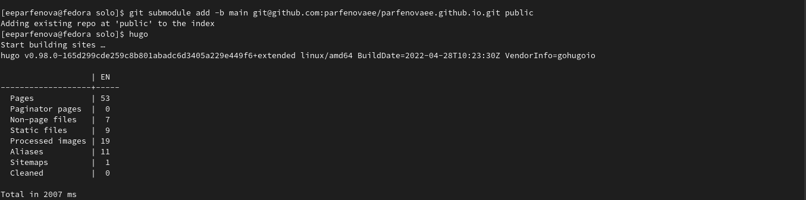
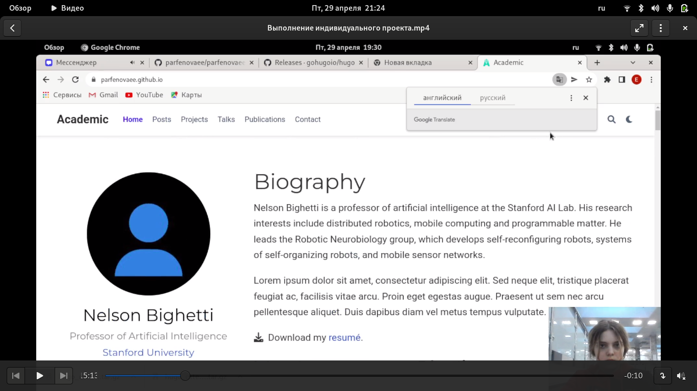

---
## Front matter
lang: ru-RU
title: Первый этап индивидуального проекта
author: Парфенова Елизавета Евгеньевна
institute: RUDN University, Moscow, Russian Federation

## Formatting
toc: false
slide_level: 2
theme: metropolis
header-includes: 
 - \metroset{progressbar=frametitle,sectionpage=progressbar,numbering=fraction}
 - '\makeatletter'
 - '\beamer@ignorenonframefalse'
 - '\makeatother'
aspectratio: 43
section-titles: true
---

## Цель работы

Разместить на Github pages заготовки для персонального сайта.

## Задание

- Установить необходимое программное обеспечение.
- Скачать шаблон темы сайта.
- Разместить его на хостинге git.
- Установить параметр для URLs сайта.
- Разместить заготовку сайта на Github pages.

# Выполнение работы

## Файл hugo

Сначала необходимо убедиться, что установлено нужное ПО. Особенно, если вы работаете на своей технике. 

Первый шаг проекта - скачать файл hugo. Нужно выбрать подходящий для своей системы, а также не забыть про требования по версии. В моем случае я скачала hugo_extended_0.98.0_Linux-64bit.tar.gz.

После его необходимо извлечь в новую папку и с помощью файлового менеджера мс скопировать в папку usr/local/bin. (рис. [-@fig:001])

{ #fig:001 width=50% }

## Создание нового репозитория на основе шаблона

Переходим по ссылке, находящейся в ТУИСе, в репозиторий, где храниться шаблон, и, используя его, создаем новый репозитроий. Название не имеет значения: я назвала solo. 

## Клонирование репозитория

Следующим шагом переходим в терминале в каталог work и с помощью команды ***git clone --recursive*** клонируем созданный репозиторий, в конце вставив ссылку из браузера (SSH cсылка). (рис. [-@fig:002])

{ #fig:002 width=70% }

## Команда ***hugo server***

После мы переходим в созданную папку и запускаем команду ***hugo server***, во время выполнения которой появится ссылка на заготовку сайта. (рис. [-@fig:003])

{ #fig:003 width=70% }

## Заготовка сайта

Далее мы должны скопировать созданную ссылку в браузер, и сайт откроется. (рис. [-@fig:004])

{ #fig:004 width=50% }

Чтобы убрать предупреждение на зеленом фоне, необходимо удалить файл demo.md, который находился в каталоге solo/content/home.

## Создание нового репозитория

Следующим шагом мы возвращаемся на свой Github и создаем новый репозиторий с определенным именем. Имя: user.github.io. В моем случае - parfenovaee.github.io. 

## Клонирование репозитория

Далее мы должны перейти в терминал, в каталог work и снова ввести команду ***git clone --recursive***, только уже для нового репозитория (SSH cсылка). (рис. [-@fig:005])

{ #fig:005 width=70% }

## Создание нвоой ветки

После командой ***git checkout -b main*** необходимо создать ветку в папке нового репозитория. (рис. [-@fig:006])

{ #fig:006 width=70% }

## Согласование локального репозитория и Github 

После создаем файл README.md командой ***touch***, и вводим стандартные команды для согласования информации локального репозитория и Github: ***git add .***, ***git commit -am "Добавили файл"*** и ***git push oridgin main***

## Исправление неполадок при команде ***git submodule***

Затем было необходимо соединить репозиторий и папку public в каталоге solo. Для этого мы вводим команду ***git submodule add -b main git@github.com:parfenovaee/parfenovaee.github.io.git public***.  Терминал выдал некую ошибку, которая звучит так: "Следующие пути игнорируются одним из ваших файлов .gitignore: public". Чтобы исправить это, я вызвала mc и в каталоге solo нашла .gitignore и закомментировала там public. (рис. [-@fig:007])

{ #fig:007 width=50% }

## Успешное завершение команды 

После устранения неполадок, мы заново вводим команду и видим, что все проходит успешно. (рис. [-@fig:008])

{ #fig:008 width=70% }

Затем необходимо перейти в папку public и выполнить стандартные команды согласования локального репозитория и Github: ***git add .***, ***git commit -am "Добавили сайт"*** и ***git push oridgin main***

## Заготовка сайта

Псоледним шагом нужно просто открыть созданную заготовку сайта. ДЛя этого вводим, как ссылку, имя последнего созданного репозитория. (рис. [-@fig:009])

{ #fig:009 width=70% }

## Вывод

Мы разместили на Github pages заготовки для персонального сайта.
