---
## Front matter
title: "Первый этап индивидуального проекта"
author: "Парфенова Елизавета Евгеньевна"

## Generic otions
lang: ru-RU
toc-title: "Содержание"

## Bibliography
bibliography: bib/cite.bib
csl: pandoc/csl/gost-r-7-0-5-2008-numeric.csl

## Pdf output format
toc: true # Table of contents
toc-depth: 2
lof: true # List of figures
lot: true # List of tables
fontsize: 12pt
linestretch: 1.5
papersize: a4
documentclass: scrreprt
## I18n polyglossia
polyglossia-lang:
  name: russian
  options:
	- spelling=modern
	- babelshorthands=true
polyglossia-otherlangs:
  name: english
## I18n babel
babel-lang: russian
babel-otherlangs: english
## Fonts
mainfont: PT Serif
romanfont: PT Serif
sansfont: PT Sans
monofont: PT Mono
mainfontoptions: Ligatures=TeX
romanfontoptions: Ligatures=TeX
sansfontoptions: Ligatures=TeX,Scale=MatchLowercase
monofontoptions: Scale=MatchLowercase,Scale=0.9
## Biblatex
biblatex: true
biblio-style: "gost-numeric"
biblatexoptions:
  - parentracker=true
  - backend=biber
  - hyperref=auto
  - language=auto
  - autolang=other*
  - citestyle=gost-numeric
## Pandoc-crossref LaTeX customization
figureTitle: "Рис."
tableTitle: "Таблица"
listingTitle: "Листинг"
lofTitle: "Список иллюстраций"
lotTitle: "Список таблиц"
lolTitle: "Листинги"
## Misc options
indent: true
header-includes:
  - \usepackage{indentfirst}
  - \usepackage{float} # keep figures where there are in the text
  - \floatplacement{figure}{H} # keep figures where there are in the text
---

# Цель работы

Разместить на Github pages заготовки для персонального сайта.

# Задание

- Установить необходимое программное обеспечение.
- Скачать шаблон темы сайта.
- Разместить его на хостинге git.
- Установить параметр для URLs сайта.
- Разместить заготовку сайта на Github pages.

# Выполнение индивидуального проекта

Перед началом выполнения первого этапа я ознакомилась с материалами, которые представлены на ТУИСе. Так как работу я выполняю на своей технике, то я установила go на компьютер с помощью команды в терминале.

После я перешла непосредственно к выполнению первого этапа. Вначале я перешла по ссылке, находящейся на ТУИСе и нашла файл hugo, предназначенный для нужной мне ОС. Я работаю на Linux Fedora, поэтому скачала hugo_extended_0.98.0_Linux-64bit.tar.gz. Скачиваю файл последней представленной версии (0.98.0). (рис. [-@fig:001])

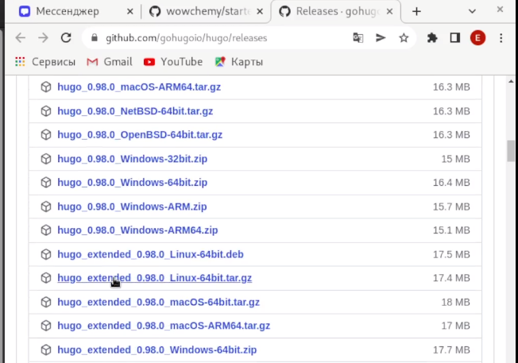{ #fig:001 width=70% }

Далее я извлекла файлы из папки и зашла в файловый менеджер через терминал (комнада ***mc***). Там я перенесла файл hugo, находящийся внутри извлеченной пакпи, в папку usr/local/bin. (рис. [-@fig:002])

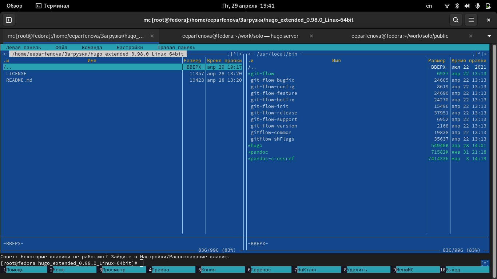{ #fig:002 width=70% }

Следующим шагом я перешла в репозиторий, где создан шаблон индивидульного сайта и нажала на "Use this template", то есть создала свой репозиторий по этому шаблону. Я назвала его solo. (рис. [-@fig:003])

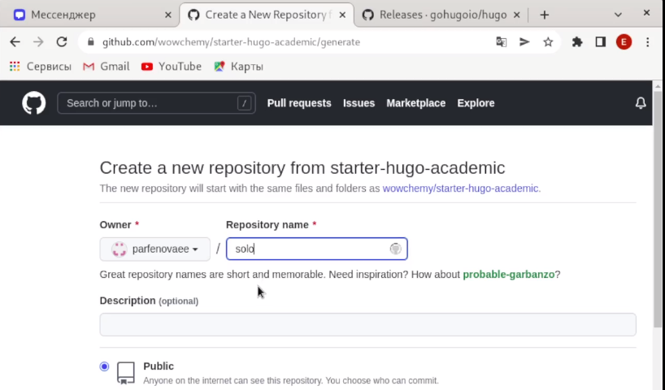{ #fig:003 width=70% }

Далее в терминале я перешла в каталог work (команда ***cd***) и ввела команду ***git clone --recursive*** , вставив в конце ссылку на созданный репозиторий (ссылка SSH). (рис. [-@fig:004])

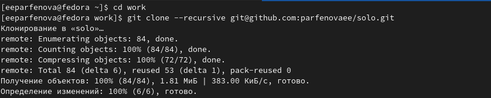{ #fig:004 width=70% }

После переходим в созданную папку solo и в ней запускаем команду ***hugo server***. При выполнении команды в конце появится ссылка. (рис. [-@fig:005])

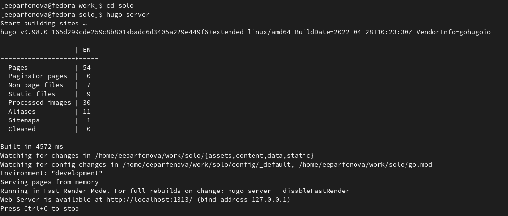{ #fig:005 width=70% }

Данную ссылку я скопировала и вставила в браузер. Открылся сайт, но пока он виден только на моем компюьтере. (рис. [-@fig:006])

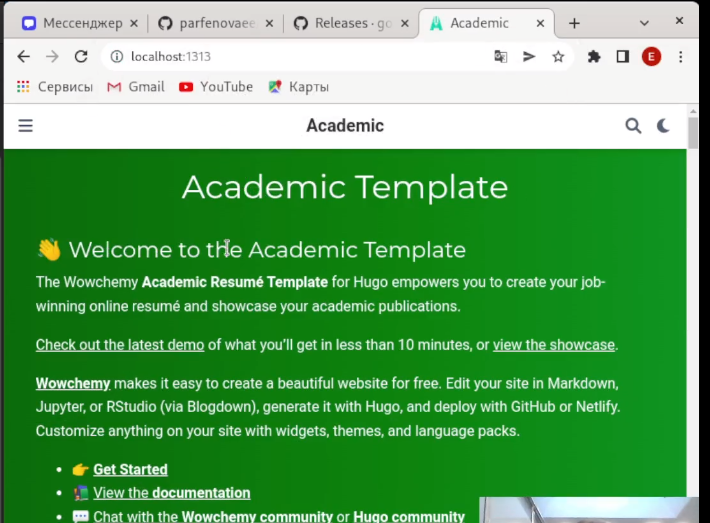{ #fig:006 width=70% }

После я убрала предупреждение на зеленом фоне, удалив файл demo.md, который находился в каталоге solo/content/home. 

Следующим шагом я создала новый репозиторий, именем которого указала user.github.io (в моем случае parfenovaee.github.io) (рис. [-@fig:007])

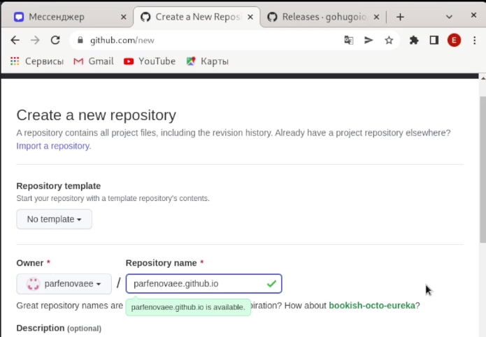{ #fig:007 width=70% }

После, вернувшись в консоль, я прешла в work и снова ввела команду ***git clone --recursive***, только теперь вставила ссылку на вновь созданный репозиторий. (ссылка SSH) (рис. [-@fig:008])

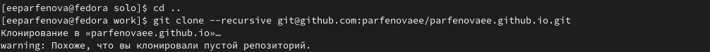{ #fig:008 width=70% }

Следующим шагом создала новую ветку main командой ***git checkout -b main***, перед этим перейдя в папку parfenovaee.github.io  (рис. [-@fig:009])

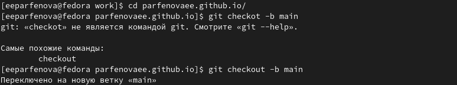{ #fig:009 width=70% }

После создала файл README.md командой ***touch***.
И ввела стандартные команды для согласования информации локального репозитория и Github: ***git add .***, ***git commit -am "Добавили файл"*** и ***git push oridgin main***. (рис. [-@fig:010])

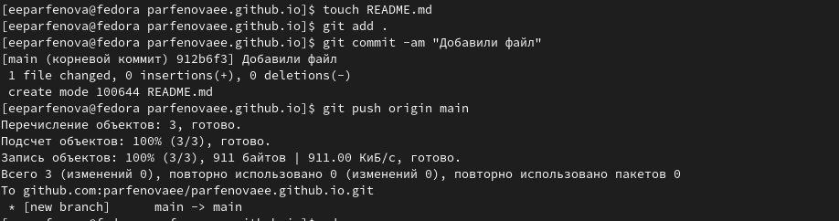{ #fig:010 width=70% }

Затем было необходимо соединить репозиторий и папку public в каталоге solo. Для этого мы вводим команду ***git submodule add -b main git@github.com:parfenovaee/parfenovaee.github.io.git public***. Ссылка из команды - ссылка на последний из созданных репозиторией (SSH ссылка), в конце указываем папку. Терминал выдал некую ошибку, которая звучит так: "Следующие пути игнорируются одним из ваших файлов .gitignore: public". Чтобы исправить это, я вызвала mc и в каталоге solo нашла .gitignore и закомментировала там public. (рис. [-@fig:011])

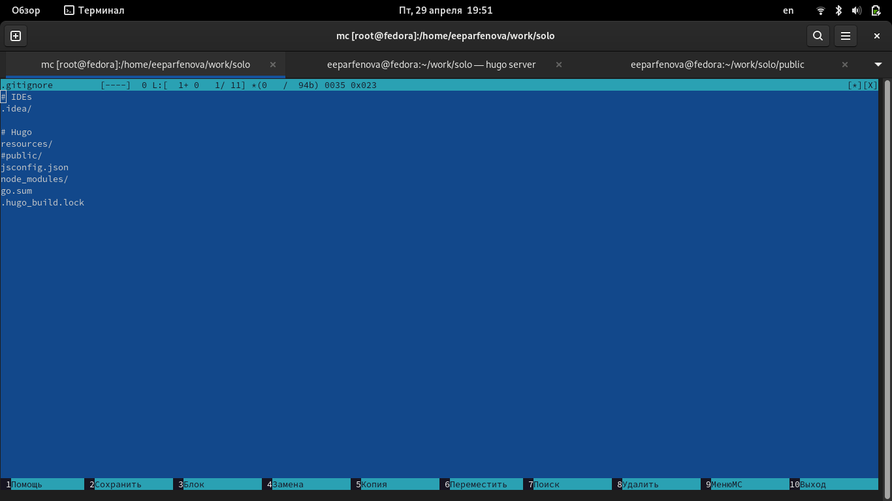{ #fig:011 width=70% }

После выполненных действий комнада прошла успешно и папка public наполнилась содержимым сайта. (рис. [-@fig:012])

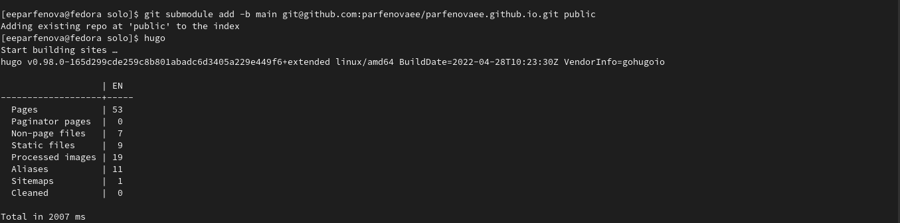{ #fig:012 width=70% }

После перешла в паку public и снова выполнила три стандартные команды: ***git add .***, ***git commit -am "Добавили сайт"*** и ***git push oridgin main***. (рис. [-@fig:013]) (рис. [-@fig:014])

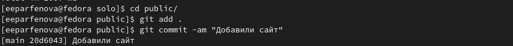{ #fig:013 width=70% }

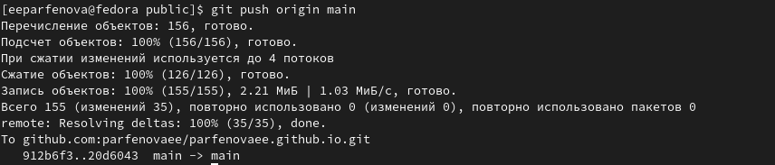{ #fig:014 width=70% }

После остается только открыть сделанный сайт в браузере. Для этого мы копируем его название (название последнего созданного репозитория) и ждем, пока сайт прогрузится. (рис. [-@fig:015])

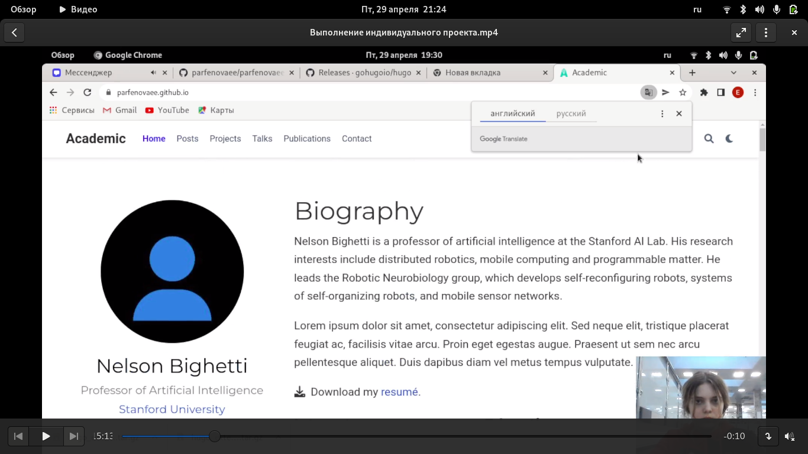{ #fig:015 width=70% }

# Выводы

Мы разместили на Github pages заготовки для персонального сайта

