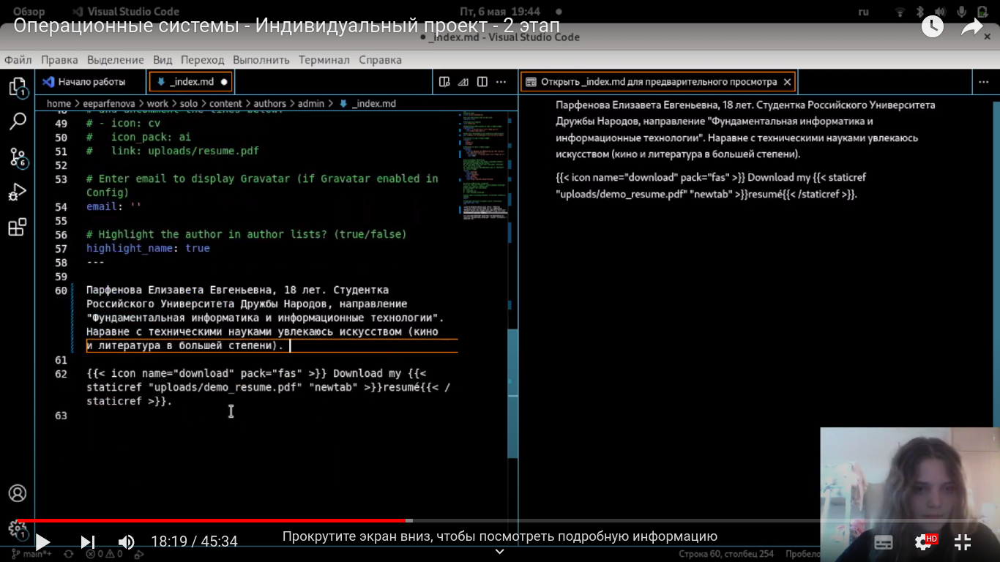
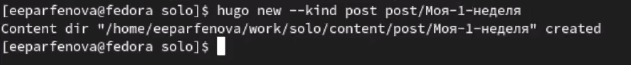
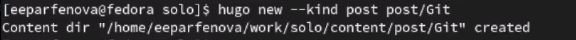
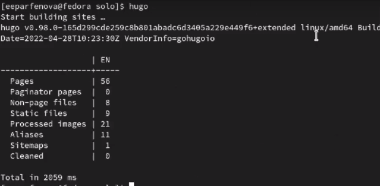
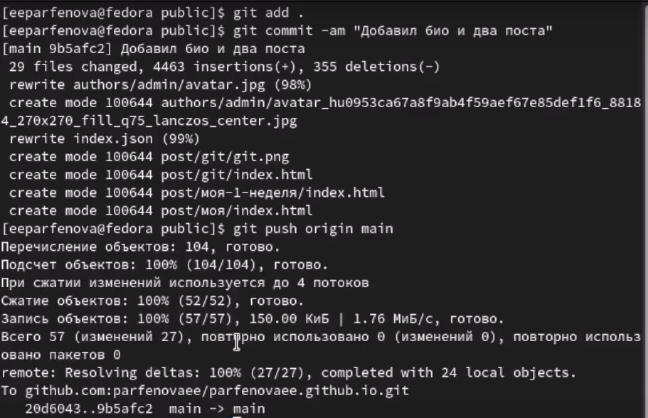
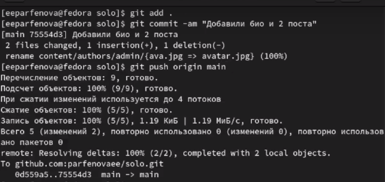
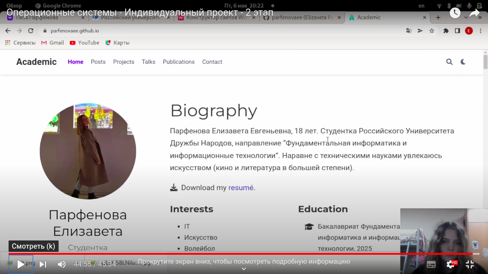

---
## Front matter
lang: ru-RU
title: Индивидульный проект. Этап 2.
author: Парфенова Елизаевта Еагеньевна
institute: RUDN University, Moscow, Russian Federation

## Formatting
toc: false
slide_level: 2
theme: metropolis
header-includes: 
 - \metroset{progressbar=frametitle,sectionpage=progressbar,numbering=fraction}
 - '\makeatletter'
 - '\beamer@ignorenonframefalse'
 - '\makeatother'
aspectratio: 43
section-titles: true
---

## Цель работы

Добавить к сайту данные о себе и научиться добавлять посты.

## Задание

1. Добавить к сайту такие данные: 

   - Разместить фотографию владельца сайта.

    - Разместить краткое описание владельца сайта (Biography).

   - Добавить информацию об интересах (Interests).

   - Добавить информацию от образовании (Education).

2. Сделать пост по прошедшей неделе.

3. Добавить пост на тему "Управление версиями. Git."

## Добавление данных о себе

В каталоге solo/content/author/admin удаляем существующую фоторафию и добавляем свою, а также редактируем находящийся в папке файл, добавив всю информацию о себе. (рис. [-@fig:001])

{ #fig:001 width=70% }

## Создание недельного поста

После возвращаемся в папку solo и открываем ее в терминале. Там набираем команду ***hugo new --kind post post/Моя-1-неделя***, которая позволяет создать новую папку в content/posts. (рис. [-@fig:002]) Открываем файл, находящийся внутри, и редактируем его, добавляя текст поста.

{ #fig:002 width=70% }

## Создание поста о Git

Таким же способом создаем еще одну папку Git. (рис. [-@fig:003]) Файл из нее открываем через VS Code и добавляем туда текст, который хотим разместить на сатйе.

{ #fig:003 width=70% }

## Запуск файла hugo

После сохранения всех измененных файлов открываем в терминале папку solo и запускаем hugo. (рис. [-@fig:004])

{ #fig:004 width=70% }

## Синхронизация папки public

Далее открываем в терминале папку public и вводим три стандартные команды, чтобы перенести данные из локального репозитория. Только к ***git push*** желательно добавить ***origin main***. (рис. [-@fig:005])

{ #fig:005 width=70% }

## Синхронизация solo

Когда все прошло успешно, возвращаемся в папку solo и повторяем действия. (рис. [-@fig:006])

{ #fig:006 width=70% }

## Обновленный сайт

После проделанных действий данные синхронизировлаись, и можно перейти на сайт, чтобы проверить, все ли прошло успешно. Информация на сайте изменилась, и посты добавились. (рис. [-@fig:010])

{ #fig:010 width=70% }

## Вывод

Мы добавили на сайт данные о себе и научились создавать посты. Добавили пост о прешедшей неделе и пост на тему "Управление версиями. Git"