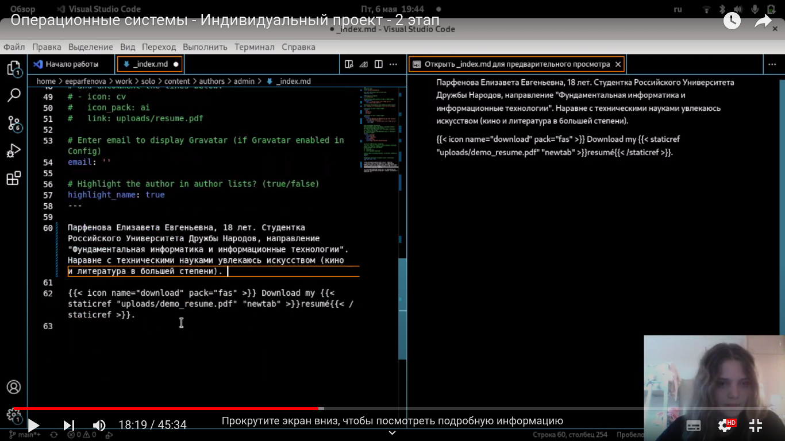
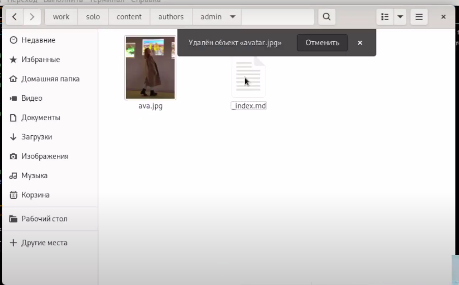
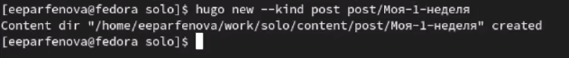
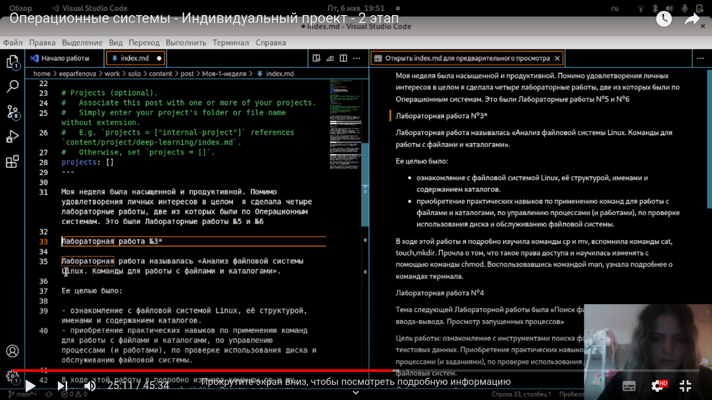
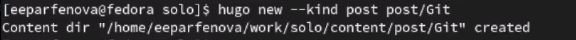
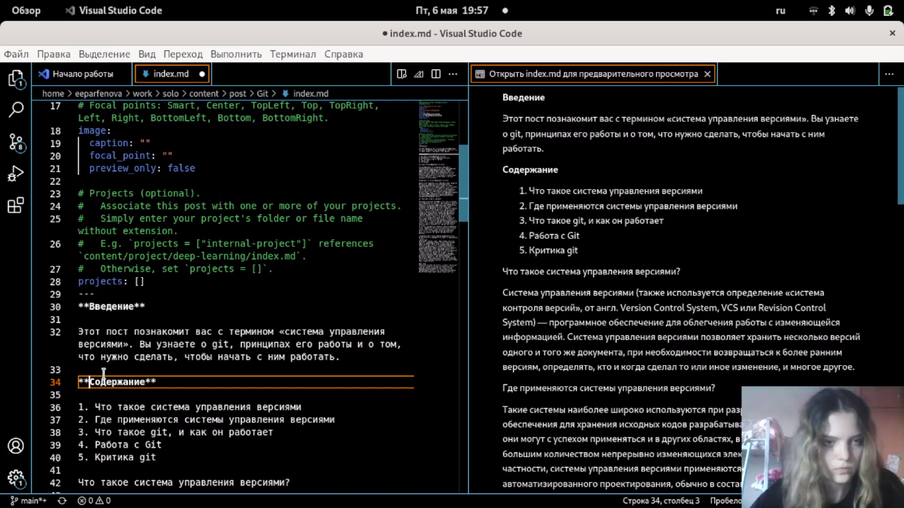
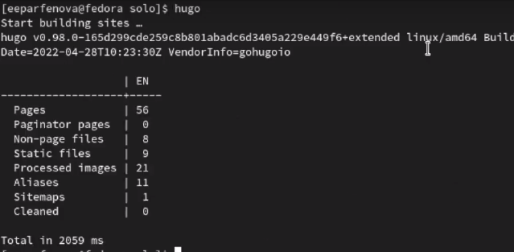
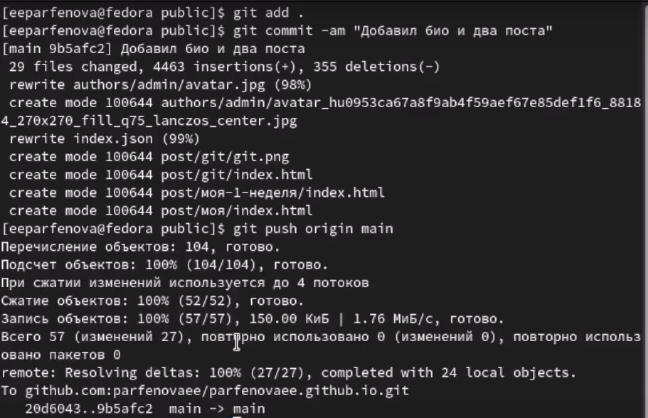
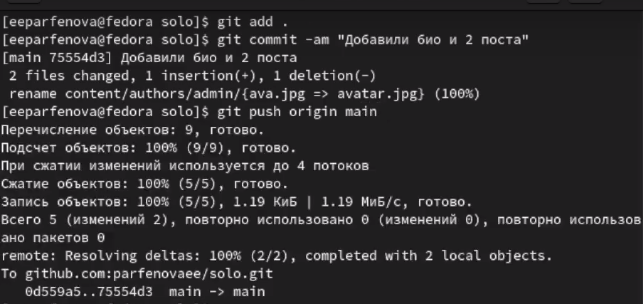
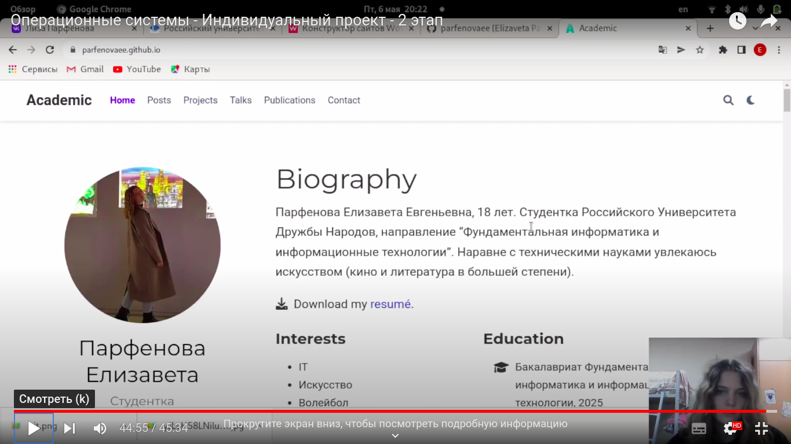

---
## Front matter
title: "Индивидульный проект. Этап 2"
author: "Парфенова Елизавета Евгеньевна"

## Generic otions
lang: ru-RU
toc-title: "Содержание"

## Bibliography
bibliography: bib/cite.bib
csl: pandoc/csl/gost-r-7-0-5-2008-numeric.csl

## Pdf output format
toc: true # Table of contents
toc-depth: 2
lof: true # List of figures
lot: true # List of tables
fontsize: 12pt
linestretch: 1.5
papersize: a4
documentclass: scrreprt
## I18n polyglossia
polyglossia-lang:
  name: russian
  options:
	- spelling=modern
	- babelshorthands=true
polyglossia-otherlangs:
  name: english
## I18n babel
babel-lang: russian
babel-otherlangs: english
## Fonts
mainfont: PT Serif
romanfont: PT Serif
sansfont: PT Sans
monofont: PT Mono
mainfontoptions: Ligatures=TeX
romanfontoptions: Ligatures=TeX
sansfontoptions: Ligatures=TeX,Scale=MatchLowercase
monofontoptions: Scale=MatchLowercase,Scale=0.9
## Biblatex
biblatex: true
biblio-style: "gost-numeric"
biblatexoptions:
  - parentracker=true
  - backend=biber
  - hyperref=auto
  - language=auto
  - autolang=other*
  - citestyle=gost-numeric
## Pandoc-crossref LaTeX customization
figureTitle: "Рис."
tableTitle: "Таблица"
listingTitle: "Листинг"
lofTitle: "Список иллюстраций"
lotTitle: "Список таблиц"
lolTitle: "Листинги"
## Misc options
indent: true
header-includes:
  - \usepackage{indentfirst}
  - \usepackage{float} # keep figures where there are in the text
  - \floatplacement{figure}{H} # keep figures where there are in the text
---

# Цель работы

Добавить к сайту данные о себе и научиться добавлять посты.

# Задание

1. Добавить к сайту такие данные: 

   - Разместить фотографию владельца сайта.

    - Разместить краткое описание владельца сайта (Biography).

   - Добавить информацию об интересах (Interests).

   - Добавить информацию от образовании (Education).

2. Сделать пост по прошедшей неделе.

3. Добавить пост на тему "Управление версиями. Git."

# Выполнение лабораторной работы

Все данные я добавляла в локальном репозитории. Сначала в папке solo я нашла папку content, а в ней папку author, затем admin. В этой папке лежит вся информация о пользователе и аватар профиля. Аватар я сразу заменила, копировав свое фото и переименовав его также. 

После открыла находящийся в папке файл в VS Code и начала его редактировать. Заполнив всю информацию о себе, я сохранила файл. (рис. [-@fig:001])
 На этоп эта добавления к сайту данных о себе был окончен. (рис. [-@fig:002])

{ #fig:001 width=70% }

{ #fig:002 width=70% }

После я вернулась в папку solo и открыла ее в терминале. Там я набрала команду ***hugo new --kind post post/Моя-1-неделя***, которая позволила мне создать новую папку в content/posts. (рис. [-@fig:003])

{ #fig:003 width=70% }

Далее открыла файл из созданной папки в VS Code и отредактировала его, добавив текст поста. (рис. [-@fig:004])

{ #fig:004 width=70% }

Таким же способом я создала еще одну папку Git. (рис. [-@fig:005]) Файл из нее я также открыла через VS Code и добавила туда текст. (рис. [-@fig:006])

{ #fig:005 width=70% }

{ #fig:006 width=70% }

После сохранения всех измененных файлов я снова открыла в терминале папку solo и запустила hugo. (рис. [-@fig:007])

{ #fig:007 width=70% }

Далее я открыла в терминале папку public и ввела три стандартные команды, чтобы перенести данные из локального репозитория. Только к ***git push*** добавила ***origin main***. (рис. [-@fig:008])

{ #fig:008 width=70% }

Когда все прошло успешно, вернулась в папку solo и повторила действия. (рис. [-@fig:009])

{ #fig:009 width=70% }

После проделанных действий данные синхронизировлаись, и я перешла на сайт, чтобы проверить, все ли прошло успешно. Информация на сайте изменилась, и посты добавились. (рис. [-@fig:010])

{ #fig:010 width=70% }

# Выводы

Мы добавили на сайт данные о себе и научились создавать посты. Добавили пост о прешедшей неделе и пост на тему "Управление версиями. Git"