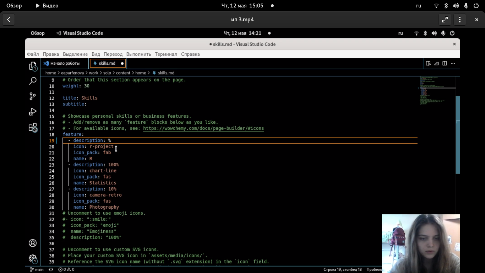
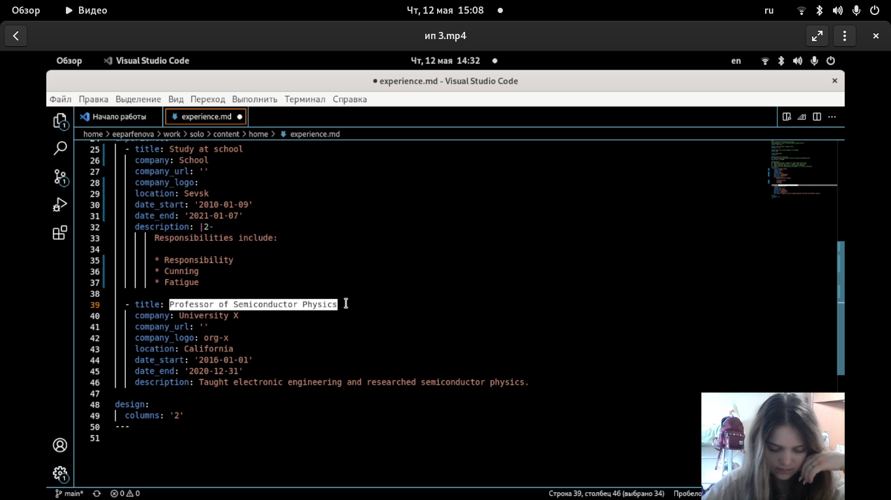
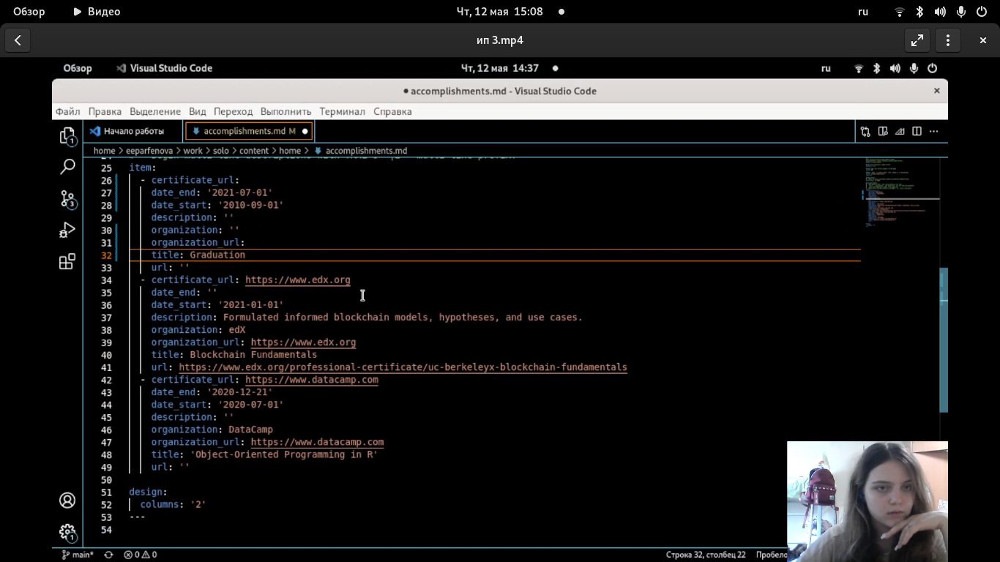
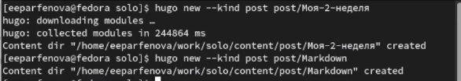
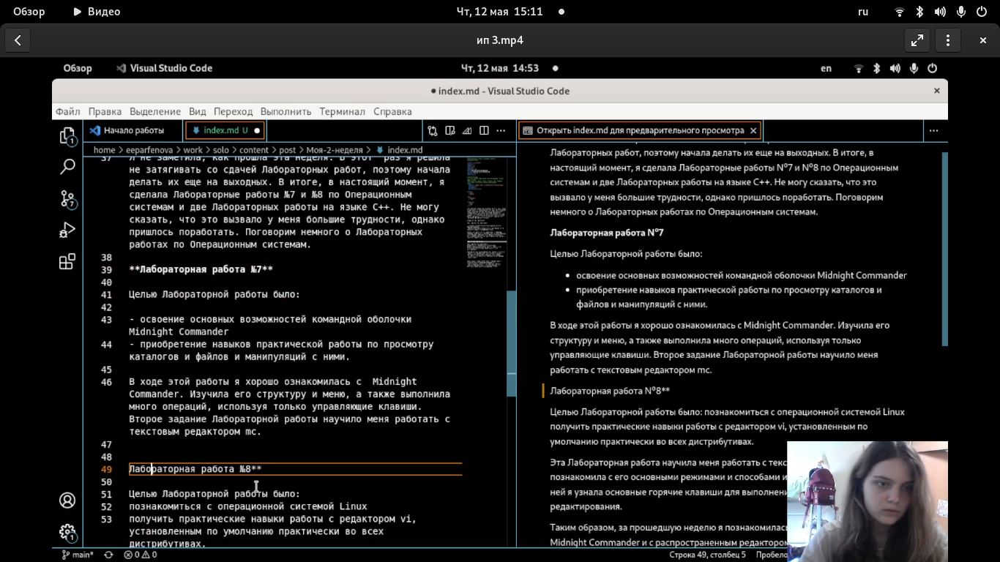
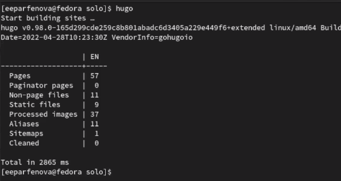
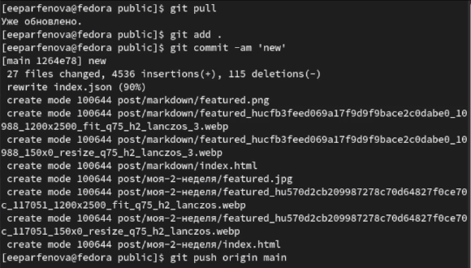
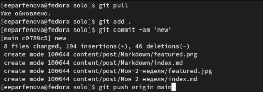
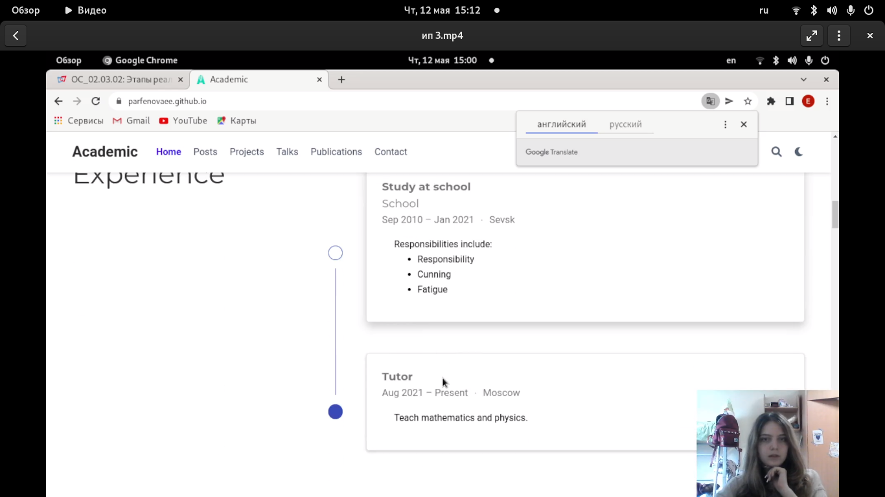

---
## Front matter
lang: ru-RU
title: Индивидуальный проект. 3 этап
author: Парфенова Елизавета Евгеньевна
institute: RUDN University, Moscow, Russian Federation

## Formatting
toc: false
slide_level: 2
theme: metropolis
header-includes: 
 - \metroset{progressbar=frametitle,sectionpage=progressbar,numbering=fraction}
 - '\makeatletter'
 - '\beamer@ignorenonframefalse'
 - '\makeatother'
aspectratio: 43
section-titles: true
---

## Цель работы

Добавить информацию о навыках, опыте и достижениях. Выложить два поста.

## Задание

1. Добавить к сайту достижения.

  - Добавить информацию о навыках (Skills).
  -  Добавить информацию об опыте (Experience).
  - Добавить информацию о достижениях (Accomplishments).

2. Сделать пост по прошедшей неделе.

3. Добавить пост на тему "Язык разметки Markdown."

# Выполнение работы

## Изменение навыков

Первым шагом изменяем информацию на сайте. Для этого заходим в папку work/solo/content/home и открываем документ оттуда через редактор. Начнем с файла "skills". В нем изменяем информацию о скилах и иконки, которые этим скилам соответсвуют. (рис. [-@fig:001])

{ #fig:001 width=40% }

## Изменение опыта

После в той же папке находим файл "experience" и изменяем информацию в нем. (рис. [-@fig:002])

{ #fig:002 width=70% }

## Изменение достижений

Последним изменяем файл "accomplishments". (рис. [-@fig:003])

{ #fig:003 width=70% }

## Добавление папок постов

После перреходим к созданию постов. Вначале создаем папки для этих постов. Для этого открываем папку репозитория в терминале и набираем команды ***hugo new --kind post post/Моя-2-неделя*** и ***hugo new --kind post post/Markdown***.(рис. [-@fig:004]) 

{ #fig:004 width=50% }

## Добавлене первого поста

После открываем файл из первой папки в редакторе  и вставляем туда  пост о прошедшей неделе. Также в папку поста переносим нужную картинку и переименовываем ее. (рис. [-@fig:005]) 

{ #fig:005 width=70% }

## Добавление второго поста

Все то же самое делаем и для второго поста по языку разметки. (рис. [-@fig:006])

{ #fig:006 width=70% }

## Вызов файла hugo

После переходим в папку репозитория, открываем папку в терминале и набираем команду ***hugo***. (рис. [-@fig:007]).

{ #fig:007 width=70% }

## Стандартные команды

Далее переходим в папку public, открываем ее в терминале и набираем три стандартные команды: git add .,git commit -am и giy push origin main.  (рис. [-@fig:008]).

{ #fig:008 width=70% }

## Стандартные команды

Далее переходим в solo и делаем тоже самое. (рис. [-@fig:009]).

{ #fig:009 width=70% }

## Обновление сайта

Последним шагом обновляем и проверяем внесенные изменения. Изменилась информация и добавились посты. (рис. [-@fig:010]).

{ #fig:010 width=70% }

## Вывод

Мы изменили информацию о навыках, достижениях и опыте и добавили новые посты. 

