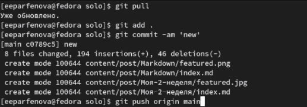

---
## Front matter
title: "Индивидуальный проект. 3 этап."
author: "Парфенова Елизавета Евгеньевна"

## Generic otions
lang: ru-RU
toc-title: "Содержание"

## Bibliography
bibliography: bib/cite.bib
csl: pandoc/csl/gost-r-7-0-5-2008-numeric.csl

## Pdf output format
toc: true # Table of contents
toc-depth: 2
lof: true # List of figures
lot: true # List of tables
fontsize: 12pt
linestretch: 1.5
papersize: a4
documentclass: scrreprt
## I18n polyglossia
polyglossia-lang:
  name: russian
  options:
	- spelling=modern
	- babelshorthands=true
polyglossia-otherlangs:
  name: english
## I18n babel
babel-lang: russian
babel-otherlangs: english
## Fonts
mainfont: PT Serif
romanfont: PT Serif
sansfont: PT Sans
monofont: PT Mono
mainfontoptions: Ligatures=TeX
romanfontoptions: Ligatures=TeX
sansfontoptions: Ligatures=TeX,Scale=MatchLowercase
monofontoptions: Scale=MatchLowercase,Scale=0.9
## Biblatex
biblatex: true
biblio-style: "gost-numeric"
biblatexoptions:
  - parentracker=true
  - backend=biber
  - hyperref=auto
  - language=auto
  - autolang=other*
  - citestyle=gost-numeric
## Pandoc-crossref LaTeX customization
figureTitle: "Рис."
tableTitle: "Таблица"
listingTitle: "Листинг"
lofTitle: "Список иллюстраций"
lotTitle: "Список таблиц"
lolTitle: "Листинги"
## Misc options
indent: true
header-includes:
  - \usepackage{indentfirst}
  - \usepackage{float} # keep figures where there are in the text
  - \floatplacement{figure}{H} # keep figures where there are in the text
---

# Цель работы

Добавить информацию о навыках, опыте и достижениях. Выложить два поста.

# Задание

1. Добавить к сайту достижения.

  - Добавить информацию о навыках (Skills).
  -  Добавить информацию об опыте (Experience).
  - Добавить информацию о достижениях (Accomplishments).

2. Сделать пост по прошедшей неделе.

3. Добавить пост на тему "Язык разметки Markdown."

# Выполнение лабораторной работы

Первым шагом я начала изменять информацию на сайте. Для этого я зашла в папку work/solo/content/home и открыла документ оттуда через VS Code. Я начала с навыков, это файл "skills". В нем я изменила информацию о скилах и иконки, которые этим скилам соответсвуют. (рис. [-@fig:001])

{ #fig:001 width=70% }

После в той же папке я нашла файл "experience" и изменила информацию в нем. (рис. [-@fig:002])

{ #fig:002 width=70% }

Последним я изменила файл "accomplishments". (рис. [-@fig:003])

{ #fig:003 width=70% }

После я перешла к созданию постов. Вначале я создала папки для этих постов. Для этого я открыла solo в терминале и набрала команды ***hugo new --kind post post/Моя-2-неделя*** и ***hugo new --kind post post/Markdown***.(рис. [-@fig:004]) 

{ #fig:004 width=70% }

После я открыла в VS Code файл из первой папки и вставила туда заоранее подготовленный пост о прошедшей неделе. Также в папку поста я перенесла нужную картинку и переименовала ее. (рис. [-@fig:005]) 

{ #fig:005 width=70% }

Все то же самое я проделала и для второго поста по языку разметки. Пост был подготовлен заранее. (рис. [-@fig:006])

{ #fig:006 width=70% }

После я перешла в solo, открыла папку в терминале и набрада команду ***hugo***. (рис. [-@fig:007]).

{ #fig:007 width=70% }

Далее перешла в папку public, открыда ее в терминале и набрада три стандартные команды: git add .,git commit -am и giy push origin main.  (рис. [-@fig:008]).

{ #fig:008 width=70% }

Далее перешла в solo и сделала тоже самое. (рис. [-@fig:009]).

{ #fig:009 width=70% }

Последним шагом я обновила сайт и проверила внесенные изменения. Изменилась информация и добавились посты. (рис. [-@fig:010]).

{ #fig:010 width=70% }

# Выводы

Мы изменили информацию о навыках, достижениях и опыте и добавили новые посты. 

