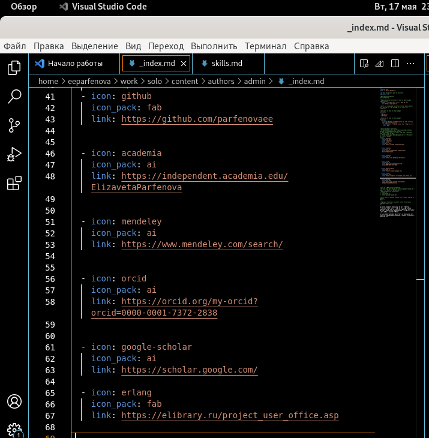
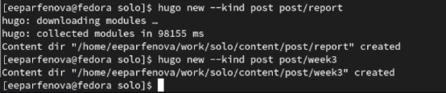
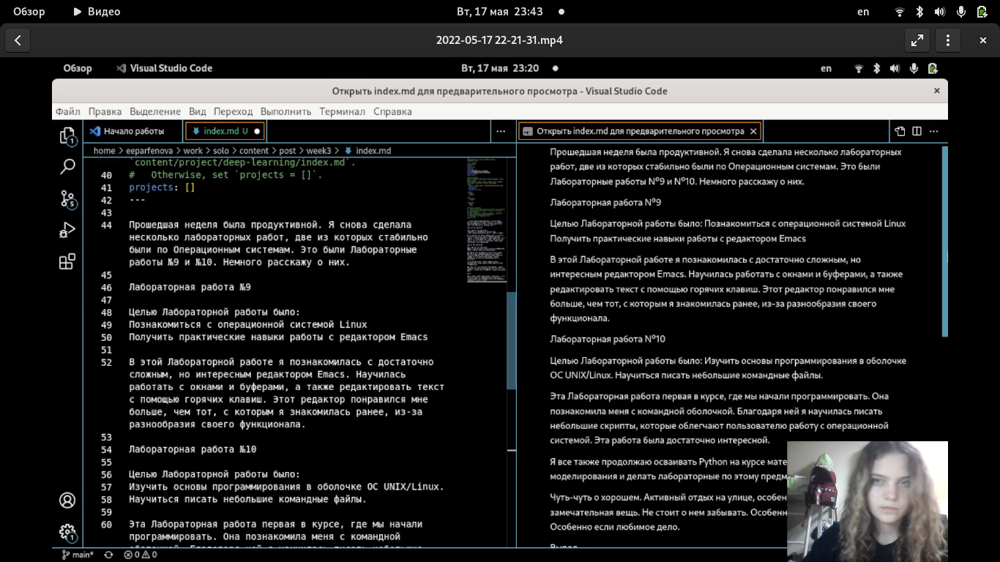
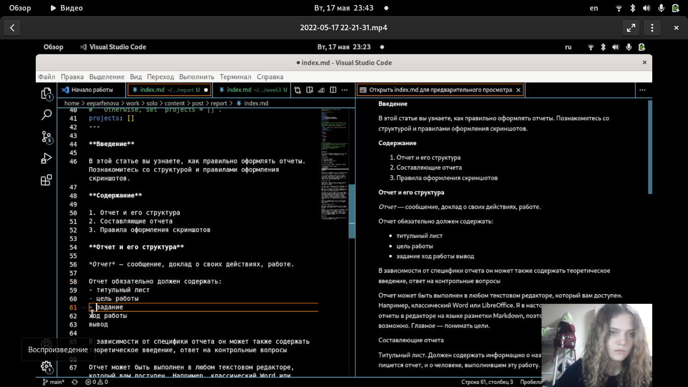
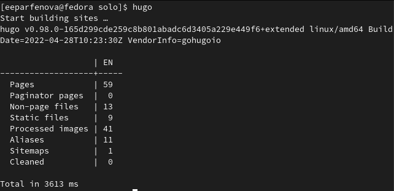
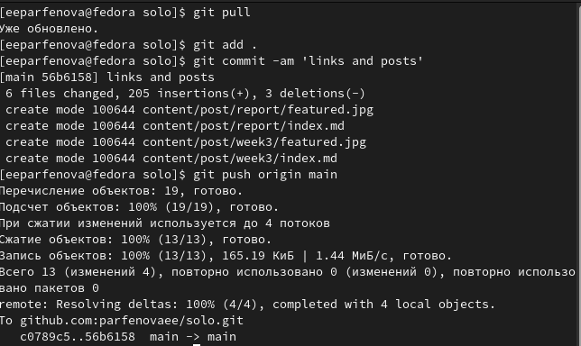
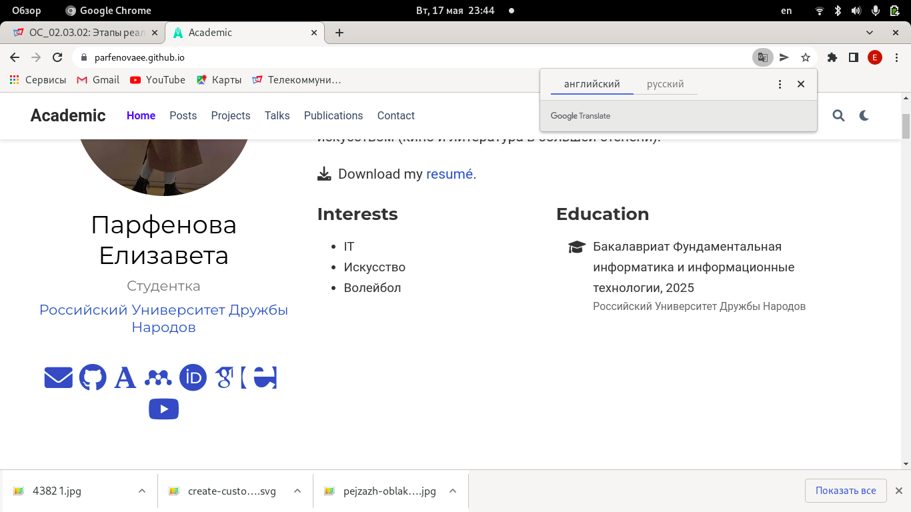

---
## Front matter
lang: ru-RU
title: 4 этап индивидуального проекта
author: Парфенова Елизавета Евгеньевна
institute: RUDN University, Moscow, Russian Federation

## Formatting
toc: false
slide_level: 2
theme: metropolis
header-includes: 
 - \metroset{progressbar=frametitle,sectionpage=progressbar,numbering=fraction}
 - '\makeatletter'
 - '\beamer@ignorenonframefalse'
 - '\makeatother'
aspectratio: 43
section-titles: true
---

## Цель работы

Разместить ссылки на научные и библиометрические ресурсы на сайте и выложить два поста.

## Задание

Добавить к сайту ссылки на научные и библиометрические ресурсы.

1. Зарегистрироваться на соответствующих ресурсах и разместить на них ссылки на сайте.

2. Сделать пост по прошедшей неделе.

3. Добавить пост на тему "Оформление отчёта."

# Выполнение работы 

## Регистрация на ресурсах

Первым шагом нужно зарегестрироваться на всех ресурсах, представленных в задании, на которых нет аккаунта. 

## Размещение ссылок

Затем открываем файл из папки work/solo/content/authors/admin редакторе. Этот файл мы уже редактировали ранее, на втором этапе проекта. В него вставиляем ссылки на свой профиль на всех нобходимых ресурсах, не забыв про иконки. (рис. [-@fig:001])

{ #fig:001 width=40% }

## Создание папок постов

После я создаем папки для постов. Для этого открываем папку solo в терминале и вводим там команду ***hugo new --kind post post/week3*** для недельного поста и комнаду ***hugo new --kind post post/report*** для поста по выбору. (рис. [-@fig:002])

{ #fig:002 width=70% }

## Недельный пост

Следующим шагом открываем файл из первой папки в редакторе и вставляем туда пост. Также редактируем файл, чтобы получилось вставить картинку к посту. (рис. [-@fig:003])

{ #fig:003 width=70% }

## Пост по выбору

После тоже самое делаем и для файла, который находился в папке к посту по выбру. (рис. [-@fig:004])

{ #fig:004 width=70% }

## Вызов hugo

Далее было необходимо все синхронизировать. Для этого я вернулась в solo и открыла папку в терминале. Ввела там ***hugo***. (рис. [-@fig:005])

{ #fig:005 width=70% }

## Синхронизация репозиториев

После переходим в папку public, открываем ее в терминале и набираем стандартные команды: ***git pull***; ***git add .***; ***git commi -am 'links and posts'***; ***git push origin main***. Когда все прошло успешно, переходим обратно в solo и выполняем теже команды в терминале. (рис. [-@fig:006])

{ #fig:006 width=40% }

## Обновленный сайт

Последним шагом нужно было зайти на сайт и убедиться, что все прошо успешно. Для просмотра изменений может быть необходимо несколько раз обновить сайт. Ссылки были добавлены и посты выложились. (рис. [-@fig:007])

{ #fig:007 width=70% }

## Вывод

Мы разместили ссылки на научные и библиометрические ресурсы на сайте и выложили два поста.