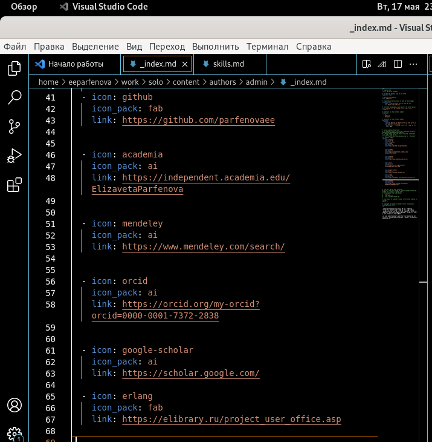
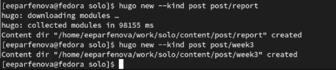
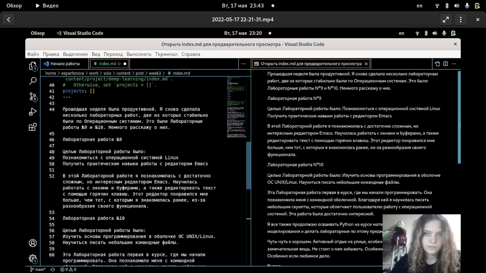
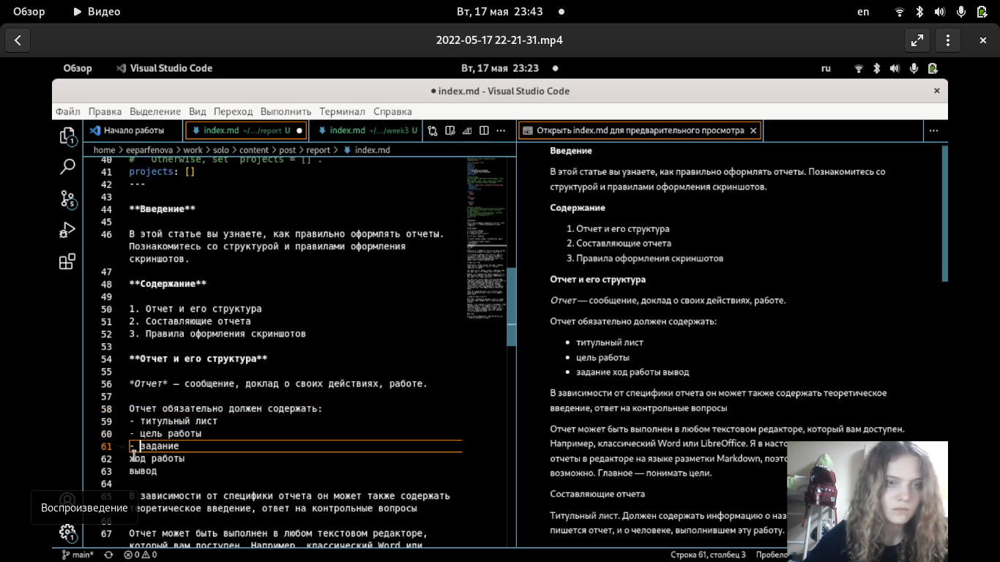
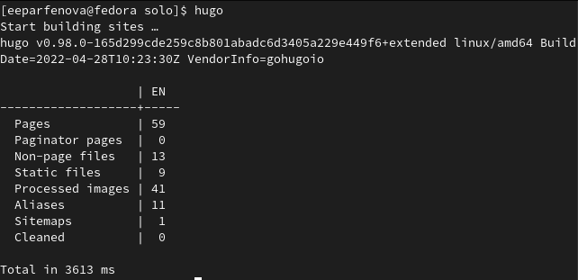
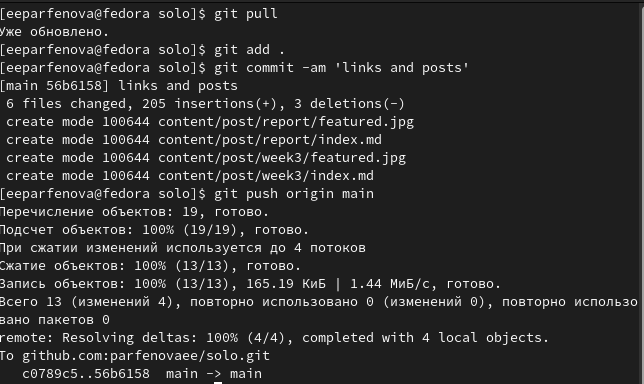
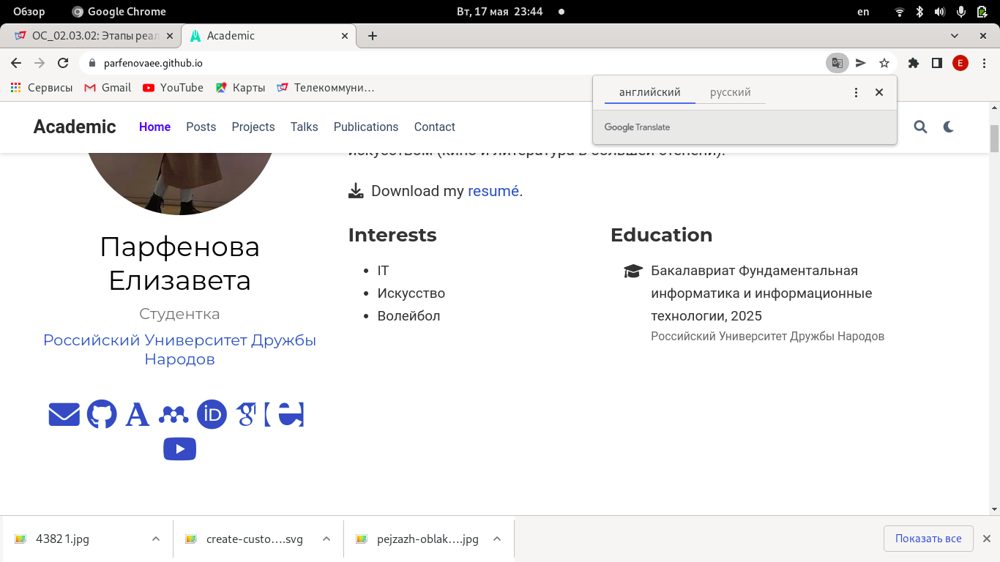

---
## Front matter
title: "4 этап индивидуального проекта"
author: "Парфенова Елизавета Евгеньевна"

## Generic otions
lang: ru-RU
toc-title: "Содержание"

## Bibliography
bibliography: bib/cite.bib
csl: pandoc/csl/gost-r-7-0-5-2008-numeric.csl

## Pdf output format
toc: true # Table of contents
toc-depth: 2
lof: true # List of figures
lot: true # List of tables
fontsize: 12pt
linestretch: 1.5
papersize: a4
documentclass: scrreprt
## I18n polyglossia
polyglossia-lang:
  name: russian
  options:
	- spelling=modern
	- babelshorthands=true
polyglossia-otherlangs:
  name: english
## I18n babel
babel-lang: russian
babel-otherlangs: english
## Fonts
mainfont: PT Serif
romanfont: PT Serif
sansfont: PT Sans
monofont: PT Mono
mainfontoptions: Ligatures=TeX
romanfontoptions: Ligatures=TeX
sansfontoptions: Ligatures=TeX,Scale=MatchLowercase
monofontoptions: Scale=MatchLowercase,Scale=0.9
## Biblatex
biblatex: true
biblio-style: "gost-numeric"
biblatexoptions:
  - parentracker=true
  - backend=biber
  - hyperref=auto
  - language=auto
  - autolang=other*
  - citestyle=gost-numeric
## Pandoc-crossref LaTeX customization
figureTitle: "Рис."
tableTitle: "Таблица"
listingTitle: "Листинг"
lofTitle: "Список иллюстраций"
lotTitle: "Список таблиц"
lolTitle: "Листинги"
## Misc options
indent: true
header-includes:
  - \usepackage{indentfirst}
  - \usepackage{float} # keep figures where there are in the text
  - \floatplacement{figure}{H} # keep figures where there are in the text
---

# Цель работы

Разместить ссылки на научные и библиометрические ресурсы на сайте и выложить два поста.

# Задание

Добавить к сайту ссылки на научные и библиометрические ресурсы.

1. Зарегистрироваться на соответствующих ресурсах и разместить на них ссылки на сайте:

   eLibrary : https://elibrary.ru/;

   Google Scholar : https://scholar.google.com/;

   ORCID : https://orcid.org/;

   Mendeley : https://www.mendeley.com/;

   ResearchGate : https://www.researchgate.net/;

   Academia.edu : https://www.academia.edu/;

   arXiv : https://arxiv.org/;

   github : https://github.com/.

2. Сделать пост по прошедшей неделе.

3. Добавить пост на тему "Оформление отчёта."

# Выполнение этапа индивидувльного проекта

Первым шагом я зарегестрировалась на всех ресурсах, представленных в задании, на которых у меня не было аккаунта. 

Затем я открыла файл из папки work/solo/content/authors/admin в VS Code, чтобы иметь возможность редактировать его. Этот файл мы уже редактировали ранее, на втором этапе проекта. В нем я и вставила ссылки на свой профиль на всех нобходимых ресурсах, не забыв про иконки, названия которых взяла с определенного сайта. (рис. [-@fig:001])

{ #fig:001 width=70% }

После я создала папки для постов. Для этого открыла папку solo в терминале и ввела там команду ***hugo new --kind post post/week3*** для недельного поста и комнаду ***hugo new --kind post post/report*** для поста по выбору. (рис. [-@fig:002])

{ #fig:002 width=70% }

Следующим шагом я открыла файл из первой папки в редакторе и вставила туда заранее подготовленный пост. Также я немного отредактировала файл, чтобы получилось вставить картинку к посту. (рис. [-@fig:003])

{ #fig:003 width=70% }

После тоже самое я сделала и для файла, который находился в папке к посту по выбру. Темой поста я выбрала "Оформление отчета". Пост также был подготовлен заранее. (рис. [-@fig:004])

{ #fig:004 width=70% }

Далее было необходимо все синхронизировать. Для этого я вернулась в solo и открыла папку в терминале. Ввела там ***hugo***. (рис. [-@fig:005])

{ #fig:005 width=70% }

После перешла в папку public, открыла ее в терминале и набрала стандартные команды: ***git pull***; ***git add .***; ***git commi -am 'links and posts'***; ***git push origin main***. Когда все прошло успешно, я перешла обратно в solo и выполнила теже команды в терминале. (рис. [-@fig:006])

{ #fig:006 width=70% }

Последним шагом нужно было зайти на сайт и убедиться, что все прошо успешно. Для просмотра изменений мне пришлось несколько раз обновить сайт. Ссылки были добавлены и посты выложились. (рис. [-@fig:007])

{ #fig:007 width=70% }

# Выводы

Мы разместили ссылки на научные и библиометрические ресурсы на сайте и выложили два поста.

