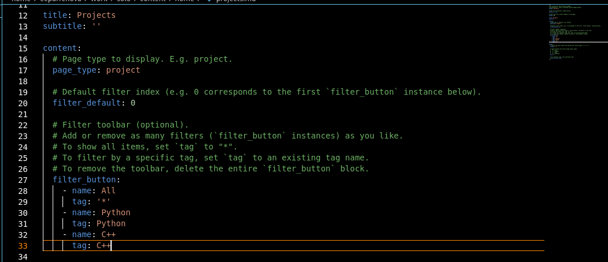
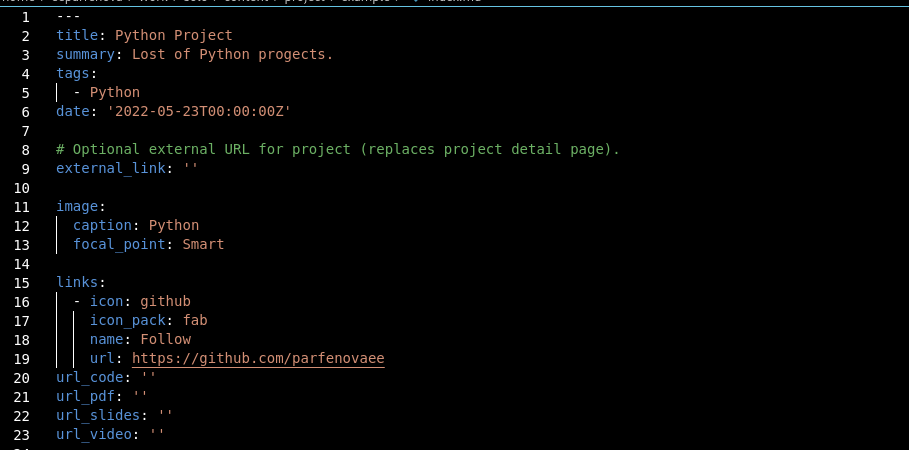
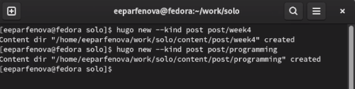
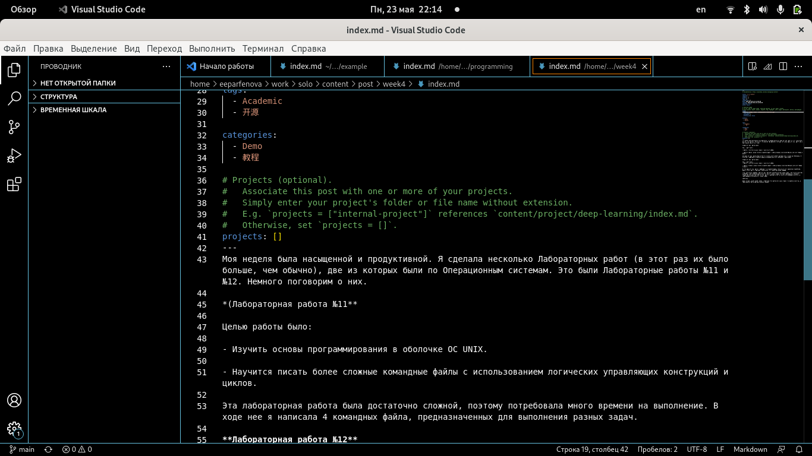
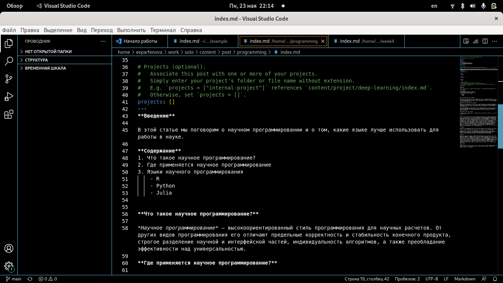
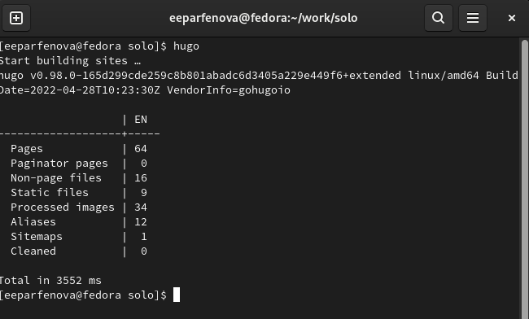
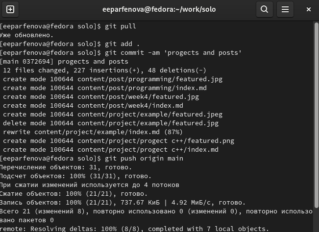
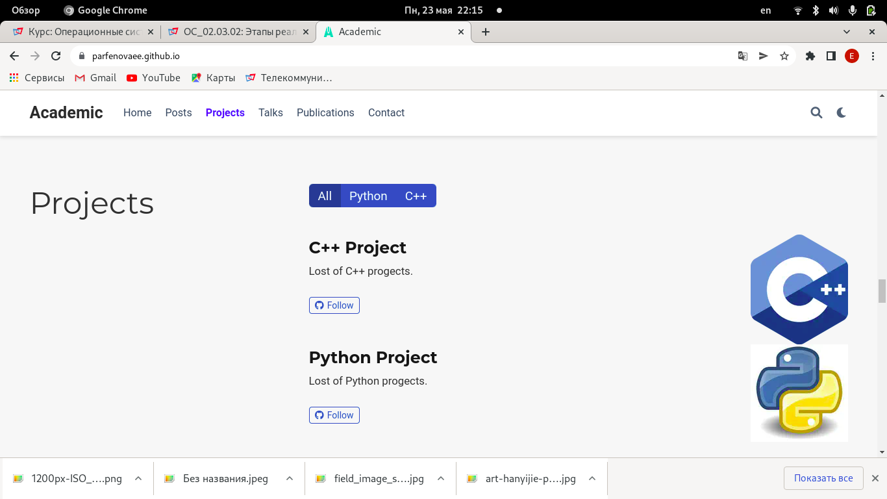

---
## Front matter
lang: ru-RU
title: Пятый этап индивидуального проекта
author: Парфенова Елизавета Евгеньевна
institute: RUDN University, Moscow, Russian Federation

## Formatting
toc: false
slide_level: 2
theme: metropolis
header-includes: 
 - \metroset{progressbar=frametitle,sectionpage=progressbar,numbering=fraction}
 - '\makeatletter'
 - '\beamer@ignorenonframefalse'
 - '\makeatother'
aspectratio: 43
section-titles: true
---

## Цель работы

Научиться добавлять на сайт записи о персональных проектах.

## Задачи

- Сделать записи для персональных проектов.

- Сделать пост по прошедшей неделе.

- Добавить пост на тему "Языки научного программирования".

# Выполнение работы 

## Изменение файла projects

Первым шагом добавляем записи для персональных проектов. Для этого изменяем три файла. Снчала заходим в work/solo/content/home и выбираем для редактирования файл projects. Открыв его в редакторе, изменяем нужную информацию. (рис. [-@fig:001])

{ #fig:001 width=40% }

## Добавление записей проектов

Затем переходим в папку work/solo/content/progects/example и открываем файл, находящийся в ней, в редакторе. Там изменяем всю информацию о проекте, заменив шаблонную запись на свою. (рис. [-@fig:002]) Затем копируем этот файл и вставляем в созданную рядом папку для второй записи. Открываем в редакторе копированный файл и изменяем в нем информацию. 

{ #fig:002 width=40% }

## Создание папок для постов

После сохраняем все изменения, перед этим проверив их  на локальном сайте. Затем переходим к созданию постов. Открываем папку solo в терминале и пишем две команды: ***hugo new --kind post post/week4*** - для недельного поста и ***hugo new --kind post post/programming*** - для поста по выбору. (рис. [-@fig:003])

{ #fig:003 width=50% }

## Недельный пост

Далее открываем файл из первой папки в редакторе и встаивляем туда пост. Также вставляем картинку к нему. (рис. [-@fig:004])

{ #fig:004 width=70% }

## Пост на тему по выбору

Тоже самое делаем с файлом из второй папки.(рис. [-@fig:005]) 

{ #fig:005 width=70% }

## Вызов файла hugo

Следующим шагом следует синхронизация локального и удаленного репозиториев. Переходим в папку solo, открываем ее в терминале и вызвалем файл hugo. (рис. [-@fig:006]) 

{ #fig:006 width=70% }

## Синхронизация репозиториев

Далее переходим в папку public и, открыв ее в терминале, набираем стандартные команды: ***git pull***, ***git add .***, ***git commit -am***, ***git push origin main***. Когда все проходит успешно, возвращаемся в папку solo и повторяем действия. (рис. [-@fig:007]) 

{ #fig:007 width=50% }

## Обновление сайта

Осталось только обновить сайт. Все изменения были добавлены. (рис. [-@fig:008]) 

{ #fig:008 width=60% }

## Вывод

Мы научились добавлять на сайт записи персональнх проектов и добавили на сайт два поста: недельный и по выбору

