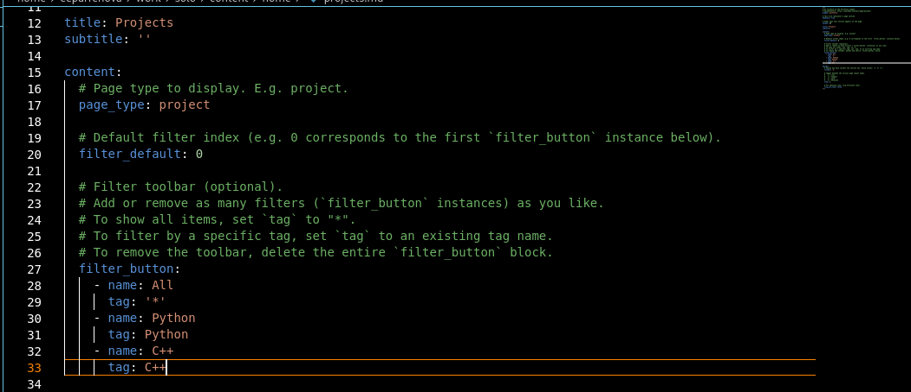
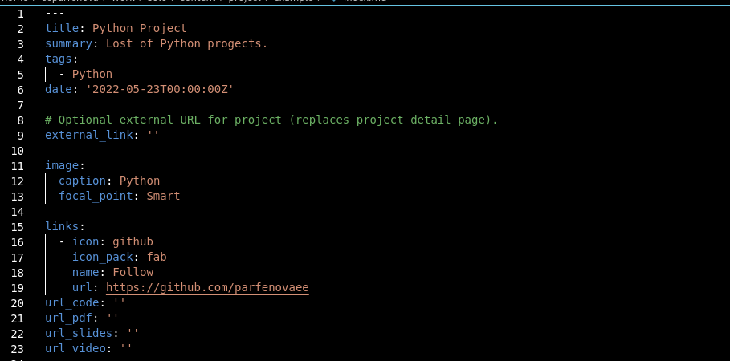
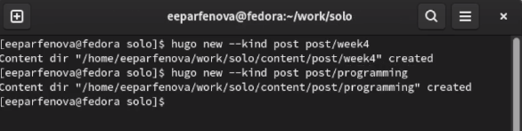
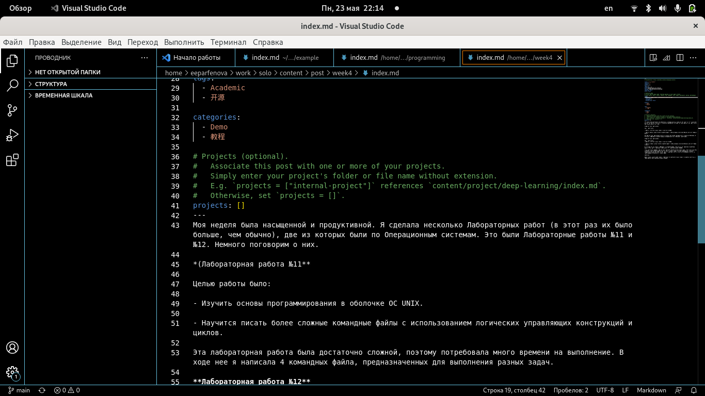
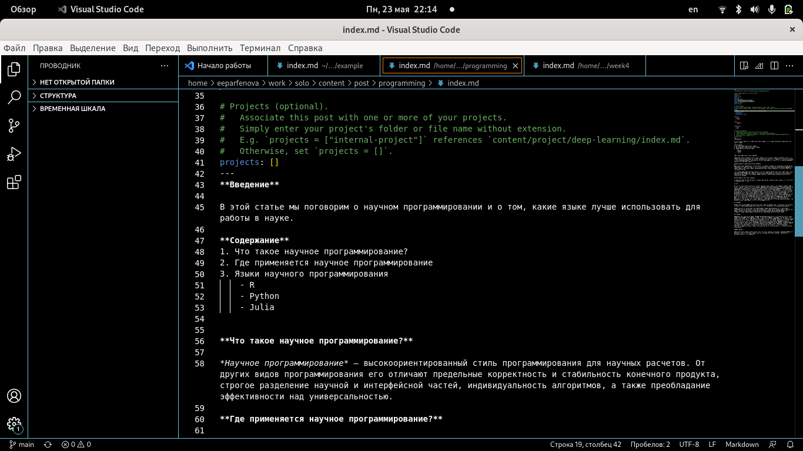
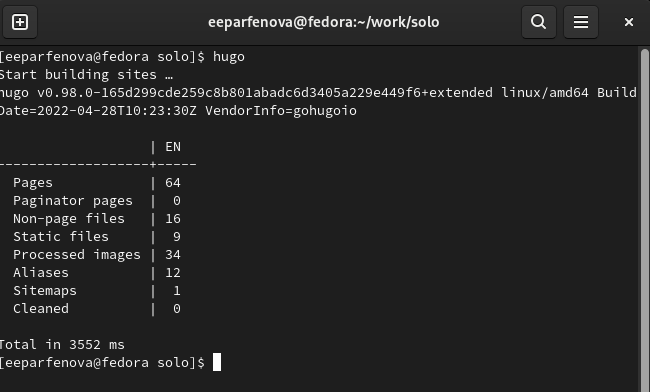
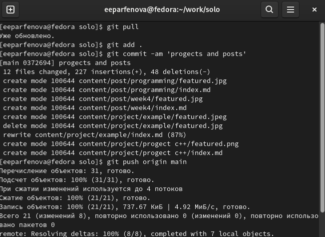
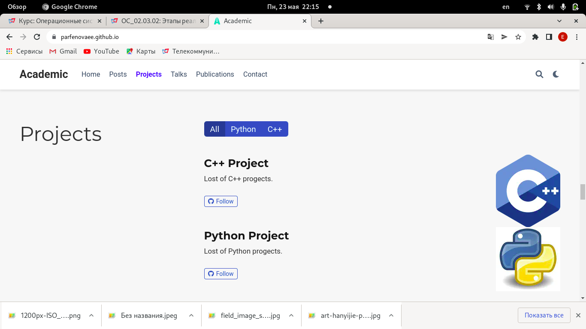

---
## Front matter
title: "Пятый этап индивидуального проекта"
author: "Парфенова Елизавета Евгеньевна"

## Generic otions
lang: ru-RU
toc-title: "Содержание"

## Bibliography
bibliography: bib/cite.bib
csl: pandoc/csl/gost-r-7-0-5-2008-numeric.csl

## Pdf output format
toc: true # Table of contents
toc-depth: 2
lof: true # List of figures
lot: true # List of tables
fontsize: 12pt
linestretch: 1.5
papersize: a4
documentclass: scrreprt
## I18n polyglossia
polyglossia-lang:
  name: russian
  options:
	- spelling=modern
	- babelshorthands=true
polyglossia-otherlangs:
  name: english
## I18n babel
babel-lang: russian
babel-otherlangs: english
## Fonts
mainfont: PT Serif
romanfont: PT Serif
sansfont: PT Sans
monofont: PT Mono
mainfontoptions: Ligatures=TeX
romanfontoptions: Ligatures=TeX
sansfontoptions: Ligatures=TeX,Scale=MatchLowercase
monofontoptions: Scale=MatchLowercase,Scale=0.9
## Biblatex
biblatex: true
biblio-style: "gost-numeric"
biblatexoptions:
  - parentracker=true
  - backend=biber
  - hyperref=auto
  - language=auto
  - autolang=other*
  - citestyle=gost-numeric
## Pandoc-crossref LaTeX customization
figureTitle: "Рис."
tableTitle: "Таблица"
listingTitle: "Листинг"
lofTitle: "Список иллюстраций"
lotTitle: "Список таблиц"
lolTitle: "Листинги"
## Misc options
indent: true
header-includes:
  - \usepackage{indentfirst}
  - \usepackage{float} # keep figures where there are in the text
  - \floatplacement{figure}{H} # keep figures where there are in the text
---

# Цель работы

Научиться добавлять на сайт записи о персональных проектах.

# Задание

- Сделать записи для персональных проектов.

- Сделать пост по прошедшей неделе.

- Добавить пост на тему "Языки научного программирования".

# Выполнение лабораторной работы

Вначале я добавила записи для персональных проектов. Для этого я изменила три файла. Снчала я зашла в work/solo/content/home и выбрада для редактирования файл projects. Открыв его в VS Code, я изменила названия разделов, сделав All, Python, C++. Все изменения я прослеживала на локальном сайте. (рис. [-@fig:001])

{ #fig:001 width=70% }

Затем я перешла в папку work/solo/content/progects/example и открыла файл, находящийся в ней, в редакторе. Там я изменила всю информацию о проекте, заменив шаблонную запись на свою. Этоу запись я назвала "Python progects". (рис. [-@fig:002])

{ #fig:002 width=70% }

Затем я копировала этот файл и вставила в созданную рядом папку для второй записи (создала папку C++ в папке progects). Открыла в редакторе копированный файл и изменила в нем информацию. Вторая запись называлась "С++ progects". 

После я сохранила все изменения, перед этим проверив их  на локальном сайте. Затем я перешла к созданию постов. Открыла папку solo в терминале и написала две команды: ***hugo new --kind post post/week4*** - для недельного поста и ***hugo new --kind post post/programming*** - для поста по выбору. (рис. [-@fig:003])

{ #fig:003 width=70% }

Далее я открыла файл из первой папки в редакторе и встаивла туда заранее подготовленный пост. Также вставила картинку к нему. (рис. [-@fig:004])

{ #fig:004 width=70% }

Тоже самое сделала с файлом из второй папки. Сам пост был также подготовлен заранее. (рис. [-@fig:005]) 

{ #fig:005 width=70% }

Следующим шагом следовала синхронизация локального и удаленного репозиториев. Перешла в папку solo, открыла ее в терминале и вызвала файл hugo. (рис. [-@fig:006]) 

{ #fig:006 width=70% }

Далее перешла в папку public и, открыв ее в терминале, набрала стандартные команды: ***git pull***, ***git add .***, ***git commit -am***, ***git push origin main***. Когда все прошло успешно, вернулась в папку solo и повторила действия. (рис. [-@fig:007]) 

{ #fig:007 width=70% }

Осталось только обновить сайт. Все изменения были добавлены. (рис. [-@fig:008]) 

{ #fig:008 width=70% }

# Выводы

Мы научились добавлять на сайт записи персональнх проектов и добавили на сайт два поста: недельный и по выбору.

