---
## Front matter
lang: ru-RU
title: Шестой этап индивидуального проекта
author: Парфенова Елизавета Евгеньвена
institute: RUDN University, Moscow, Russian Federation

## Formatting
toc: false
slide_level: 2
theme: metropolis
header-includes: 
 - \metroset{progressbar=frametitle,sectionpage=progressbar,numbering=fraction}
 - '\makeatletter'
 - '\beamer@ignorenonframefalse'
 - '\makeatother'
aspectratio: 43
section-titles: true
---

## Цель работы

Разместить двуязычный сайт на Github.

## Задание

Размещение двуязычного сайта на Github.

- Сделать поддержку английского и русского языков.
- Разместить элементы сайта на обоих языках.
- Разместить контент на обоих языках.
- Сделать пост по прошедшей неделе.
- Добавить пост на тему по выбору (на двух языках).

## Создание папок двух языков

Сначала создаем в папке ~/work/solo/content две папки: en и ru, и копируем в них все папки, которые находились в content. То есть каждая из папок имееет одинаковое содеражимое. (рис. [-@fig:001])

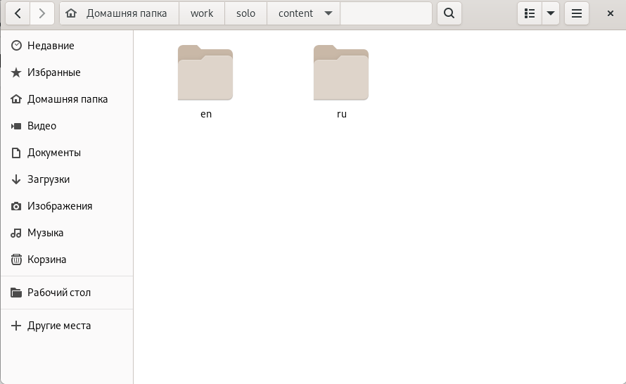{ #fig:001 width=50% }

## Поддержка русского языка на сайте

Далее заходим в папку ~/work/solo/config/_default и в файле languages.yaml разкоментируем нужную строку для английского языка и добавляем теже строки для русского языка, немного изменив данные. Здесь же добавляем название на русском языке и меню также на русском языке. (рис. [-@fig:002])

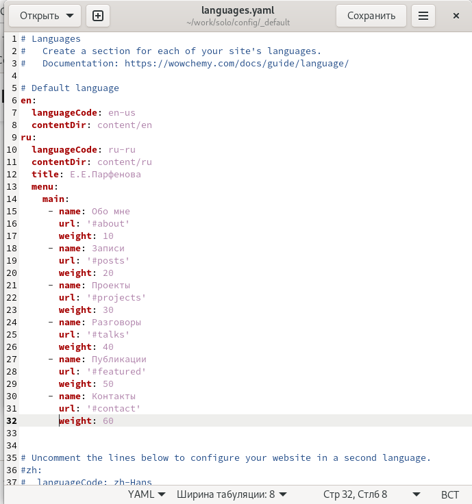{ #fig:002 width=30% }

## Перевод всех данных

 Начинаем редактировать все файлы в папках на двух языках. Вот пример перевода информации обо мне. (рис. [-@fig:003]) (рис. [-@fig:004])

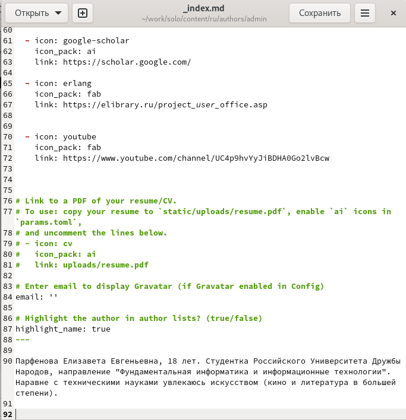{ #fig:003 width=20% }

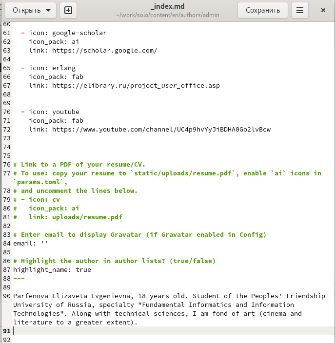{ #fig:004 width=20% }

## Перевод постов

После того, как мф изменили все данные, приступаем к переводу постов. Вот пример перевода последнего поста по выбору. (рис. [-@fig:005])

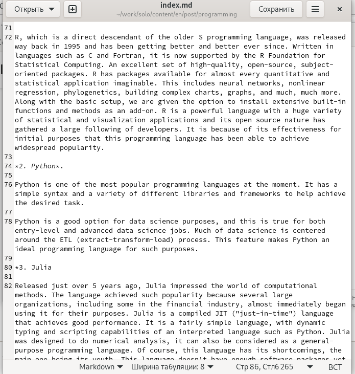{ #fig:005 width=50% }

## Сайт с переведенными постами

После перевода всех постов смотрим локальный сайт, все выглядит присерно так (рис. [-@fig:006])

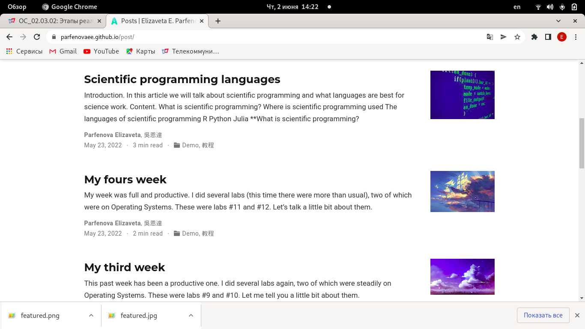{ #fig:006 width=50% }

## Создание папок постов

Далее было необходимо добавить недельный пост и пост на тему по выбору. Вначале мы как обычно создаем две папки для постов командой ***hugo new --kind post post/weeks*** - для недельного поста и ***hugo new --kind post post/language*** - для поста по выбору. (рис. [-@fig:007])

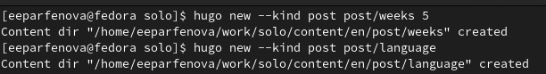{ #fig:007 width=50% }

## Выложенные посты

После вставляем в файл в каждой из папок пост и картинку к нему и отредактировала текст. Затем переходим в папку en и делаем тоже самое там, только переведя посты. Вот так это выглядело на сайте в итоге. (рис. [-@fig:008]) (рис. [-@fig:009])

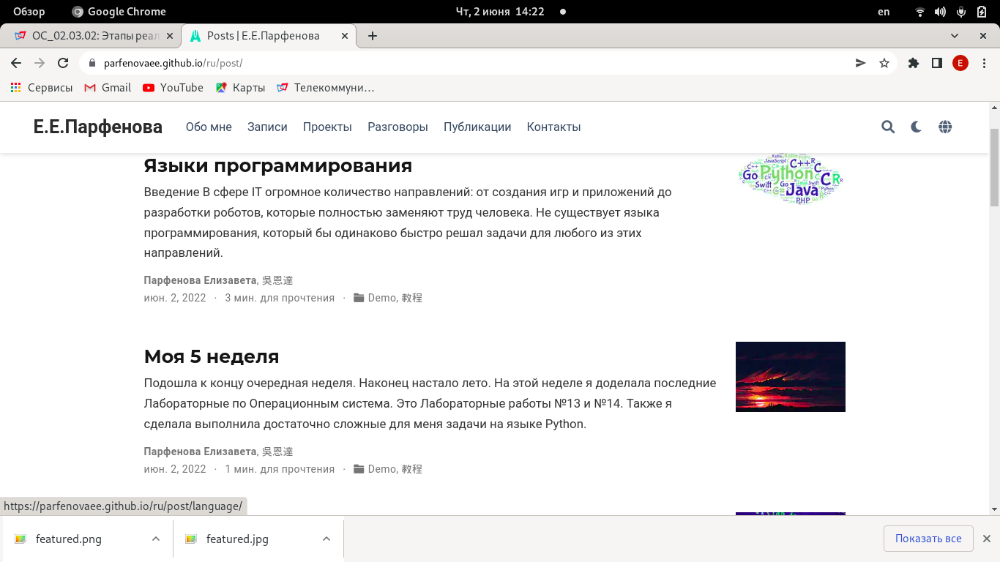{ #fig:008 width=30% }

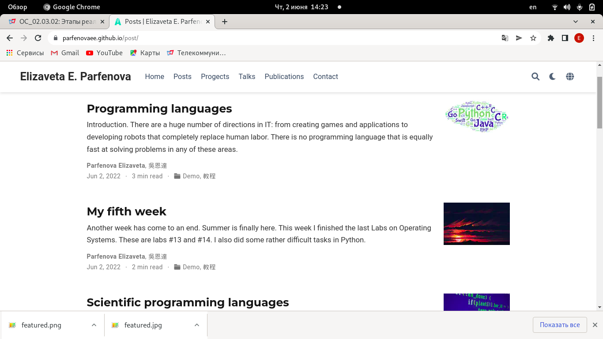{ #fig:009 width=30% }

## Готовый сайт

Последним шагом я синхронизируем локальный и удаленный репозитории привычным способом. Обнавляем сайт, и вот такой результат получился. (рис. [-@fig:010]) (рис. [-@fig:011])

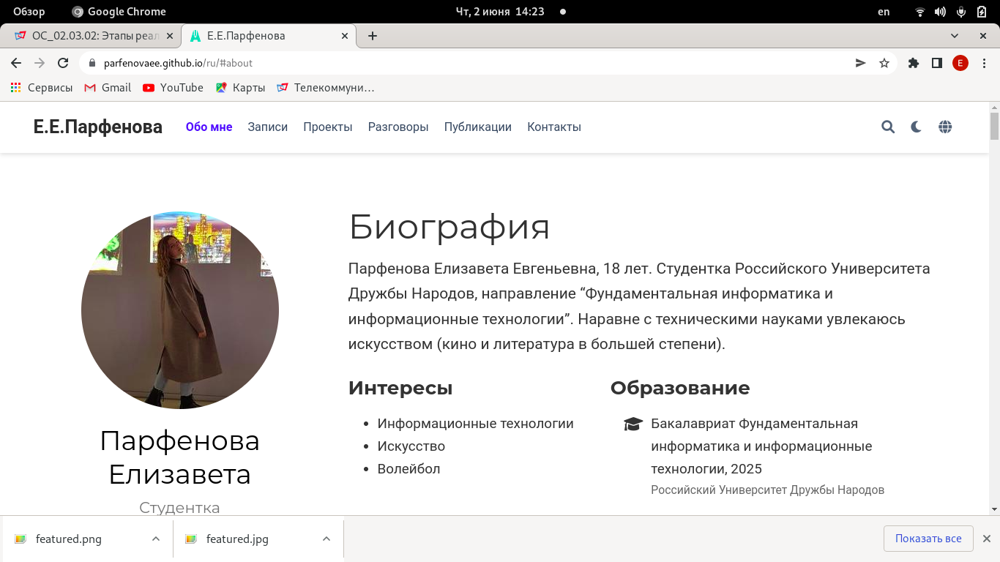{ #fig:010 width=30% }

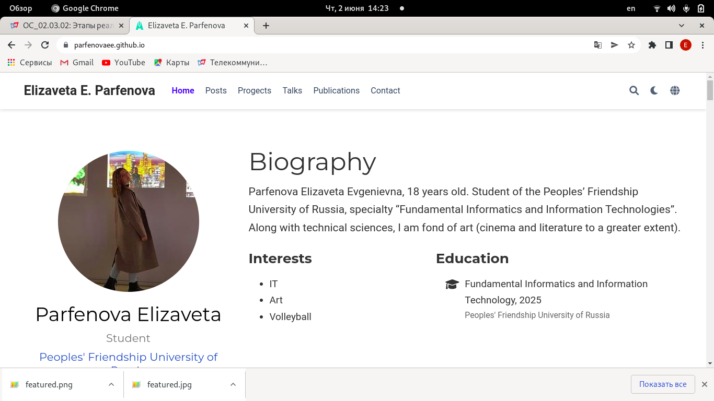{ #fig:011 width=30% }

## Вывод

Мы разместили двуязычный сайт на Github.