---
## Front matter
title: "Шестой этап индивидуального проекта"
author: "Парфенова Елизавета Евгеньевна"

## Generic otions
lang: ru-RU
toc-title: "Содержание"

## Bibliography
bibliography: bib/cite.bib
csl: pandoc/csl/gost-r-7-0-5-2008-numeric.csl

## Pdf output format
toc: true # Table of contents
toc-depth: 2
lof: true # List of figures
lot: true # List of tables
fontsize: 12pt
linestretch: 1.5
papersize: a4
documentclass: scrreprt
## I18n polyglossia
polyglossia-lang:
  name: russian
  options:
	- spelling=modern
	- babelshorthands=true
polyglossia-otherlangs:
  name: english
## I18n babel
babel-lang: russian
babel-otherlangs: english
## Fonts
mainfont: PT Serif
romanfont: PT Serif
sansfont: PT Sans
monofont: PT Mono
mainfontoptions: Ligatures=TeX
romanfontoptions: Ligatures=TeX
sansfontoptions: Ligatures=TeX,Scale=MatchLowercase
monofontoptions: Scale=MatchLowercase,Scale=0.9
## Biblatex
biblatex: true
biblio-style: "gost-numeric"
biblatexoptions:
  - parentracker=true
  - backend=biber
  - hyperref=auto
  - language=auto
  - autolang=other*
  - citestyle=gost-numeric
## Pandoc-crossref LaTeX customization
figureTitle: "Рис."
tableTitle: "Таблица"
listingTitle: "Листинг"
lofTitle: "Список иллюстраций"
lotTitle: "Список таблиц"
lolTitle: "Листинги"
## Misc options
indent: true
header-includes:
  - \usepackage{indentfirst}
  - \usepackage{float} # keep figures where there are in the text
  - \floatplacement{figure}{H} # keep figures where there are in the text
---

# Цель работы

Разместить двуязычный сайт на Github.

# Задание

Размещение двуязычного сайта на Github.

- Сделать поддержку английского и русского языков.
- Разместить элементы сайта на обоих языках.
- Разместить контент на обоих языках.
- Сделать пост по прошедшей неделе.
- Добавить пост на тему по выбору (на двух языках).

# Выполнение лабораторной работы

 Сначала я создала в папке ~/work/solo/content две папки: en и ru, и копировала в них все папки, которые находились в content. То есть каждая из папок имела одинаковое содеражимое. (рис. [-@fig:001])

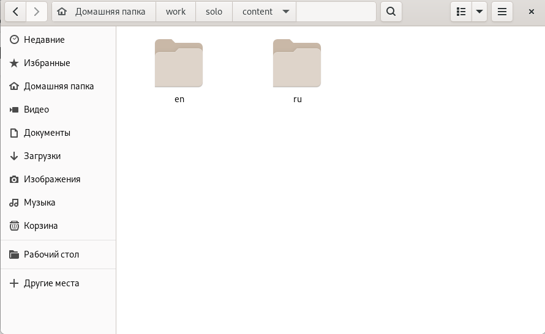{ #fig:001 width=70% }

Далее я зашла в папку ~/work/solo/config/_default и в файле languages.yaml разкоментировала нужную строку для английского языка и добавила теже строки для русского языка, немного изменив данные. Здесь же я добавила название на русском языке и меню также на русском языке. (рис. [-@fig:002])

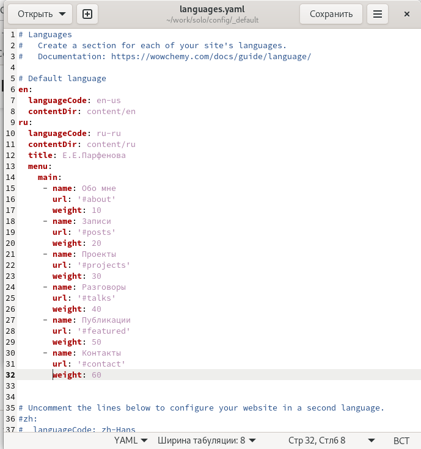{ #fig:002 width=70% }

Изначально весь мой сайт был на русском, поэтому в папке ru я почти ничего не изменила. Я начала редактировать все файлы в папке en, то есть переводить все данные. Вот пример перевода информации обо мне. (рис. [-@fig:003]) (рис. [-@fig:004])

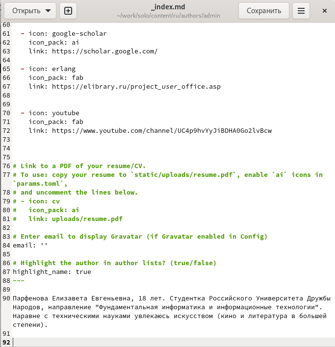{ #fig:003 width=70% }

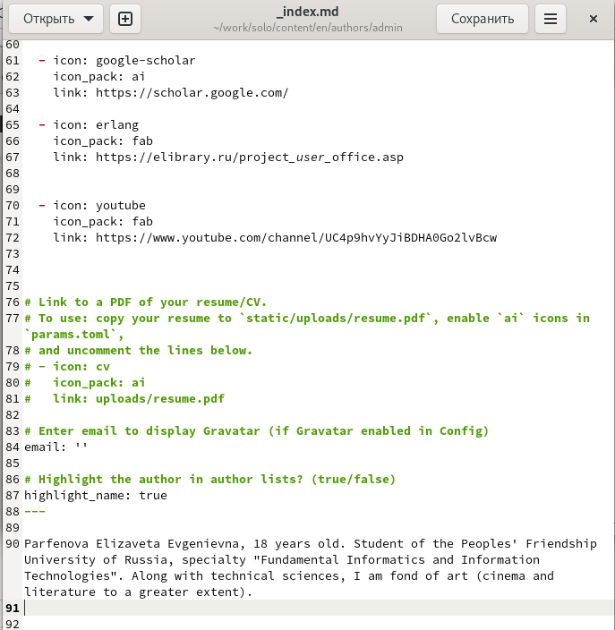{ #fig:004 width=70% }

После того, как я изменила все данные, я приступила к переводу постов. Это оказалось самым трудоемким. По факту, я просто меняла название поста и переводила его содержимое. Вот пример перевода последнего поста по выбору. (рис. [-@fig:005])

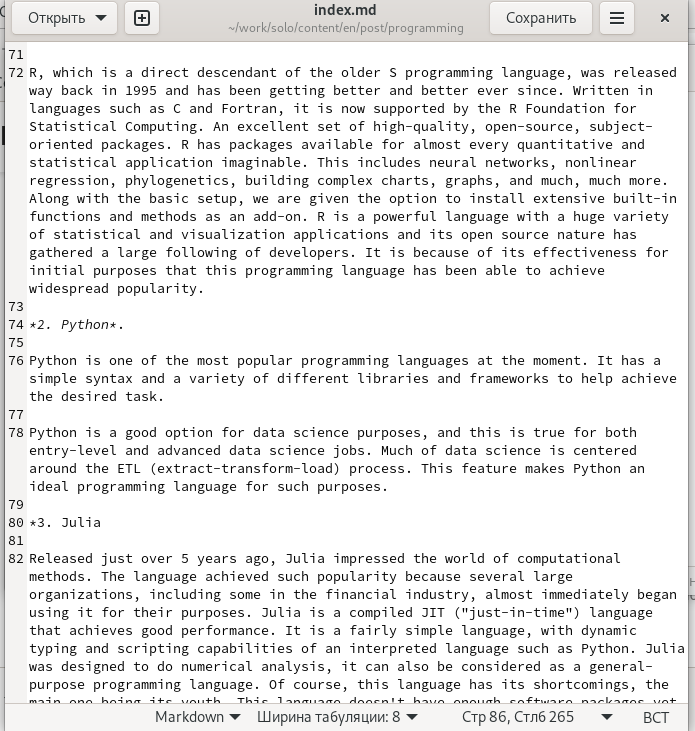{ #fig:005 width=70% }

Так я первела все посты и вот так это выглядело по итогу на локальном сайте. (рис. [-@fig:006])

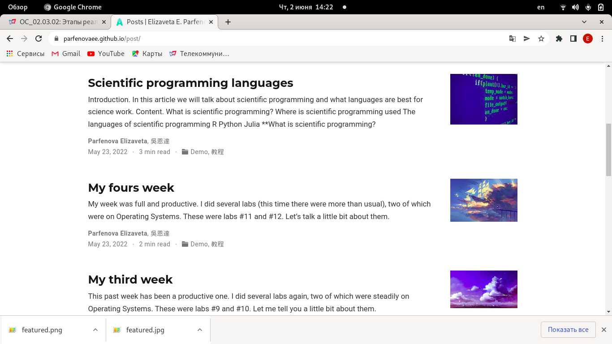{ #fig:006 width=70% }

Далее было необходимо добавить недельный пост и пост на тему по выбору. Вначале я как обычно создала две папки для постов командой ***hugo new --kind post post/weeks*** - для недельного поста и ***hugo new --kind post post/language*** - для поста по выбору. Тема "Языки программирования". (рис. [-@fig:007])

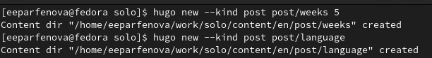{ #fig:007 width=70% }

После я вставила в файл в каждой из папок заранее подготовленный пост и картинку к нему и отредактировала текст. Затем я перешла в папку en и сделала тоже самое там, только переведя посты. Вот так это выглядело на сайте в итоге. (рис. [-@fig:008]) (рис. [-@fig:009])

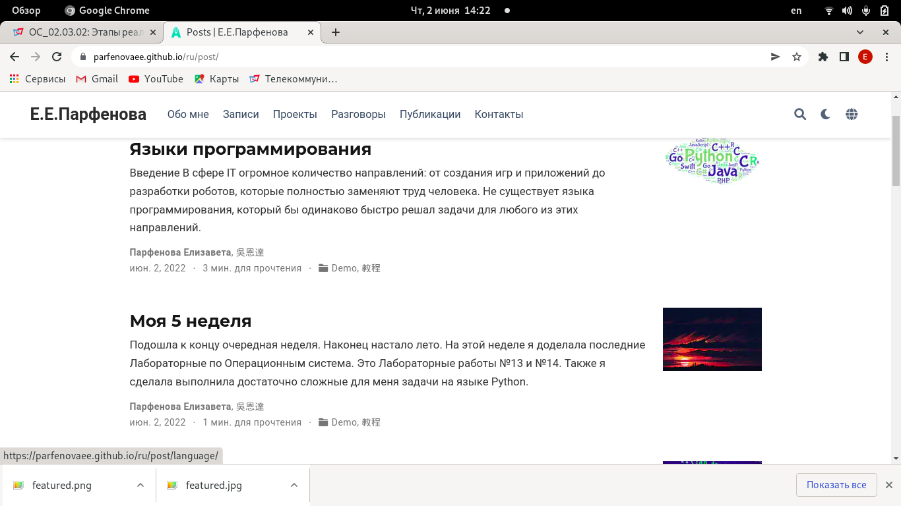{ #fig:008 width=70% }

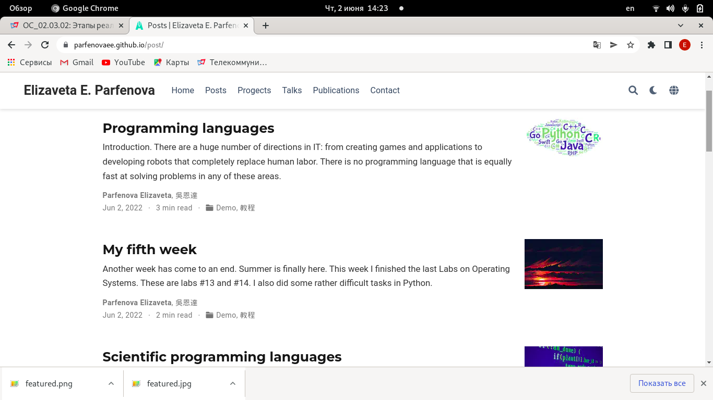{ #fig:009 width=70% }

Последним шагом я синхронизировала локальный и удаленный репозитории привычным способом. Веачале вызвала hugo в папке solo, затем ввела 4 команды из папки public и эти же команды из папки solo. Я обновила сайт, и вот такой результат получился. (рис. [-@fig:010]) (рис. [-@fig:011])

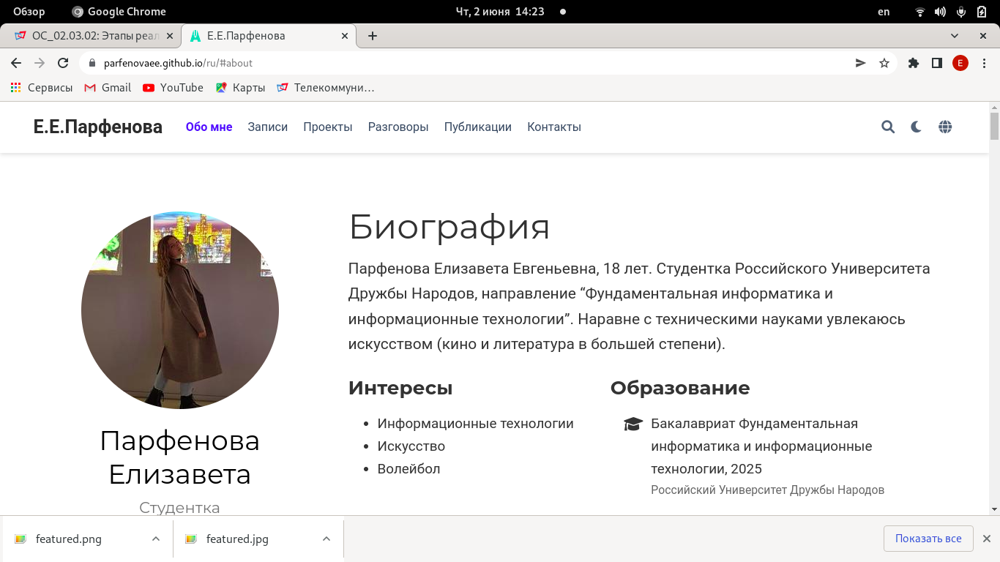{ #fig:010 width=70% }

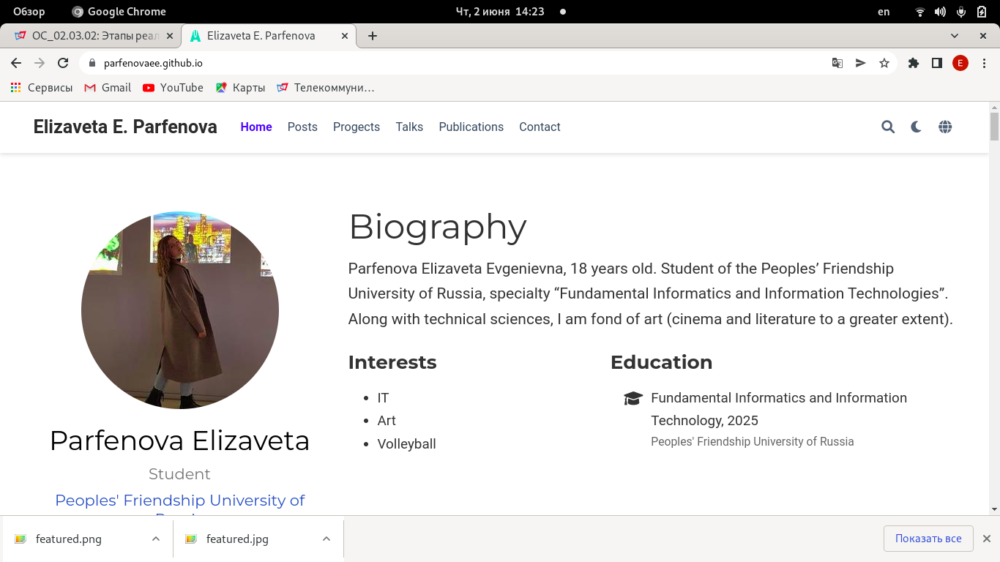{ #fig:011 width=70% }

# Выводы

Мы разместили двуязычный сайт на Github.
